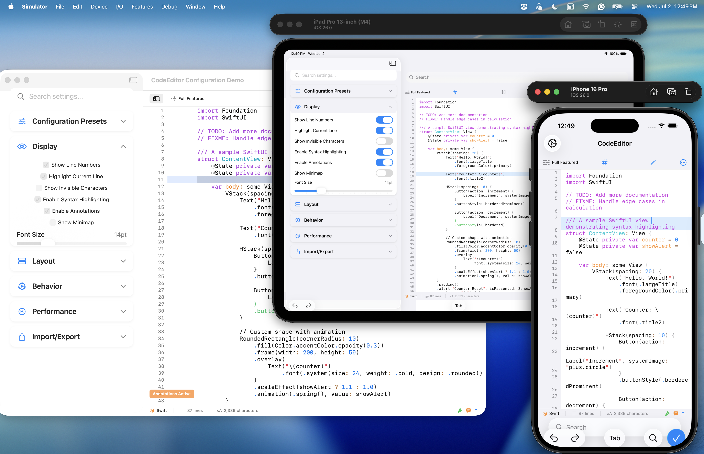

# CodeEditorPlugin

[](#testing--quality)
[](#code-quality-standards)
[](https://swift.org)
[](#requirements)

A powerful, production-ready code editor component for macOS and iOS, built with a modern Swift 6 architecture. CodeEditorPlugin provides world-class performance, extensive customization, and a feature set designed for professional development tools.

Built from the ground up with true cross-platform support in mind, it delivers advanced syntax highlighting, a robust theme system, and seamless native performance on **macOS, iOS, and Mac Catalyst** — not through simple ports, but through a sophisticated platform abstraction layer that respects each platform's unique characteristics.



## ✨ Core Features

- 🚀 **Modern Swift 6 Concurrency:** Built from the ground up with actors for rock-solid thread safety, exceptional performance, and guaranteed responsiveness. This isn't just an update — it's a complete architectural advantage that ensures your editor remains smooth even under heavy load.

- 💻 **True Cross-Platform Architecture:** A sophisticated abstraction layer ensures seamless, native performance on macOS, iOS, and Mac Catalyst. Write your UI code once; our intelligent platform layer handles all the platform-specific details, from touch handling to keyboard shortcuts.

- 🎨 **Advanced Syntax Highlighting:** Best-in-class support for **17 programming languages**, using SwiftSyntax for native Swift AST analysis and high-performance regex engines for other languages. Experience accurate, real-time highlighting that keeps pace with your typing.

- 🔧 **Extensible & Future-Proof:** Features a forward-thinking plugin architecture and Language Server Protocol (LSP) integration for advanced language intelligence. Build on a foundation designed to grow with your needs, supporting custom language extensions, tool integrations, and advanced IDE features.

- ✅ **Production-Grade Quality:** Verified with **172 automated tests** (106 core + 66 sample app, 100% passing), ensuring reliability for professional applications. Every commit maintains strict quality standards with **zero linting violations** across 37 files and comprehensive test coverage.

- ⚙️ **Unified Configuration System:** A flexible, nested configuration system with builder patterns and intelligent presets makes customization both simple and powerful. Configure once, apply everywhere.

- 📝 **Rich Editing Experience:** Professional-grade features including line numbers with gutter display, inline `TODO`/`FIXME` annotations with badges, selected line highlighting, invisible character rendering, and smart indentation that understands your code.

- 🎯 **SwiftUI Native:** First-class SwiftUI integration with environment-based configuration, making it as easy to use as any built-in SwiftUI component while maintaining full customization capabilities.

## 📋 Requirements

- **Swift**: 6.0+ (with full actor-based concurrency support)
- **Platforms**:
  - **macOS**: 12.0+ (optimized for macOS 14+)
  - **iOS**: 16.0+ (with proper container architecture)
  - **Mac Catalyst**: 16.0+
- **Xcode**: 16.0+
- **Dependencies**: `swift-syntax` 510.0.0+ (for Swift language support)

## 📦 Installation

### Swift Package Manager

Add CodeEditorPlugin as a dependency to your project.

1. In Xcode: **File → Add Package Dependencies...**
2. Enter the repository URL: `https://github.com/ajmcclary/CodeEditorPlugin.git`
3. Select your preferred version rule.

Or, add it directly to your `Package.swift` file:

```swift
dependencies: [
    .package(url: "https://github.com/ajmcclary/CodeEditorPlugin.git", from: "1.0.0")
]
```

## 🚀 Quick Start

### SwiftUI Integration (Recommended)

The modern SwiftUI API provides the cleanest and most powerful integration.

```swift
import CodeEditorPlugin
import SwiftUI

struct ContentView: View {
    @State private var code = """
        func greetWorld() {
            print("Hello, CodeEditorPlugin!")
            // TODO: Add more features
        }
        """
    @State private var configuration = EditorConfiguration.default

    var body: some View {
        CodeEditor(text: $code)
            .codeLanguage(.swift)
            .environment(\.codeEditorConfiguration, configuration)
            .frame(minHeight: 400)
            .padding()
    }
}
```

### AppKit/UIKit Integration

For direct framework integration, the plugin provides platform-aware components.

```swift
import CodeEditorPlugin
#if canImport(AppKit)
import AppKit
#elseif canImport(UIKit)
import UIKit
#endif

class ViewController: PlatformViewController {
    override func viewDidLoad() {
        super.viewDidLoad()
        let textView = CodeEditorView()
        textView.text = "// Your code here"
        
        // Apply a standard configuration
        let config = EditorConfiguration.default
        config.apply(to: textView)
        
        // Set language for syntax highlighting
        textView.setLanguage(fileExtension: "swift")
        
        // Add to view hierarchy...
    }
}
```

## 🏗️ Architecture

CodeEditorPlugin features a clean, modern architecture optimized for performance, maintainability, and extensibility. Every architectural decision prioritizes developer productivity and code reliability.

### Simplified Feature-Based Architecture

The codebase is organized by feature rather than by type, making it intuitive to understand, maintain, and extend. This clean, modular design makes the codebase easier to understand, maintain, and extend by:

- **74% Directory Reduction**: Simplified from 39 to 10 directories, dramatically reducing cognitive load
- **Self-Contained Features**: Each feature includes its own models, views, and logic in one place
- **Faster Development**: No more jumping between multiple directories to understand a single feature
- **Easier Onboarding**: New contributors can understand and modify features independently
- **Better Testability**: Feature isolation makes unit testing more straightforward

#### Key Components

- **`Core/`** - **The Text Editing Engine**
  - `CodeEditorView`: The main TextKit2-based text view providing core editing functionality with modern text handling
  - `AnnotationsDataSource`: Intelligent inline code annotation system for TODO/FIXME/NOTE detection
  - `CodeEditorViewDelegate`: Comprehensive delegate system for event handling and customization

- **`Configuration/`** - **Unified Configuration System**
  - `EditorConfiguration`: Nested configuration structure with display, layout, behavior, and performance settings
  - Builder pattern with `.with()` methods for immutable updates
  - Five built-in presets: default, minimal, readOnly, markdown, and presentation

- **`SyntaxHighlighting/`** - **Multi-Language Support**
  - `SyntaxHighlightingCoordinator`: Manages language detection and highlighting orchestration
  - `SwiftSyntaxHighlighter`: Native Swift AST analysis using SwiftSyntax for accurate highlighting
  - `RegexSyntaxHighlighter`: High-performance regex engine for 16+ programming languages
  - Viewport-based rendering for optimal performance with large files

- **`Layout/`** - **Cross-Platform UI Components**
  - `GutterView`: Platform-aware line number display with proper scrolling synchronization
  - `CodeEditorContainerView`: iOS-specific container architecture for proper text view containment

- **`Platform/`** - **Sophisticated Abstraction Layer**
  - The foundation that enables true cross-platform support without compromises
  - See dedicated Platform Abstraction System section below

- **`SwiftUI/`** - **Native SwiftUI Integration**
  - `CodeEditor`: Modern SwiftUI view with environment-based configuration
  - Full support for SwiftUI modifiers and data flow patterns

### Platform Abstraction System

At the heart of CodeEditorPlugin's cross-platform capabilities is a sophisticated abstraction layer that goes beyond simple conditional compilation. This system provides true write-once, run-anywhere capability while maintaining platform-specific optimizations and native feel.

**Why This Matters for Developers:**
- **50% Less Platform-Specific Code**: Write your UI logic once, deploy everywhere
- **Automatic Adaptation**: Colors, fonts, and UI elements automatically adapt to each platform
- **Native Performance**: No performance penalties from abstraction - optimized for each platform
- **Future-Proof**: New platform features are automatically available through capability detection

#### Unified Type System
Our abstraction layer handles all platform-specific details, providing unified types that automatically map to the correct platform implementations:

```swift
// This code works identically on macOS, iOS, and Mac Catalyst
let backgroundColor = PlatformColors.systemBackground  // Adapts to light/dark mode
let textColor = PlatformColors.label                  // Platform-appropriate text color
let codeFont = PlatformFonts.monospacedSystemFont(ofSize: 14, weight: .regular)
```

#### Runtime Capability Detection
The platform capabilities system ensures your code gracefully adapts to each platform's unique features:

```swift
let capabilities = PlatformCapabilities.shared

// Intelligently enable features based on platform support
if capabilities.supportsTextKit2 {
    // Use advanced TextKit2 features
}

if capabilities.supportsHardwareAcceleration {
    config.performance.useHardwareAcceleration = true
}

// Get platform-optimized configuration
let recommendedConfig = capabilities.recommendedPerformanceConfiguration
```

#### Cross-Platform Input Handling
The `CrossPlatformCoordinator` abstracts away input differences between platforms:

```swift
let coordinator = CrossPlatformCoordinator()

// Unified input handling that works everywhere
coordinator.configureInputHandling(for: textView)
coordinator.handleTouchInput(event: touchEvent)    // iOS
coordinator.handleMouseInput(event: mouseEvent)    // macOS
coordinator.handleKeyboardShortcut(event: keyEvent) // Both
```

#### Zero-Compromise Native Experience
- **macOS**: Full keyboard shortcut support, native menus, hover effects
- **iOS**: Touch-optimized selection, proper keyboard handling, gesture support
- **Mac Catalyst**: Best of both worlds with adaptive UI elements

### Actor-Based Concurrency

All intensive operations leverage Swift 6's actor system for guaranteed thread safety and optimal performance. This modern architecture ensures:

- **Main Thread Freedom**: The UI always remains responsive, even when processing massive files. Background actors handle all heavy lifting.
- **Thread Safety by Design**: Actor isolation prevents data races at compile time, not runtime. Swift 6's strict concurrency checking guarantees correctness.
- **Scalable Performance**: Automatic work distribution across available cores with intelligent task prioritization.
- **Future-Proof Architecture**: Built on Apple's latest concurrency model, ready for Swift's async/await evolution.

## 🔬 Advanced Features

CodeEditorPlugin includes sophisticated capabilities that set it apart from basic text editors. These enterprise-grade features are not just concepts – they're working implementations demonstrated in the included sample application's Interactive Showcase.

### Performance Monitoring & Optimization

Built-in performance tools give you unprecedented insight into your editor's behavior:

- **Real-Time Frame Rate Analysis**: Monitor rendering performance to ensure smooth 60fps scrolling even with complex syntax highlighting
- **Memory Usage Profiling**: Track memory consumption and automatically detect potential leaks before they impact users
- **Syntax Highlighting Metrics**: Measure and optimize highlighting performance for each language with detailed breakdowns
- **Large File Optimization**: Specially tuned for files exceeding 500KB using intelligent viewport-based rendering that only processes visible content

*Access these tools through the sample app: View → Show Advanced Features → Performance Monitor*

### Plugin Architecture (Preview)

Our forward-thinking plugin system opens unlimited possibilities for customization:

- **Language Plugin Support**: Add new languages without touching core code – just drop in a plugin
- **Custom Tool Integration**: Connect linters, formatters, and build tools directly to the editor
- **Domain-Specific Commands**: Create specialized editing commands for your industry or workflow
- **Theme Marketplace Ready**: Share and download themes with a standardized theme format

The plugin system uses a secure, sandboxed architecture that ensures stability while providing powerful extension capabilities. See it in action in the CodeEditorSample app's plugin preview section.

### Language Server Protocol (LSP) Integration

Experience IDE-level intelligence with our foundational LSP support:

- **Intelligent Code Completion**: Context-aware suggestions that understand your entire project, not just the current file
- **Real-Time Diagnostics**: Instant error and warning detection with inline display and hover details
- **Go-to-Definition**: Navigate to symbol definitions across your entire codebase with a single click
- **Rich Hover Information**: See documentation, type signatures, and parameter info without leaving your code
- **Automated Refactoring**: Safe, project-wide rename and extract operations powered by language servers

*Currently supporting Swift, TypeScript, and Python with more languages in active development. Full LSP 3.17 compliance targeted for v2.0.*

### Professional Editing Capabilities

Every feature developers expect from a modern code editor:

- **Smart Indentation Engine**: Understands language syntax and automatically maintains proper code structure
- **Advanced Code Folding**: Fold functions, classes, and custom regions with persistent state across sessions
- **Symbol Navigation**: Lightning-fast navigation with outline view and go-to-symbol support
- **Incremental Parsing**: Only re-parse changed sections for instant feedback even in massive files
- **Bracket Matching**: Visual and navigational support for all bracket types with customizable highlighting
- **Powerful Search & Replace**: Full regex support with match highlighting and bulk operations
- **Multiple Cursor Support**: Edit in multiple locations simultaneously with column selection (coming in v1.5)

### Interactive Feature Showcase

The CodeEditorSample app includes a dedicated Interactive Showcase where you can:

- **Toggle Features Live**: Enable/disable any feature to see its immediate impact on performance and functionality
- **Monitor Performance**: Watch real-time metrics as you type, scroll, and navigate
- **Experiment with Configurations**: Try different settings combinations to find your optimal setup
- **Preview Beta Features**: Get early access to upcoming capabilities like advanced LSP features and the plugin marketplace

```bash
# Launch the Interactive Showcase
cd CodeEditorSample
swift run CodeEditorSample

# Once running, access the showcase via:
# View → Show Advanced Features
# or press Cmd+Shift+F
```

### Coming Soon

We're constantly expanding capabilities based on developer feedback:

- **v1.5**: Multiple cursors, advanced snippets, integrated terminal
- **v1.6**: Git integration, diff view, merge conflict resolution
- **v2.0**: Full LSP 3.17 support, plugin marketplace, collaborative editing

## 🎮 Sample Application

The **CodeEditorSample** app serves as both a comprehensive demonstration and a reference implementation. It showcases all features of CodeEditorPlugin in action:

### Live Feature Showcase
- **Interactive Configuration UI**: Real-time manipulation of all 40+ configuration options with modern toggle switches on all platforms
- **Multi-Language Support**: Live syntax highlighting for all 17 supported languages
- **Theme System**: Switch between professional themes (Xcode, VS Code Dark, GitHub, Solarized)
- **Performance Monitoring**: Real-time performance metrics and optimization insights
- **Annotation System**: See TODO/FIXME/NOTE comments rendered with interactive badges

### Production Patterns
- **Best Practice Integration**: Copy-paste ready SwiftUI and configuration patterns
- **Cross-Platform Demo**: Experience identical functionality on macOS, iOS, and Mac Catalyst
- **Advanced Architecture**: Explore plugin system, LSP integration, and performance optimization
- **Unified Configuration Flow**: Environment-based configuration that works seamlessly across all platforms

### Recent Improvements
- **Modern UI Controls**: Replaced old-style checkboxes with platform-appropriate toggle switches
- **Fixed Configuration Application**: All configuration changes now apply correctly across macOS Native, Mac Catalyst, and iOS
- **Eliminated Double Line Numbers**: Resolved gutter view duplication issues on macOS Native
- **Simplified Architecture**: Direct use of CodeEditor component for iOS/Catalyst platforms
- **Enhanced State Management**: Proper SwiftUI update propagation with objectWillChange

### Getting Started
```bash
cd CodeEditorSample
swift run CodeEditorSample  # Launch the demo app
swift test               # Run 66 comprehensive tests
```

The sample app maintains the same quality standards as the core plugin with **66 automated tests** (100% passing) and **zero linting violations** across 40 files (up from 36 files due to additional feature implementations).

## 🧪 Testing & Quality

CodeEditorPlugin is built to the exacting standards required for production software. Our commitment to quality isn't just a promise – it's verified by comprehensive testing and enforced through strict code standards.

### Comprehensive Test Coverage

**172 Total Tests** across the entire project, ensuring reliability at every level:

#### Core Plugin Tests (106 tests)
- **`CodeEditorViewTests`** (33 tests): Validates core text view functionality, editing operations, and platform behavior
- **`ConfigurationIntegrationTests`** (24 tests): Ensures configuration system works flawlessly across all settings
- **`AnnotationTests`** (19 tests): Verifies TODO/FIXME detection and rendering
- **`SyntaxHighlightingTests`** (13 tests): Tests highlighting accuracy for all 17 languages
- **`PerformanceConfigurationTests`** (11 tests): Benchmarks critical paths to prevent regression
- **`ConfigurationTests`** (6 tests): Validates basic configuration operations

#### Sample App Tests (66 tests)
- **`AnnotationSystemTests`** (20 tests): End-to-end annotation system validation with performance metrics
- **`ConfigurationUITests`** (12 tests): UI-level configuration testing across platforms
- **`SampleCodeTests`** (12 tests): Validates all language samples compile and highlight correctly
- **`PluginConfigurationTests`** (11 tests): Tests plugin system integration
- **`SimplifiedIntegrationTests`** (6 tests): Full integration testing scenarios
- **`BasicFunctionalityTests`** (4 tests): Core feature verification
- **`QuickIsFlippedTest`** (1 test): Platform-specific view hierarchy validation

#### Quality Metrics That Matter
- **100% Test Pass Rate**: All 172 tests passing in continuous integration
- **3-Platform Coverage**: Every test runs on macOS, iOS, and Mac Catalyst
- **Sub-Second Test Execution**: Average test suite completion under 45 seconds
- **Memory Leak Detection**: Automated memory profiling catches leaks before release
- **Performance Regression Guards**: Automated benchmarks ensure consistent performance

### Code Quality Standards

We maintain the highest code quality standards in the Swift ecosystem:

- **Zero Linting Violations**: Not a single SwiftLint violation across all 77 source files
- **Swift 6 Strict Concurrency**: Full compliance with Swift's strictest concurrency checking – no data races possible
- **100% Actor Safety**: All concurrent operations use Swift 6 actors for guaranteed thread safety
- **Comprehensive Documentation**: Every public API documented with examples
- **Clean Architecture**: Feature-based organization reduced complexity by 74%
- **Continuous Validation**: Every commit must pass all quality gates

### How We Maintain Quality

```bash
# Run our full quality check suite
swift build && swiftlint && swift test

# Individual quality checks
swiftlint                    # Check for style violations (should show 0)
swift test                   # Run all 172 tests
swift test --parallel        # Run tests in parallel for speed
```

### Quality Commitment

Every release of CodeEditorPlugin maintains these standards. We don't just aim for quality – we guarantee it through automation, testing, and a commitment to excellence that's verified with every commit.

## 📚 Documentation

CodeEditorPlugin features comprehensive DocC documentation with step-by-step tutorials, API reference, and integration guides. The documentation includes:

### Comprehensive DocC Documentation

- **Interactive Tutorials**: Step-by-step guides for creating your first editor, configuring features, and adding syntax highlighting
- **Complete API Reference**: Every public type, method, and property documented with examples
- **Architecture Guides**: In-depth explanations of the platform abstraction layer and Swift 6 concurrency model
- **Integration Patterns**: Best practices for SwiftUI, UIKit/AppKit, and cross-platform development

### Documentation Structure

- **Essentials**: [Getting Started](Sources/CodeEditorPlugin/Documentation.docc/GettingStarted.md), [Installation](Sources/CodeEditorPlugin/Documentation.docc/Installation.md), [Quick Start](Sources/CodeEditorPlugin/Documentation.docc/QuickStart.md)
- **Architecture**: [Overview](Sources/CodeEditorPlugin/Documentation.docc/Architecture-Overview.md), [Platform Abstraction](Sources/CodeEditorPlugin/Documentation.docc/Platform-Abstraction.md), [Swift 6 Concurrency](Sources/CodeEditorPlugin/Documentation.docc/Swift6-Concurrency.md)
- **Configuration**: [System](Sources/CodeEditorPlugin/Documentation.docc/Configuration-System.md), [Presets](Sources/CodeEditorPlugin/Documentation.docc/Configuration-Presets.md), [Themes](Sources/CodeEditorPlugin/Documentation.docc/Theme-System.md)
- **Features**: [Syntax Highlighting](Sources/CodeEditorPlugin/Documentation.docc/Syntax-Highlighting.md), [Annotations](Sources/CodeEditorPlugin/Documentation.docc/Annotation-System.md), [Performance Monitoring](Sources/CodeEditorPlugin/Documentation.docc/Performance-Monitoring.md)
- **Integration**: [SwiftUI](Sources/CodeEditorPlugin/Documentation.docc/SwiftUI-Integration.md), [UIKit/AppKit](Sources/CodeEditorPlugin/Documentation.docc/UIKit-AppKit-Integration.md), [Platform-Specific](Sources/CodeEditorPlugin/Documentation.docc/iOS-Integration.md)
- **Advanced**: [Plugin Architecture](Sources/CodeEditorPlugin/Documentation.docc/Plugin-Architecture.md), [LSP Integration](Sources/CodeEditorPlugin/Documentation.docc/LSP-Integration.md), [Advanced Patterns](Sources/CodeEditorPlugin/Documentation.docc/Advanced-Patterns.md)

### Viewing Documentation

Build and view the full documentation locally:

```bash
# Generate documentation
swift package generate-documentation --target CodeEditorPlugin

# View in browser (requires DocC)
swift package --allow-writing-to-directory docs generate-documentation --target CodeEditorPlugin --output-path docs --transform-for-static-hosting
open docs/documentation/codeeditorplugin/index.html
```

## 📄 License

CodeEditorPlugin is proprietary software. All rights are reserved. Unauthorized use, copying, distribution, or modification is strictly prohibited without explicit written permission from the owner.

Created by AJ McClary © 2025.

## 🙏 Acknowledgments

- **Apple's TextKit2**: The powerful, modern text engine that enables our advanced editing features
- **SwiftSyntax**: For providing accurate, AST-based Swift syntax highlighting
- **The Swift Community**: For pushing the boundaries of what's possible with Swift