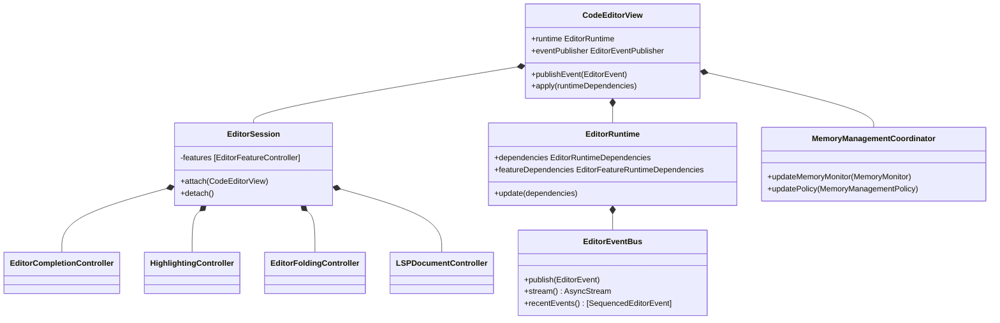

# Core Components Class Diagram

The public editor view remains the integration surface, while lifecycle and mutable feature ownership live in an internal session of focused controllers.

```mermaid
classDiagram
    class CodeEditorView {
        +runtime EditorRuntime
        +eventPublisher EditorEventPublisher
        +publishEvent(EditorEvent)
        +apply(runtimeDependencies)
    }
    class EditorSession {
        -features [EditorFeatureController]
        +attach(CodeEditorView)
        +detach()
    }
    class EditorCompletionController
    class HighlightingController
    class EditorFoldingController
    class LSPDocumentController
    class EditorRuntime {
        +dependencies EditorRuntimeDependencies
        +featureDependencies EditorFeatureRuntimeDependencies
        +update(dependencies)
    }
    class EditorEventBus {
        +publish(EditorEvent)
        +stream() AsyncStream
        +recentEvents() [SequencedEditorEvent]
    }
    class MemoryManagementCoordinator {
        +updateMemoryMonitor(MemoryMonitor)
        +updatePolicy(MemoryManagementPolicy)
    }

    CodeEditorView *-- EditorSession
    EditorSession *-- EditorCompletionController
    EditorSession *-- HighlightingController
    EditorSession *-- EditorFoldingController
    EditorSession *-- LSPDocumentController
    CodeEditorView *-- EditorRuntime
    EditorRuntime *-- EditorEventBus
    CodeEditorView *-- MemoryManagementCoordinator
```
