# Service Architecture Diagram

This diagram shows the service-oriented architecture and how services interact within the CodeEditorPlugin framework.

```mermaid
classDiagram
    direction LR
    
    %% Top Row - Central Registry & Core Services
    class EditorRuntime {
        &lt;&lt;dependency injection&gt;&gt;
        -services Dictionary&lt;String, Any&gt;
        -eventSystem UnifiedEventSystem
        -coordinator MemoryManagementCoordinator
        +register()
        +resolve()
        +initialize()
        +shutdown()
        +configureForEditor()
        +getServiceStatus()
        +clearAllCaches()
        +resetAllServices()
    }

    %% Second Row - Core Text & Language Services
    class TextEditingService {
        &lt;&lt;text operations&gt;&gt;
        -textView CodeEditorView
        -undoManager UndoManager
        +performEdit()
        +insertText()
        +deleteText()
        +replaceText()
        +applyIndentation()
    }

    class SyntaxHighlightingService {
        &lt;&lt;syntax coloring&gt;&gt;
        -coordinator SyntaxHighlightingCoordinator
        -cache HighlightingCache
        -queue DispatchQueue
        +highlightDocument()
        +highlightRange()
        +invalidateCache()
    }

    class LanguageDetectionService {
        &lt;&lt;language recognition&gt;&gt;
        -detectors [LanguageDetector]
        -cache Dictionary
        +detectLanguage()
        +registerDetector()
        +clearCache()
    }

    %% Third Row - Enhanced Service Registry (8 Services Total)
    class CompletionProviderRegistry {
        &lt;&lt;completion orchestration&gt;&gt;
        -providers Dictionary&lt;String, CompletionProvider&gt;
        -universalProvider UniversalCompletionProvider
        -activeSession CompletionSession?
        -debouncer Debouncer
        +requestCompletions()
        +registerProvider()
        +unregisterProvider()
        +cancelActiveSession()
        +getProvidersForLanguage()
    }

    class LineNumberCalculationService {
        &lt;&lt;line numbering&gt;&gt;
        -textLayoutManager NSTextLayoutManager
        -lineCache LRUCache&lt;LineNumberInfo&gt;
        -coordinator ActorCoordinator
        +calculateLineNumbers()
        +getLineAtPosition()
        +invalidateLineCache()
        +getTotalLines()
        +refreshLineNumbers()
    }

    class GutterSizingService {
        &lt;&lt;gutter layout&gt;&gt;
        -lineNumberService LineNumberCalculationService
        -configuration EditorConfiguration
        -sizingCache Dictionary&lt;String, CGFloat&gt;
        +calculateGutterWidth()
        +updateForLineCount()
        +getGutterComponents()
        +invalidateSizingCache()
    }

    class CodeFoldingCoordinatorService {
        &lt;&lt;code folding&gt;&gt;
        -foldingEngine CodeFoldingEngine
        -lineNumberService LineNumberCalculationService
        -foldingRanges [NSRange]
        -coordinator ActorCoordinator
        +calculateFoldingRanges()
        +toggleFolding()
        +expandAll()
        +collapseAll()
        +getFoldingState()
    }

    %% Fourth Row - New Services & Memory Coordination
    class EditorLayoutService {
        &lt;&lt;layout coordination&gt;&gt;
        -gutterService GutterSizingService
        -textContainer NSTextContainer
        -layoutManager NSTextLayoutManager
        +coordinateLayout()
        +updateTextContainerSize()
        +calculateViewportBounds()
        +optimizeForPerformance()
    }

    class MemoryManagementCoordinator {
        &lt;&lt;central memory coordination&gt;&gt;
        -memoryMonitor MemoryMonitor
        -managedComponents [WeakRef]
        -cacheManager CacheManager
        -coordinator ActorCoordinator
        +registerManagedComponent()
        +handleMemoryWarning()
        +updateMemoryMonitor()
        +getMemoryStats()
        +performCleanup()
    }

    class MemoryMonitor {
        &lt;&lt;resource monitoring&gt;&gt;
        -threshold Double
        -timer Timer?
        -delegate MemoryMonitorDelegate?
        -actorCoordinator ActorCoordinator
        +init(coordinator)
        +startMonitoring()
        +stopMonitoring()
        +currentMemoryUsage()
    }

    class CacheManager {
        &lt;&lt;cache orchestrator&gt;&gt;
        -caches Dictionary
        +syntaxCache Cache
        +completionCache Cache
        +languageCache Cache
        +lineNumberCache Cache
        +gutterSizingCache Cache
        +clearAll()
        +clearExpired()
    }

    %% Fifth Row - Service Coordination & Session Management
    class SyntaxHighlightingCoordinator {
        &lt;&lt;highlighting orchestrator&gt;&gt;
        -highlighters Dictionary
        -swiftSyntaxHighlighter SwiftSyntaxHighlighter?
        -regexHighlighter RegexHighlighter
        +coordinate()
        +selectHighlighter()
    }

    class UniversalCompletionProvider {
        &lt;&lt;completion factory&gt;&gt;
        -providers Dictionary&lt;Language, CompletionProvider&gt;
        -fallbackProvider CompletionProvider
        +createProvider()
        +getProviderForLanguage()
        +registerLanguageProvider()
    }

    class CompletionSession {
        &lt;&lt;completion state&gt;&gt;
        +id UUID
        +context CompletionContext
        +provider CompletionProvider
        +startTime Date
        +items [CompletionItem]
        +isActive Bool
        +cancel()
    }

    class CodeFoldingEngine {
        &lt;&lt;folding logic&gt;&gt;
        -languageHandlers Dictionary
        -foldingPatterns [FoldingPattern]
        +calculateFoldingRanges()
        +isFoldable()
        +getFoldingLevel()
    }

    %% Sixth Row - Provider Protocols & Core Types
    class LanguageDetector {
        &lt;&lt;detection protocol&gt;&gt;
        +detectorName String
        +supportedExtensions [String]
        +confidence Double
        +detectLanguage()
        +canDetect()
    }

    class CompletionProvider {
        &lt;&lt;completion protocol&gt;&gt;
        +providerId String
        +supportedLanguages [String]
        +priority Int
        +provideCompletions()
        +canProvideCompletions()
    }

    class SyntaxHighlighter {
        &lt;&lt;highlighter protocol&gt;&gt;
        +highlighterName String
        +supportedLanguages [String]
        +highlight()
        +highlightRange()
        +canHighlight()
    }

    class LineNumberInfo {
        &lt;&lt;line metadata&gt;&gt;
        +lineNumber Int
        +characterRange NSRange
        +yPosition CGFloat
        +height CGFloat
        +isVisible Bool
    }

    class FoldingPattern {
        &lt;&lt;folding definition&gt;&gt;
        +startPattern String
        +endPattern String
        +language Language
        +foldingType FoldingType
    }

    %% Seventh Row - Highlighter Implementations
    class SwiftSyntaxHighlighter {
        &lt;&lt;Swift AST highlighter&gt;&gt;
        +swiftSyntax SwiftSyntaxAPI
        +colorScheme SyntaxColorScheme
        +highlight()
        +parseSwiftCode()
        +applyColors()
    }

    class RegexHighlighter {
        &lt;&lt;pattern-based highlighter&gt;&gt;
        +patterns Dictionary
        +colorMappings Dictionary
        +highlight()
        +loadPatterns()
        +applyPattern()
    }

    class HighlightingCache {
        &lt;&lt;highlighting cache&gt;&gt;
        +maxSize Int
        +cache LRUCache
        +store()
        +retrieve()
        +invalidate()
        +clear()
    }

    %% Eighth Row - Support Types & Utilities
    class EditAction {
        &lt;&lt;operation types&gt;&gt;
        insert
        delete
        replace
        indent
        outdent
        comment
    }

    class CompletionContext {
        &lt;&lt;completion request&gt;&gt;
        +position NSRange
        +text String
        +language Language?
        +triggerCharacter String?
    }

    class CompletionItem {
        &lt;&lt;completion suggestion&gt;&gt;
        +title String
        +detail String?
        +kind CompletionItemKind
        +insertText String
        +priority Int
    }

    %% Ninth Row - Concurrency & Coordination
    class ActorCoordinator {
        &lt;&lt;concurrency management&gt;&gt;
        +backgroundQueue DispatchQueue
        +mainActor MainActor
        +performAsync()
        +performSync()
        +schedule()
        +create()$ ActorCoordinator
    }

    %% Tenth Row - Basic Support Types
    class Language {
        &lt;&lt;language definition&gt;&gt;
        +identifier String
        +name String
        +fileExtensions [String]
        +supportsCompletion Bool
        +supportsSyntaxHighlighting Bool
    }

    class Debouncer {
        &lt;&lt;timing utility&gt;&gt;
        +delay TimeInterval
        +queue DispatchQueue
        +debounce()
        +cancel()
        +flush()
    }

    class CrossPlatformLogger {
        &lt;&lt;logging&gt;&gt;
        +logLevel LogLevel
        +destinations [LogDestination]
        +log()
        +debug()
        +info()
        +warning()
        +error()
    }

    %% Key Relationships - Enhanced 8-Service Architecture
    
    %% Registry manages all 8 services
    EditorRuntime *-- TextEditingService : manages
    EditorRuntime *-- SyntaxHighlightingService : manages
    EditorRuntime *-- LanguageDetectionService : manages
    EditorRuntime *-- CompletionProviderRegistry : manages
    EditorRuntime *-- LineNumberCalculationService : manages
    EditorRuntime *-- GutterSizingService : manages
    EditorRuntime *-- CodeFoldingCoordinatorService : manages
    EditorRuntime *-- EditorLayoutService : manages
    
    %% Central coordination
    EditorRuntime --> MemoryManagementCoordinator : coordinates
    
    %% Service dependencies and relationships
    GutterSizingService --> LineNumberCalculationService : depends on
    EditorLayoutService --> GutterSizingService : coordinates
    CodeFoldingCoordinatorService --> LineNumberCalculationService : uses
    CodeFoldingCoordinatorService --> CodeFoldingEngine : coordinates
    
    %% Memory management coordination
    MemoryManagementCoordinator --> MemoryMonitor : manages
    MemoryManagementCoordinator --> CacheManager : coordinates
    MemoryManagementCoordinator --> ActorCoordinator : uses
    
    %% Core service relationships
    TextEditingService --> EditAction : uses
    
    SyntaxHighlightingService --> SyntaxHighlightingCoordinator : uses
    SyntaxHighlightingService --> HighlightingCache : uses
    SyntaxHighlightingCoordinator --> SyntaxHighlighter : coordinates
    SyntaxHighlighter <|-- SwiftSyntaxHighlighter : implements
    SyntaxHighlighter <|-- RegexHighlighter : implements
    
    LanguageDetectionService --> LanguageDetector : uses
    LanguageDetectionService --> Language : detects
    
    CompletionProviderRegistry --> UniversalCompletionProvider : uses
    CompletionProviderRegistry --> CompletionSession : creates
    CompletionProviderRegistry --> CompletionProvider : manages
    CompletionProviderRegistry --> CompletionContext : creates
    CompletionProviderRegistry --> CompletionItem : provides
    CompletionProviderRegistry --> Debouncer : uses
    UniversalCompletionProvider --> CompletionProvider : creates
    
    LineNumberCalculationService --> LineNumberInfo : creates
    LineNumberCalculationService --> ActorCoordinator : uses
    
    CodeFoldingEngine --> FoldingPattern : uses
    
    %% Memory monitor coordination
    MemoryMonitor --> ActorCoordinator : uses
    
    %% Styling - Light/Dark mode compatible colors
    classDef registry fill:#007AFF20,stroke:#007AFF,stroke-width:3px,color:#1D1D1F
    classDef service fill:#AF52DE20,stroke:#AF52DE,stroke-width:2px,color:#1D1D1F
    classDef coordinator fill:#34C75920,stroke:#34C759,stroke-width:2px,color:#1D1D1F
    classDef support fill:#FF950020,stroke:#FF9500,stroke-width:2px,color:#1D1D1F
    classDef enum fill:#007AFF20,stroke:#007AFF,stroke-width:2px,color:#1D1D1F
    classDef protocol fill:#FF3B3020,stroke:#FF3B30,stroke-width:2px,color:#1D1D1F
    classDef cache fill:#8E8E9320,stroke:#8E8E93,stroke-width:2px,color:#1D1D1F
    classDef highlighting fill:#34C75920,stroke:#34C759,stroke-width:2px,color:#1D1D1F
    classDef completion fill:#007AFF20,stroke:#007AFF,stroke-width:2px,color:#1D1D1F
    
    class EditorRuntime registry
    class TextEditingService service
    class SyntaxHighlightingService service
    class LanguageDetectionService service
    class CompletionProviderRegistry service
    class LineNumberCalculationService service
    class GutterSizingService service
    class CodeFoldingCoordinatorService service
    class EditorLayoutService service
    class MemoryManagementCoordinator coordinator
    class MemoryMonitor service
    class SyntaxHighlightingCoordinator coordinator
    class UniversalCompletionProvider coordinator
    class CompletionSession coordinator
    class CodeFoldingEngine coordinator
    class CacheManager support
    class Debouncer support
    class CrossPlatformLogger support
    class EditAction enum
    class CompletionItemKind enum
    class SyntaxTokenType enum
    class FoldingType enum
    class LanguageDetector protocol
    class CompletionProvider protocol
    class MemoryMonitorDelegate protocol
    class SyntaxHighlighter protocol
    class HighlightingCache cache
    class Cache cache
    class CacheEntry cache
    class HighlightingRequest highlighting
    class HighlightingResult highlighting
    class SwiftSyntaxHighlighter highlighting
    class RegexHighlighter highlighting
    class SyntaxToken highlighting
    class CompletionContext completion
    class CompletionItem completion
    class Language completion
    class LineNumberInfo completion
    class FoldingPattern completion
    class ActorCoordinator coordinator
```

## Service Architecture Principles

### Enhanced 8-Service Architecture

The CodeEditorPlugin framework now implements a sophisticated service architecture with **8 core services** managed through a central registry pattern with enhanced memory coordination and dependency management.

#### Core Services (8 Total)

1. **TextEditingService** - Text manipulation and editing operations
2. **SyntaxHighlightingService** - Syntax highlighting coordination
3. **LanguageDetectionService** - Language detection and configuration
4. **CompletionProviderRegistry** - Code completion orchestration (replaces CompletionManager)
5. **LineNumberCalculationService** - Line numbering calculations and caching
6. **GutterSizingService** - Gutter layout and sizing calculations
7. **CodeFoldingCoordinatorService** - Code folding state management
8. **EditorLayoutService** - Overall editor layout coordination

#### Key Architectural Patterns

1. **Enhanced Service Registry**: Central registry with **configureForEditor()**, **getServiceStatus()**, **clearAllCaches()**, and **resetAllServices()** methods
2. **Memory Management Coordination**: **MemoryManagementCoordinator** provides centralized memory oversight and cleanup coordination
3. **Dependency Injection**: All services receive dependencies through constructor injection - **no singletons**
4. **Service Interdependencies**: 
   - GutterSizingService → LineNumberCalculationService
   - EditorLayoutService → GutterSizingService  
   - CodeFoldingCoordinatorService → LineNumberCalculationService + CodeFoldingEngine
5. **Event-Driven Communication**: Services communicate through UnifiedEventSystem
6. **Enhanced Caching**: Extended cache manager with specialized caches (line numbers, gutter sizing, etc.)
7. **Async Operations**: Heavy operations coordinated through ActorCoordinator
8. **Memory Optimization**: Automatic cleanup via MemoryManagementCoordinator with weak reference management
