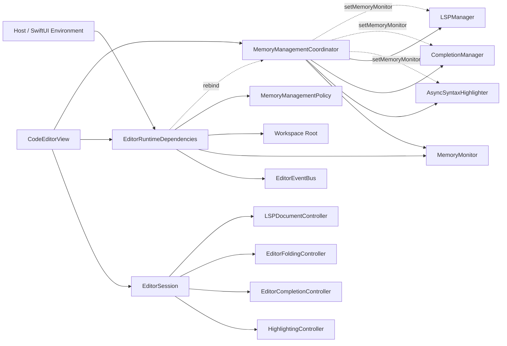

# Service Architecture Diagram

Runtime infrastructure is replaceable without recreating feature owners. `MemoryManagementCoordinator` rebinds monitor-aware components, and `EditorSession` owns attach/detach order.

