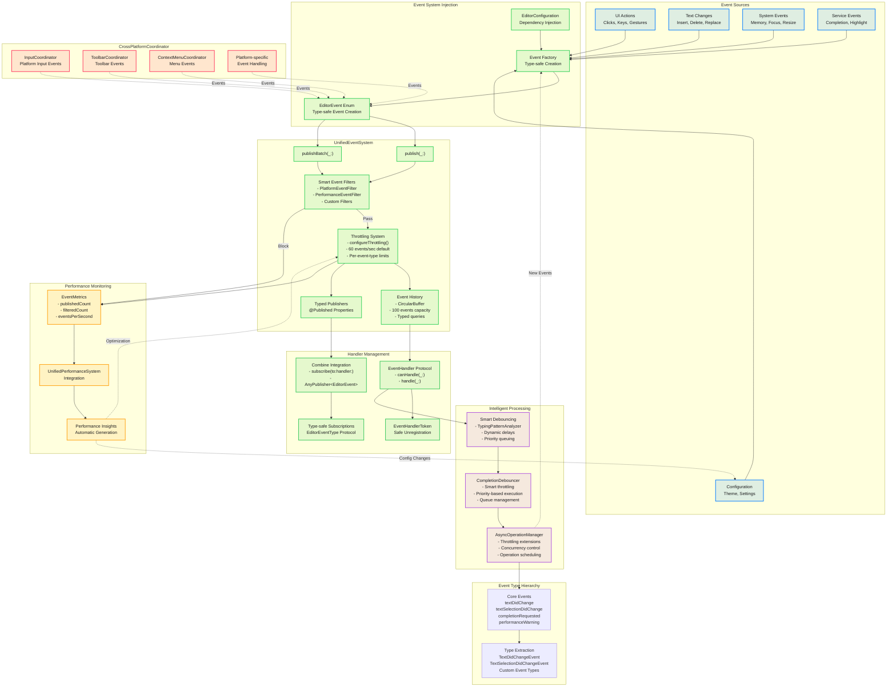

# Event System Flow Diagram

This diagram illustrates the enhanced unified event system with modern async processing and performance monitoring.



## Event System Code Examples

### Modern Event Definition
```swift
// Type-safe EditorEvent enum
public enum EditorEvent: Sendable {
    case textDidChange(String)
    case textWillChange(range: NSRange, replacement: String)
    case textSelectionDidChange(NSRange)
    case completionRequested(context: CompletionContext)
    case completionItemSelected(any CompletionItemView)
    case performanceWarning(message: String)
    case error(Error)
}
```

### Dependency Injection Setup
```swift
// Modern dependency injection approach
let eventSystem = UnifiedEventSystem()
var config = EditorConfiguration()
config.eventSystem = eventSystem

// SwiftUI integration
CodeEditor(text: $code)
    .eventSystem(eventSystem)
    .environment(\.codeEditorConfiguration, config)
```

### Type-Safe Event Handling
```swift
// Type-safe event subscription
let cancellable = eventSystem.subscribe(to: TextDidChangeEvent.self) { event in
    print("Text changed: \(event.text)")
}

// Protocol-based handler registration
struct MyEventHandler: EventHandler {
    func canHandle(_ event: EditorEvent) -> Bool {
        switch event {
        case .textDidChange, .textSelectionDidChange:
            return true
        default:
            return false
        }
    }

    func handle(_ event: EditorEvent) {
        switch event {
        case .textDidChange(let text):
            // Handle text change
            break
        case .textSelectionDidChange(let range):
            // Handle selection change
            break
        default:
            break
        }
    }
}

let token = eventSystem.registerHandler(MyEventHandler())
```

### Enhanced Event Publishing
```swift
// Modern event publishing
eventSystem.publish(.textDidChange("new text content"))

// Batch publishing for efficiency
let events: [EditorEvent] = [
    .textDidChange("content"),
    .textSelectionDidChange(NSRange(location: 0, length: 7))
]
eventSystem.publishBatch(events)

// Direct publishing from CodeEditorView
codeEditorView.publishEvent(.completionRequested(context: context))
```

### Smart Event Filtering and Throttling
```swift
// Configure throttling for performance
eventSystem.configureThrottling(maxEventsPerSecond: 30)

// Custom event filters
struct DebugEventFilter: EventFilter {
    func shouldAllow(_ event: EditorEvent) -> Bool {
        #if DEBUG
        return true
        #else
        // Filter out debug events in release builds
        switch event {
        case .performanceWarning:
            return false
        default:
            return true
        }
        #endif
    }
}

eventSystem.addFilter(DebugEventFilter())
```

### Completion System Integration
```swift
// Smart debouncing with typing pattern analysis
let debouncer = CompletionDebouncer()
debouncer.enableSmartDebouncing = true
debouncer.debounceDelay = 0.3

debouncer.requestCompletions(
    for: context,
    priority: .high
) { result in
    switch result {
    case .success(let completions):
        // Handle completions
        break
    case .failure(let error):
        // Handle error
        break
    }
}
```

### Performance Monitoring Integration
```swift
// Event metrics tracking
let metrics = eventSystem.getMetrics()
print("Events per second: \(metrics.eventsPerSecond)")
print("Total published: \(metrics.publishedCount)")
print("Filtered count: \(metrics.filteredCount)")

// Event history queries
let recentTextEvents = eventSystem.getEvents(
    ofType: TextDidChangeEvent.self,
    limit: 5
)

// Performance optimization based on metrics
if metrics.eventsPerSecond > 50 {
    eventSystem.configureThrottling(maxEventsPerSecond: 30)
}
```

## Enhanced Key Features

### Core Event System
1. **Type-Safe Events**: Strongly-typed `EditorEvent` enum with associated values
2. **Dependency Injection**: Event system injected via `EditorConfiguration.eventSystem`
3. **Combine Integration**: Native support for reactive programming patterns
4. **Batch Publishing**: Efficient `publishBatch(_:)` for multiple events

### Performance & Throttling
5. **Smart Throttling**: Configurable per-event-type throttling (default: 60 events/sec)
6. **Event History**: Circular buffer storing last 100 events with typed queries
7. **Performance Metrics**: Real-time tracking of event throughput and filtering
8. **Memory-Efficient**: Automatic cleanup and bounded history storage

### Advanced Processing
9. **Smart Debouncing**: Typing pattern analysis with dynamic delay adjustment
10. **Priority Queuing**: Completion requests with `immediate`, `high`, `normal`, `low` priorities
11. **Async Operation Management**: Integration with `AsyncOperationManager` for concurrency control
12. **Error Recovery**: Comprehensive error handling with recoverable error patterns

### Cross-Platform Support
13. **Platform Event Filtering**: `PlatformEventFilter` for platform-specific event handling
14. **Coordinator Integration**: Events from `InputCoordinator`, `ToolbarCoordinator`, `ContextMenuCoordinator`
15. **Platform Abstraction**: Unified event handling across macOS and iOS

### Developer Experience
16. **Token-Based Unregistration**: Safe handler cleanup with `EventHandlerToken`
17. **Type Extraction**: `EditorEventType` protocol for type-safe event filtering
18. **Debugging Support**: Event history inspection and performance insights
19. **SwiftUI Integration**: Environment-based configuration and typed publishers

### Performance Optimization
20. **Automatic Optimization**: Integration with `UnifiedPerformanceSystem` for adaptive throttling
21. **Smart Filtering**: Multiple filter layers including performance and platform filters
22. **Typing Pattern Analysis**: Dynamic debouncing based on user typing behavior
23. **Resource Management**: Automatic cleanup and memory management for long-running applications
