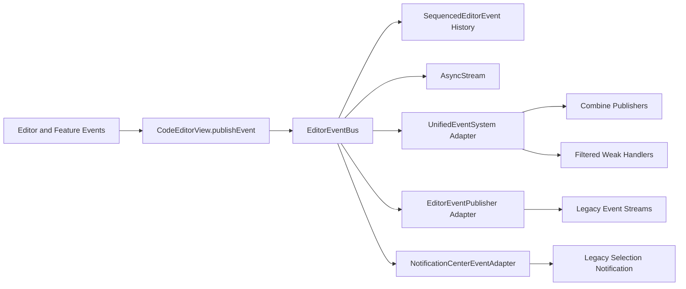

# Event System Flow Diagram

`EditorEventBus` is the single ordered publication point. Combine, the legacy publisher, weak handlers, and `NotificationCenter` are projections from that bus rather than independent sources.

All adapters observe the same sequence, so one editor action results in one canonical bus publication.
