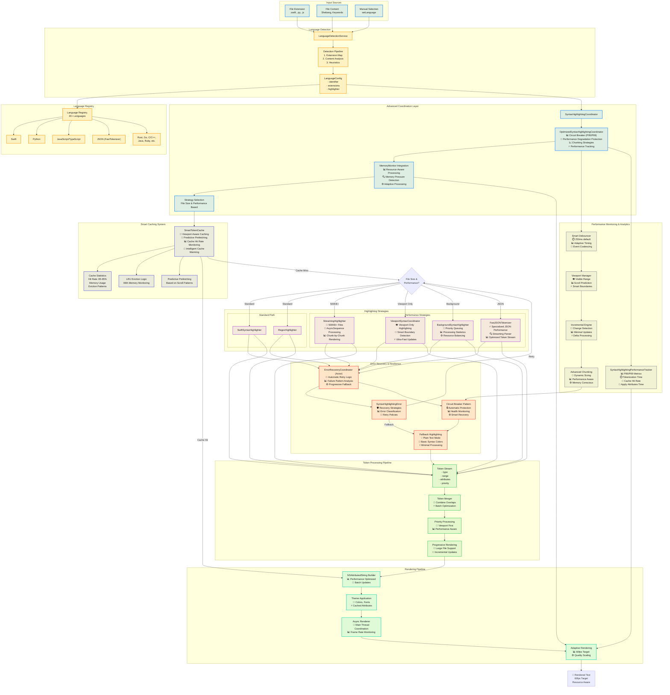

# Language Support & Syntax Highlighting Pipeline

This diagram shows the complete pipeline for language detection and syntax highlighting, including both SwiftSyntax and regex-based paths, with sophisticated performance optimization capabilities including multiple highlighting strategies, intelligent caching, error recovery, and comprehensive monitoring.



## Language Configuration Example

```swift
struct LanguageConfig {
    let identifier: String
    let displayName: String
    let fileExtensions: [String]
    let highlighterType: HighlighterType
    let completionProvider: CompletionProvider?
    let indentationRules: IndentationRules
    let performanceProfile: PerformanceProfile
}

enum HighlighterType {
    case swiftSyntax
    case regex(patterns: LanguagePatterns)
    case streaming(chunkSize: Int)
    case fastJSON
    case viewport(boundaries: ViewportBoundaries)
}

struct PerformanceProfile {
    let maxFileSize: Int
    let preferredStrategy: HighlightingStrategy
    let fallbackStrategy: HighlightingStrategy
    let circuitBreakerThreshold: TimeInterval
}
```

## Advanced Performance Optimizations

### 1. Multi-Strategy Highlighting System
- **StreamingHighlighter**: AsyncSequence processing for 500KB+ files
- **ViewportSyntaxCoordinator**: Ultra-fast viewport-only highlighting
- **BackgroundSyntaxHighlighter**: Priority queuing with resource balancing
- **FastJSONTokenizer**: Specialized high-performance JSON parsing

### 2. Smart Caching Infrastructure
- **Viewport-Aware Caching**: Intelligently caches based on visible content
- **Predictive Prefetching**: Anticipates user scroll patterns
- **Cache Hit Rate Monitoring**: 85-95% target hit rates with analytics
- **Intelligent Cache Warming**: Proactive caching of likely-to-be-used content
- **LRU Eviction with Memory Monitoring**: Memory-conscious cache management

### 3. Error Recovery & Resilience
- **ErrorRecoveryCoordinator**: Actor-based automatic retry logic
- **Circuit Breaker Patterns**: Automatic protection with P95/P99 monitoring
- **Progressive Fallback System**: Graceful degradation through multiple strategies
- **SyntaxHighlightingError**: Comprehensive error classification and recovery

### 4. Memory Management Integration
- **MemoryMonitor Integration**: Resource-aware processing decisions
- **Memory Pressure Detection**: Automatic adaptation to system constraints
- **Adaptive Processing**: Dynamic adjustment based on available resources
- **Progressive Rendering**: Memory-efficient rendering for large files

### 5. Performance Monitoring & Analytics
- **P95/P99 Metrics**: Advanced percentile tracking for performance optimization
- **Circuit Breaker Monitoring**: Health tracking with automatic recovery
- **Cache Statistics**: Hit rates, memory usage, and eviction pattern analysis
- **Processing Statistics**: Detailed breakdown of tokenization and rendering times

## OptimizedSyntaxHighlightingCoordinator Configuration

```swift
let memoryMonitor = MemoryMonitor()

let coordinator = OptimizedSyntaxHighlightingCoordinator(
    memoryMonitor: memoryMonitor,
    configuration: .performance
)

var configuration = OptimizedSyntaxHighlightingCoordinator.HighlightingConfiguration.default
configuration.enableViewportOptimization = true
configuration.viewportPadding = 500
configuration.maxChunkSize = 5_000
configuration.enableIncrementalHighlighting = true
configuration.cacheWarmingEnabled = true
configuration.circuitBreakerThreshold = 0.1

coordinator.updateConfiguration(configuration)
```

## AsyncSyntaxHighlighter Cache Settings

```swift
let highlighter = AsyncSyntaxHighlighter(memoryMonitor: memoryMonitor)

await highlighter.configureCacheSettings(
    maxCacheSize: 100,
    maxMemoryUsageMB: 50.0,
    staleThreshold: .hours(1)
)
```

## Highlighting Strategy Selection Logic

```swift
func selectHighlightingStrategy(
    fileSize: Int,
    language: LanguageConfig,
    memoryPressure: Double,
    performanceMetrics: PerformanceMetrics
) -> HighlightingStrategy {
    
    // Circuit breaker check
    if performanceMetrics.p95ResponseTime > circuitBreakerThreshold {
        return .fallback(.plainText)
    }
    
    // Memory pressure adaptation
    if memoryPressure > 0.8 {
        return .viewport(boundaries: .conservative)
    }
    
    // File size-based strategy selection
    switch fileSize {
    case 0..<10_000:
        return .standard(language.highlighterType)
        
    case 10_000..<100_000:
        return .background(priority: .normal)
        
    case 100_000..<500_000:
        return .viewport(boundaries: .standard)
        
    case 500_000...:
        return .streaming(chunkSize: largeFileChunkSize)
        
    default:
        return .fallback(.basicSyntax)
    }
}
```

## Error Recovery Strategies

```swift
enum RecoveryStrategy {
    case retry(attempts: Int, backoff: TimeInterval)
    case fallbackToSimpler(strategy: HighlightingStrategy)
    case enableCircuitBreaker(threshold: TimeInterval)
    case reduceQuality(level: QualityLevel)
    case plainTextMode
}

enum SyntaxHighlightingError: Error {
    case parsingTimeout(TimeInterval)
    case memoryPressure(usage: Double)
    case circuitBreakerTripped(threshold: TimeInterval)
    case tokenizationFailure(reason: String)
    
    var recoveryStrategy: RecoveryStrategy {
        switch self {
        case .parsingTimeout(let time) where time < 0.2:
            return .retry(attempts: 2, backoff: 0.1)
        case .memoryPressure(let usage) where usage > 0.9:
            return .fallbackToSimpler(.viewport(boundaries: .minimal))
        case .circuitBreakerTripped:
            return .plainTextMode
        case .tokenizationFailure:
            return .fallbackToSimpler(.basicSyntax)
        default:
            return .enableCircuitBreaker(threshold: 0.05)
        }
    }
}
```
