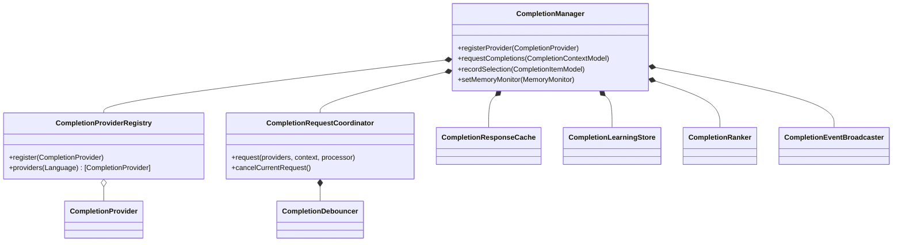

# Completion System Architecture

`CompletionManager` is a compatibility façade over independently owned provider, request, cache, learning, ranking, and event components.

```mermaid
classDiagram
    class CompletionManager {
        +registerProvider(CompletionProvider)
        +requestCompletions(CompletionContextModel)
        +recordSelection(CompletionItemModel)
        +setMemoryMonitor(MemoryMonitor)
    }
    class CompletionProviderRegistry {
        +register(CompletionProvider)
        +providers(Language) [CompletionProvider]
    }
    class CompletionRequestCoordinator {
        +request(providers, context, processor)
        +cancelCurrentRequest()
    }
    class CompletionResponseCache
    class CompletionLearningStore
    class CompletionRanker
    class CompletionEventBroadcaster
    class CompletionDebouncer
    class CompletionProvider

    CompletionManager *-- CompletionProviderRegistry
    CompletionManager *-- CompletionRequestCoordinator
    CompletionManager *-- CompletionResponseCache
    CompletionManager *-- CompletionLearningStore
    CompletionManager *-- CompletionRanker
    CompletionManager *-- CompletionEventBroadcaster
    CompletionRequestCoordinator *-- CompletionDebouncer
    CompletionProviderRegistry o-- CompletionProvider
```
