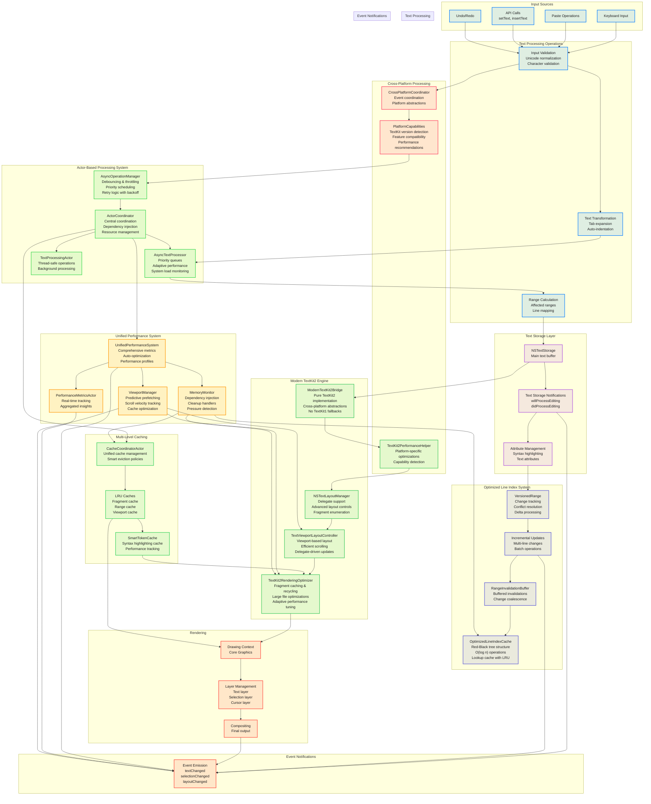

# Text Processing Pipeline

This diagram illustrates the modern TextKit2-based text processing pipeline with sophisticated async processing, comprehensive performance optimization, and intelligent coordination mechanisms based on the latest codebase implementations.



## Modern Architecture Components

### 1. Actor-Based Coordination
```swift
@MainActor
public final class ActorCoordinator {
    public let textProcessor: TextProcessingActor
    public let cacheCoordinator: CacheCoordinatorActor
    public let fileSystem: FileSystemActor
    public let performanceMetrics: PerformanceMetricsActor
    public let documentState: DocumentStateActor
    public let errorRecovery: ErrorRecoveryCoordinator
    
    public func processText(
        _ text: String,
        processorType: TextProcessingActor.TextProcessor.ProcessorType,
        priority: TaskPriority = .high
    ) async throws -> String {
        do {
            return try await textProcessor.process(
                text: text,
                with: processorType,
                priority: priority
            )
        } catch {
            // Auto error recovery with retry logic
            if let recoverableError = error as? any RecoverableAsyncError {
                return try await errorRecovery.recover(from: recoverableError) {
                    try await self.textProcessor.process(
                        text: text,
                        with: processorType,
                        priority: priority
                    )
                }
            }
            throw error
        }
    }
}
```

### 2. Modern TextKit2 Bridge with Cross-Platform Support
```swift
@MainActor
internal class ModernTextKit2Bridge: NSObject {
    private weak var textView: PlatformTextView?
    private var textLayoutManager: NSTextLayoutManager? { textView?.textLayoutManager }
    private var textContentManager: NSTextContentManager? { textLayoutManager?.textContentManager }
    
    init(textView: PlatformTextView) {
        self.textView = textView
        super.init()
        ensureTextKit2Configuration()
    }
    
    private func ensureTextKit2Configuration() {
        // Configure delegate support and advanced layout controls
        textLayoutManager?.delegate = self
        textLayoutManager?.textViewportLayoutController.delegate = self
        textLayoutManager?.limitsLayoutForSuspiciousContents = true
        textLayoutManager?.usesFontLeading = true
    }
    
    func enumerateFragments(
        in textRange: NSTextRange,
        using block: (NSTextLayoutFragment) -> Bool
    ) {
        textLayoutManager?.enumerateTextLayoutFragments(
            from: textRange.location,
            options: [.ensuresLayout, .ensuresExtraLineFragment]
        ) { fragment in
            return block(fragment)
        }
    }
}
```

### 3. Advanced Async Text Processor with System Load Monitoring
```swift
actor AsyncTextProcessor {
    private var processingQueue = PriorityQueue<ProcessingTask>()
    private var activeTasks: [UUID: Task<ProcessingResult, Error>] = [:]
    private var maxConcurrentOperations: Int
    private var currentLoad: ProcessingLoad = .idle
    private var systemLoadMonitor: SystemLoadMonitor?
    private let performanceMonitor = ProcessingPerformanceMonitor()
    private var adaptiveSettings = AdaptiveSettings()
    private let memoryMonitor: MemoryMonitor
    
    @discardableResult
    func submit(
        text: String,
        range: NSRange,
        operation: ProcessingOperation,
        priority: TaskPriority = .normal,
        completion: @Sendable @escaping (Result<ProcessingResult, Error>) -> Void
    ) async -> ProcessingTaskHandle {
        let taskId = UUID()
        let cacheKey = ProcessingCacheKey(text: text, range: range, operation: operation)
        
        // Check cache first with LRU eviction
        let cache = await getCache()
        if let cachedResult = await cache.get(cacheKey) {
            logger.debug("Cache hit for operation: \(operation.name)")
            completion(.success(cachedResult))
            return ProcessingTaskHandle(id: taskId, processor: self)
        }
        
        // Create and enqueue processing task with adaptive batching
        let task = ProcessingTask(/*...*/)
        processingQueue.enqueue(task)
        await processNextTaskIfPossible()
        
        return ProcessingTaskHandle(id: taskId, processor: self)
    }
}
```

### 4. Optimized Line Index System with Red-Black Trees
```swift
public actor OptimizedLineIndexCache {
    private class LineNode {
        var lineStart: Int
        var lineLength: Int
        var subtreeLineCount: Int = 1
        var subtreeCharCount: Int = 0
        var isRed: Bool = true
        weak var parent: LineNode?
        var left: LineNode?
        var right: LineNode?
    }
    
    private var root: LineNode?
    private var lookupCache: [Int: (line: Int, column: Int)] = [:]
    
    /// Returns line and column for character offset - O(log n)
    public func lineAndColumn(for offset: Int) -> (line: Int, column: Int) {
        if let cached = lookupCache[offset] {
            return cached
        }
        
        let line = lineIndexForCharacterOffset(offset)
        let lineStart = characterOffsetForLine(line)
        let column = offset - lineStart
        
        let result = (line: line, column: column)
        
        // LRU cache management
        if lookupCache.count >= maxCacheSize {
            lookupCache.removeAll()
        }
        lookupCache[offset] = result
        
        return result
    }
}
```

### 5. Unified Performance System with Auto-Optimization
```swift
@MainActor
public final class UnifiedPerformanceSystem {
    public static let shared = UnifiedPerformanceSystem()
    
    private var metrics: [PerformanceMetricType: [PerformanceMetric]] = [:]
    private var activeOperations: [UUID: OperationInfo] = [:]
    private var performanceProfiles: [String: PerformanceProfile] = [:]
    
    public func track<T>(
        _ metricType: PerformanceMetricType,
        operation: () async throws -> T
    ) async throws -> T {
        let operationId = UUID()
        let startTime = CFAbsoluteTimeGetCurrent()
        let startMemory = getMemoryUsage()
        
        activeOperations[operationId] = OperationInfo(/*...*/)
        
        do {
            let result = try await operation()
            let endTime = CFAbsoluteTimeGetCurrent()
            let endMemory = getMemoryUsage()
            
            await recordMetric(
                type: metricType,
                duration: endTime - startTime,
                memoryDelta: Int64(endMemory) - Int64(startMemory),
                success: true
            )
            
            return result
        } catch {
            await recordMetric(
                type: metricType,
                duration: CFAbsoluteTimeGetCurrent() - startTime,
                memoryDelta: 0,
                success: false,
                error: error
            )
            throw error
        }
    }
}
```

### 6. Advanced Viewport Manager with Predictive Prefetching
```swift
@MainActor
public final class ViewportManager: ObservableObject {
    @Published public private(set) var viewport: Viewport = .zero
    @Published public private(set) var metrics = ViewportMetrics()
    
    private var scrollVelocity: Double = 0.0
    private var renderingTasks: [UUID: Task<Void, Never>] = [:]
    private let rangeCache: LRUCache<ViewportManagerCacheKey, CachedViewportData>
    
    public func updateViewport() {
        // Calculate scroll velocity for predictive prefetching
        let currentTime = ProcessInfo.processInfo.systemUptime
        let currentPosition = visibleBounds.origin.y
        
        if lastScrollTime > 0 {
            let timeDelta = currentTime - lastScrollTime
            if timeDelta > 0 && timeDelta < 1.0 {
                scrollVelocity = (currentPosition - lastScrollPosition) / timeDelta
            }
        }
        
        // Perform viewport-based rendering
        performViewportRendering()
        
        // Trigger predictive prefetching if scrolling fast
        if abs(scrollVelocity) > 50.0 {
            performPredictivePrefetching()
        }
    }
}
```

## Performance Characteristics

| Operation | Complexity | Modern Optimization |
|-----------|------------|---------------------|
| Text Insertion | O(log n) | Actor-based async processing + Red-Black tree line indexing |
| Line Lookup | O(log n) → O(1) | Red-Black tree with LRU lookup cache + batch operations |
| Syntax Highlight | O(visible) | Viewport-aware rendering + smart token caching |
| Layout | O(viewport) | Predictive prefetching + fragment recycling + adaptive batching |
| Scrolling | O(1) | Velocity tracking + predictive prefetch + viewport caching |
| Range Updates | O(log n) | Delta processing + versioned ranges + change coalescence |
| Memory Management | O(1) | Dependency injection + cleanup handlers + multi-level caching |
| Cross-Platform Operations | O(1) | Platform capability detection + optimized abstractions |

## Advanced Optimizations

### Actor-Based Concurrency
1. **ActorCoordinator**: Central coordination with dependency injection for specialized actors
2. **AsyncTextProcessor**: Priority-based task queues with system load monitoring
3. **TextProcessingActor**: Thread-safe background processing with error recovery
4. **CacheCoordinatorActor**: Unified cache management with smart eviction policies
5. **PerformanceMetricsActor**: Real-time performance tracking with aggregated insights

### Unified Performance System
6. **UnifiedPerformanceSystem**: Comprehensive metrics tracking with auto-optimization
7. **Performance Profiles**: Adaptive configurations based on system conditions (low memory, high latency, CPU intensive)
8. **Automatic Recommendations**: AI-driven performance optimization suggestions
9. **Real-Time Health Monitoring**: Continuous system health assessment with issue detection

### Advanced TextKit2 Integration
10. **ModernTextKit2Bridge**: Pure TextKit2 implementation with cross-platform abstractions
11. **TextKit2RenderingOptimizer**: Fragment caching, recycling, and large file optimizations
12. **TextKit2PerformanceHelper**: Platform-specific optimizations with capability detection
13. **Delegate-Driven Updates**: Fine-grained control over layout behavior with viewport coordination

### Optimized Data Structures
14. **OptimizedLineIndexCache**: Red-Black tree for O(log n) line operations with LRU caching
15. **VersionedRange**: Conflict-free concurrent updates with sophisticated change tracking
16. **Multi-Level Caching**: Fragment cache, range cache, viewport cache with unified coordination
17. **Smart Token Cache**: Syntax highlighting cache with performance tracking and adaptive sizing

### Advanced Viewport Management
18. **Predictive Prefetching**: ViewportManager with scroll velocity tracking and content anticipation
19. **Adaptive Rendering**: Dynamic fragment management based on scroll patterns and system load
20. **Cache Optimization**: Viewport-aware caching with intelligent prefetch boundaries
21. **Performance Budgets**: 60fps rendering targets with automatic fallback strategies

### Cross-Platform Excellence
22. **PlatformCapabilities**: Runtime detection of TextKit2 support and feature availability
23. **CrossPlatformCoordinator**: Unified event coordination across macOS and iOS
24. **Platform Abstractions**: Seamless text processing across different Apple platforms
25. **Capability-Driven Optimization**: Automatic feature enablement based on platform capabilities

### Memory Management Innovation
26. **Dependency Injection**: MemoryMonitor instances injected through configuration for better testability
27. **Cleanup Handlers**: Hierarchical cleanup with priority-based resource management
28. **Pressure Detection**: Proactive memory pressure handling with automatic cache reduction
29. **Multi-Component Coordination**: Unified memory management across all text processing components

### Async Operations Excellence
30. **AsyncOperationManager**: Advanced debouncing, throttling, and retry logic with exponential backoff
31. **Priority Scheduling**: Critical operations prioritized over background tasks
32. **Cancellation Support**: Proper task cancellation with resource cleanup
33. **System Load Adaptation**: Dynamic concurrency adjustment based on system conditions