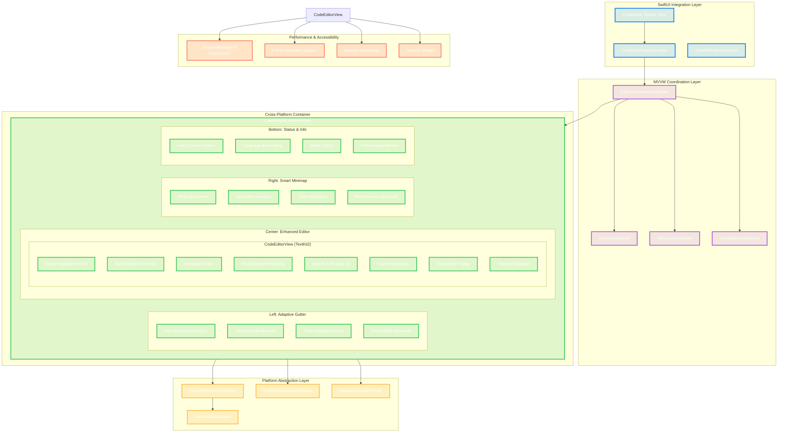

# UI Component Hierarchy

This diagram shows the comprehensive visual component hierarchy and architecture of the CodeEditorKit, featuring modern SwiftUI integration, cross-platform abstractions, and MVVM patterns.

```mermaid
classDiagram
    direction LR
    
    %% SwiftUI Integration Layer
    class CodeEditor {
        &lt;&lt;SwiftUI View&gt;&gt;
        +text Binding~String~
        +language Language
        +theme Theme
        +configuration EditorConfiguration
        +memoryMonitor MemoryMonitor
        +onTextChange ((String) -> Void)?
        +onSelectionChange ((Range~String.Index~?) -> Void)?
        +completionProvider CompletionProvider?
        +body some View
    }

    class CodeEditorRepresentable {
        &lt;&lt;UIViewRepresentable/NSViewRepresentable&gt;&gt;
        +makeUIView(context:) CodeEditorContainerView
        +updateUIView(_:context:) Void
        +makeCoordinator() CodeEditorCoordinator
    }

    class CodeEditorEnvironment {
        &lt;&lt;SwiftUI Environment&gt;&gt;
        +configuration EditorConfiguration
        +language Language
        +theme Theme
        +eventSystem UnifiedEventSystem?
        +memoryMonitor MemoryMonitor?
    }

    %% MVVM Layer
    class EditorContainerViewModel {
        &lt;&lt;@Observable ViewModel&gt;&gt;
        +editorState EditorState
        +componentVisibility ComponentVisibility
        +configuration EditorConfiguration
        +layoutFrames ComponentFrames?
        +errorMessage String?
        +isLoading Bool
        +statusText String
        +configure(with:) Void
        +updateConfiguration(_:) Void
        +updateLayout(containerBounds:animated:) Void
    }

    class GutterViewModel {
        &lt;&lt;@Observable ViewModel&gt;&gt;
        +visibleLineNumbers [Int]
        +breakpoints Set~Int~
        +foldedRanges [NSRange]
        +currentLine Int
        +updateFrame(_:animated:) Void
        +textDidChange(_:) Void
        +selectionDidChange(_:) Void
    }

    class MinimapViewModel {
        &lt;&lt;@Observable ViewModel&gt;&gt;
        +minimapData MinimapData?
        +viewportRect CGRect
        +updateFrame(_:animated:) Void
        +scrollPositionDidChange(_:) Void
    }

    class CompletionViewModel {
        &lt;&lt;@Observable ViewModel&gt;&gt;
        +completionItems [CompletionItem]
        +selectedIndex Int
        +isVisible Bool
        +popupLocation CGPoint
        +showPopup(at:) Void
        +hidePopup() Void
    }

    %% Container and Core Views
    class CodeEditorContainerView {
        &lt;&lt;Cross-Platform Container&gt;&gt;
        +textView CodeEditorView
        +gutterView GutterView
        +minimapView MinimapView
        +contentView EditorContentView
        +configuration EditorConfiguration
        +businessLogicServices EditorRuntime
        +layoutViews() Void
        +applyConfiguration() Void
    }

    class CodeEditorView {
        &lt;&lt;TextKit2 Editor&gt;&gt;
        +language Language
        +memoryMonitor MemoryMonitor
        +businessLogicServices EditorRuntime
        +textKitBridge TextKitBridge
        +viewportManager ViewportManager
        +setupAccessibility() Void
        +applyDynamicTypeScaling() Void
    }

    %% Cross-Platform Abstractions
    class CrossPlatformCoordinator {
        &lt;&lt;Platform Coordinator&gt;&gt;
        +inputCoordinator InputCoordinator
        +toolbarCoordinator ToolbarCoordinator
        +contextMenuCoordinator ContextMenuCoordinator
        +platformAdjustments PlatformAdjustments
        +optimizeTextView(_:) Void
        +createToolbarItems() [ToolbarItem]
        +handlePlatformInput(_:in:) Bool
    }

    class PlatformCapabilities {
        &lt;&lt;Capability Detection&gt;&gt;
        +currentPlatform Platform
        +textKitCapabilities TextKitCapabilities
        +uiCapabilities UICapabilities
        +performanceCapabilities PerformanceCapabilities
        +inputCapabilities InputCapabilities
        +isFeatureAvailable(_:) Bool
        +recommendedConfiguration() EditorConfiguration
    }

    %% Gutter Components
    class GutterView {
        &lt;&lt;Cross-Platform Gutter&gt;&gt;
        +textView CodeEditorView?
        +renderer GutterViewRenderer
        +interactionHandler GutterInteractionHandler
        +setNeedsDisplayLineNumbers() Void
        +drawLineNumbers(in:) Void
        +setupAccessibility() Void
        +updateAccessibilityElements() Void
    }

    class GutterViewRenderer {
        &lt;&lt;Rendering Engine&gt;&gt;
        +draw(in:context:textView:gutterBounds:fillBackground:) Void
        +drawLineNumber(_:at:context:) Void
        +drawFoldingControl(at:context:) Void
        +drawBreakpoint(at:context:) Void
    }

    class GutterInteractionHandler {
        &lt;&lt;Interaction Handler&gt;&gt;
        +handleMouseDown(with:) Bool
        +handleTap(_:) Bool
        +handleFoldingToggle(at:) Bool
        +handleBreakpointToggle(at:) Bool
    }

    %% Minimap Components
    class MinimapView {
        &lt;&lt;Protocol MinimapViewProtocol&gt;&gt;
        +configuration MinimapConfiguration
        +data MinimapData?
        +onNavigate ((Int) -> Void)?
        +updateData(_:) Void
        +lineNumber(at:) Int?
    }

    class AppKitMinimapView {
        &lt;&lt;macOS Implementation&gt;&gt;
        +draw(_:) Void
        +mouseDown(with:) Void
        +updateTrackingAreas() Void
    }

    class UIKitMinimapView {
        &lt;&lt;iOS Implementation&gt;&gt;
        +draw(_:) Void
        +handleTap(_:) Void
    }

    class MinimapDataProvider {
        &lt;&lt;Data Provider&gt;&gt;
        +generateData() MinimapData?
        +getVisibleLineRange(textView:totalLines:) Range~Int~
    }

    %% Layout and Performance
    class AdaptiveLayoutProvider {
        &lt;&lt;Adaptive Layout System&gt;&gt;
        +sectionSpacing(for:) CGFloat
        +controlSpacing(for:) CGFloat
        +fontSize(base:for:) CGFloat
        +isCompactLayout(for:) Bool
        +cornerRadius(for:) CGFloat
    }

    class ViewportManager {
        &lt;&lt;Performance Optimization&gt;&gt;
        +viewport Viewport
        +metrics ViewportMetrics
        +memoryMonitor MemoryMonitor
        +rangeCache LRUCache
        +updateViewport() Void
        +performViewportRendering() Void
        +getOptimizationHints() [OptimizationHint]
    }

    class UnifiedDrawingCoordinator {
        &lt;&lt;Cross-Platform Drawing&gt;&gt;
        +currentContext() CGContext?
        +setNeedsDisplay(for:) Void
        +drawMinimapLine(_:at:font:color:maxWidth:) Void
        +drawViewportIndicator(in:backgroundColor:borderColor:borderWidth:) Void
        +calculateVisibleTextRect(for:) CGRect
    }

    %% Text Processing Layer
    class TextKitBridge {
        &lt;&lt;TextKit Abstraction&gt;&gt;
        +visibleRange NSRange?
        +ensureLayout(for:) Void
        +createTextKitBridge() TextKitBridge
    }

    class ModernTextKit2Bridge {
        &lt;&lt;TextKit2 Implementation&gt;&gt;
        +textLayoutManager NSTextLayoutManager
        +textContentStorage NSTextContentStorage
        +performTextOperations() Void
    }

    %% Accessibility Support
    class AccessibilitySupport {
        &lt;&lt;Cross-Platform A11y&gt;&gt;
        +setupAccessibility() Void
        +updateAccessibilityLabel() Void
        +announceChange(_:) Void
        +applyDynamicTypeScaling() Void
        +updateAccessibilityElements() Void
    }

    class LineNumberAccessibilityElement {
        &lt;&lt;A11y Element&gt;&gt;
        +lineNumber Int
        +accessibilityFrame CGRect
        +accessibilityActivate() Bool
        +jumpToLine() Void
    }

    %% State Management
    class EditorState {
        &lt;&lt;State Container&gt;&gt;
        +isEditing Bool
        +hasUnsavedChanges Bool
        +lineCount Int
        +characterCount Int
        +selectedRange NSRange
        +visibleRange NSRange
        +scrollPosition CGPoint
    }

    class ComponentVisibility {
        &lt;&lt;Visibility State&gt;&gt;
        +showGutter Bool
        +isMinimapVisible Bool
        +showScrollbar Bool
        +showStatusBar Bool
        +showCompletionPopup Bool
    }

    %% Relationships - SwiftUI Layer
    CodeEditor --> CodeEditorRepresentable : uses
    CodeEditor --> CodeEditorEnvironment : reads
    CodeEditorRepresentable --> CodeEditorContainerView : creates
    
    %% Relationships - MVVM Layer
    CodeEditorContainerView --> EditorContainerViewModel : managed by
    EditorContainerViewModel --> GutterViewModel : owns
    EditorContainerViewModel --> MinimapViewModel : owns
    EditorContainerViewModel --> CompletionViewModel : owns
    EditorContainerViewModel --> EditorState : maintains
    EditorContainerViewModel --> ComponentVisibility : controls
    
    %% Relationships - Core Components
    CodeEditorContainerView *-- CodeEditorView : contains
    CodeEditorContainerView *-- GutterView : contains
    CodeEditorContainerView *-- MinimapView : contains
    
    %% Relationships - Platform Abstractions
    CodeEditorView --> CrossPlatformCoordinator : uses
    CrossPlatformCoordinator --> PlatformCapabilities : queries
    CodeEditorView --> ViewportManager : manages
    ViewportManager --> TextKitBridge : coordinates
    
    %% Relationships - Gutter
    GutterView --> GutterViewRenderer : uses
    GutterView --> GutterInteractionHandler : uses
    GutterView --> GutterViewModel : binds to
    GutterView --> AccessibilitySupport : implements
    GutterView --> LineNumberAccessibilityElement : creates
    
    %% Relationships - Minimap
    MinimapView <|-- AppKitMinimapView : implements
    MinimapView <|-- UIKitMinimapView : implements
    MinimapView --> MinimapDataProvider : uses
    MinimapView --> MinimapViewModel : binds to
    
    %% Relationships - Text Processing
    CodeEditorView --> TextKitBridge : uses
    TextKitBridge <|-- ModernTextKit2Bridge : implements
    CodeEditorView --> AccessibilitySupport : implements
    
    %% Relationships - Layout and Drawing
    CodeEditorContainerView --> AdaptiveLayoutProvider : uses
    GutterView --> UnifiedDrawingCoordinator : uses
    MinimapView --> UnifiedDrawingCoordinator : uses

    %% Styling - Modern Dark Mode Theme
    classDef swiftui fill:#007AFF15,stroke:#007AFF,stroke-width:3px,color:#1D1D1F
    classDef mvvm fill:#AF52DE15,stroke:#AF52DE,stroke-width:3px,color:#1D1D1F
    classDef container fill:#34C75915,stroke:#34C759,stroke-width:3px,color:#1D1D1F
    classDef platform fill:#FF9F0A15,stroke:#FF9F0A,stroke-width:2px,color:#1D1D1F
    classDef component fill:#5AC8FA15,stroke:#5AC8FA,stroke-width:2px,color:#1D1D1F
    classDef accessibility fill:#30D15815,stroke:#30D158,stroke-width:2px,color:#1D1D1F
    classDef text fill:#FF453A15,stroke:#FF453A,stroke-width:2px,color:#1D1D1F
    classDef state fill:#BF5AF215,stroke:#BF5AF2,stroke-width:2px,color:#1D1D1F
    
    %% Apply styles
    class CodeEditor swiftui
    class CodeEditorRepresentable swiftui
    class CodeEditorEnvironment swiftui
    
    class EditorContainerViewModel mvvm
    class GutterViewModel mvvm
    class MinimapViewModel mvvm
    class CompletionViewModel mvvm
    
    class CodeEditorContainerView container
    class CodeEditorView container
    
    class CrossPlatformCoordinator platform
    class PlatformCapabilities platform
    class AdaptiveLayoutProvider platform
    class UnifiedDrawingCoordinator platform
    
    class GutterView component
    class MinimapView component
    class AppKitMinimapView component
    class UIKitMinimapView component
    class ViewportManager component
    
    class AccessibilitySupport accessibility
    class LineNumberAccessibilityElement accessibility
    
    class TextKitBridge text
    class ModernTextKit2Bridge text
    
    class EditorState state
    class ComponentVisibility state
```

## Modern Layout Architecture

## Architecture Enhancements

### 1. SwiftUI Integration Improvements

**Modern Declarative API**
- **CodeEditor SwiftUI View**: Native SwiftUI interface with declarative configuration
- **Environment-Based Configuration**: Uses SwiftUI environment system for consistent theming
- **Reactive State Management**: Leverages @Observable for real-time UI updates
- **Modifier Chains**: Fluent API for inline configuration (`.lineNumbers(true).codeLanguage(.swift)`)

**Key Features**:
- Direct SwiftUI bindings with automatic text synchronization
- Custom environment values for configuration injection
- SwiftUI preview support for development
- Seamless integration with SwiftUI view hierarchies

### 2. Cross-Platform UI Component Abstractions

**Unified Platform Layer**
- **PlatformCapabilities**: Runtime feature detection across macOS and iOS
- **CrossPlatformCoordinator**: Centralized platform-specific behavior coordination
- **UnifiedDrawingCoordinator**: Consistent drawing APIs across platforms
- **AdaptiveLayoutProvider**: Dynamic Type and device-adaptive layouts

**Platform-Specific Implementations**:
- Separate AppKit and UIKit implementations for optimal native experience
- Automatic capability detection and feature availability
- Platform-optimized input handling (mouse, touch, keyboard)
- Native context menu and toolbar integration

### 3. Platform-Specific View Controllers and Coordinators

**Specialized Coordinators**
- **InputCoordinator**: Handles keyboard, mouse, touch, and Apple Pencil input
- **ToolbarCoordinator**: Manages platform-appropriate toolbar creation
- **ContextMenuCoordinator**: Creates native context menus with proper actions
- **ObserverStore**: Thread-safe notification observer management

**Enhanced Container Management**:
- Dependency injection for all services through EditorRuntime
- Proper memory management with weak references and automatic cleanup
- Platform-specific optimizations for performance and user experience

### 4. Enhanced Accessibility Support

**Comprehensive A11y Implementation**
- **Full VoiceOver/Voice Control Support**: Custom accessibility elements for all components
- **Dynamic Type Integration**: Automatic font scaling with layout adjustments
- **Accessibility Actions**: Jump-to-line, code navigation, and text manipulation
- **Screen Reader Optimizations**: Intelligent content descriptions and navigation hints

**Advanced Features**:
- Line-by-line accessibility elements in gutter
- Smart text announcements for code changes
- Accessibility-aware color schemes and contrast
- Custom accessibility roles for code-specific elements

### 5. Performance-Optimized Rendering Components

**Viewport-Based Rendering**
- **ViewportManager**: Intelligent viewport management with prefetching
- **Predictive Rendering**: Scroll velocity-based content preloading
- **Memory-Aware Caching**: LRU cache with memory pressure monitoring
- **Background Processing**: Async text processing with cancellation support

**Rendering Optimizations**:
- TextKit2 integration (legacy layout fallback retired in 0.2.0)
- Hardware acceleration detection and utilization
- Efficient line number rendering with minimal redraws
- Smart invalidation for syntax highlighting and layout

### 6. Modern UI State Management

**MVVM Architecture**
- **@Observable ViewModels**: Modern SwiftUI-compatible state management
- **Reactive Updates**: Automatic UI updates based on state changes
- **Debounced Operations**: Intelligent update batching for performance
- **Error Handling**: Centralized error state management with user feedback

**State Containers**:
- EditorState: Core editor state (selection, scroll position, text metrics)
- ComponentVisibility: UI component visibility management
- Centralized configuration management with change propagation

### 7. Adaptive UI Components for Different Platforms

**Dynamic Layout System**
- **AdaptiveLayoutProvider**: Dynamic Type-aware spacing and sizing
- **Device-Specific Layouts**: iPhone, iPad, and Mac-optimized layouts
- **Orientation Support**: Adaptive layouts for portrait/landscape modes
- **Accessibility Scaling**: Automatic layout adjustments for larger text sizes

**Component Adaptations**:
- Contextual toolbar items based on platform capabilities
- Touch-optimized vs mouse-optimized interaction areas
- Platform-appropriate visual feedback (haptics on iOS, hover effects on macOS)

### 8. UI Performance Monitoring Integration

**Real-Time Performance Metrics**
- **ViewportMetrics**: Track rendering performance and cache efficiency
- **Memory Monitoring**: Real-time memory usage tracking with pressure handling
- **Optimization Hints**: Automatic performance recommendations
- **Debug Information**: Comprehensive performance debugging data

**Performance Features**:
- Automatic performance degradation detection
- Smart cache size adjustments based on available memory
- Background task prioritization for smooth UI interaction
- Performance-aware feature toggling (disable expensive features under load)

## Component Responsibilities

### Core Components
1. **CodeEditor (SwiftUI)**: Main SwiftUI interface with declarative configuration
2. **CodeEditorContainerView**: Cross-platform container managing all subcomponents
3. **CodeEditorView**: TextKit2-based text editor with advanced features
4. **EditorContainerViewModel**: MVVM coordinator managing all component state

### Specialized Components
5. **GutterView**: Enhanced line numbers with accessibility and interaction support
6. **MinimapView**: Performance-optimized document overview with click navigation
7. **ViewportManager**: Intelligent rendering optimization for large files
8. **CrossPlatformCoordinator**: Platform abstraction and capability management

### Support Systems
9. **AccessibilitySupport**: Comprehensive VoiceOver and Dynamic Type integration
10. **AdaptiveLayoutProvider**: Dynamic layout system for all screen sizes
11. **UnifiedDrawingCoordinator**: Cross-platform drawing abstraction
12. **EditorRuntime**: Dependency injection and service coordination
