# Advanced Features Integration Architecture

This diagram shows the advanced features system with performance monitoring, actor-based coordination, and cross-platform abstractions that provide search/replace, smart editing, code folding, symbol navigation, annotations, gutter affordances, and LSP integration.

```mermaid
classDiagram
    direction LR
    
    %% Top Row - Enhanced Core Coordination System
    class ActorCoordinator {
        <<actor coordinator>>
        +textProcessor TextProcessingActor
        +cacheCoordinator CacheCoordinatorActor
        +fileSystem FileSystemActor
        +performanceMetrics PerformanceMetricsActor
        +documentState DocumentStateActor
        +errorRecovery ErrorRecoveryCoordinator
        +processText(text, processorType, priority)
        +trackPerformance(name, duration, metadata)
        +createOrUpdateDocument(content, url, language)
        +manageActorLifecycle()
        +coordinateAdvancedFeatures()
    }

    class MemoryManagementCoordinator {
        <<memory coordinator>>
        +memoryMonitor MemoryMonitor
        +asyncHighlighter AsyncSyntaxHighlighter
        +renderingOptimizer TextKit2RenderingOptimizer
        +completionManager CompletionManager
        +lspManager LSPManager
        +createAsyncHighlighter()
        +createRenderingOptimizer()
        +updateMemoryMonitor(newMonitor)
        +performMemoryCleanup()
    }

    class CrossPlatformCoordinator {
        <<platform coordinator>>
        +inputCoordinator InputCoordinator
        +toolbarCoordinator ToolbarCoordinator
        +contextMenuCoordinator ContextMenuCoordinator
        +platformAdjustments PlatformAdjustments
        +capabilities PlatformCapabilities
        +optimizeTextView(textView)
        +handlePlatformInput(event, textView)
        +createContextMenu(range, textView)
        +coordinatePlatformFeatures()
    }

    %% Second Row - Enhanced Performance-Driven Advanced Features
    class PerformanceInsights {
        <<performance monitoring>>
        +performanceMonitor PerformanceMonitor
        +textKit2Monitor InsightsTextKit2Monitor
        +memoryMonitor MemoryMonitor
        +alertManager PerformanceAlertManager
        +status InsightsPerformanceStatus
        +issues [InsightsPerformanceIssue]
        +recommendations [InsightsPerformanceRecommendation]
        +startMonitoring()
        +generateDetailedReport()
        +configureMonitoring(config)
        +detectIssues()
        +generateRecommendations()
    }

    class AsyncOperationManager {
        <<async operations>>
        +scheduledOperations [ScheduledOperation]
        +debounceTasks [String: Task]
        +throttleInfo [String: Date]
        +activeOperations Set<UUID>
        +maxConcurrentOperations Int
        +schedule(operation, priority)
        +debounce(key, delay, operation)
        +throttle(key, interval, operation)
        +retry(operation, maxAttempts, backoff)
        +batch(operations, batchSize)
        +getStatus()
        +cleanup(olderThan)
    }

    class SymbolNavigator {
        <<symbol navigation>>
        +providers [DocumentSymbolProvider]
        +symbolRangeIndex IntervalTree<DocumentSymbol>
        +flattenedSymbolsCache [DocumentSymbol]
        +symbolByIdCache [UUID: DocumentSymbol]
        +asyncOperationManager AsyncOperationManager
        +currentBreadcrumbs [BreadcrumbItem]
        +selectedSymbol DocumentSymbol
        +attach(textView)
        +updateSymbols()
        +navigate(symbol)
        +navigateToNext()
        +navigateToPrevious()
        +searchSymbols(query)
        +symbolAt(location)
        +updateBreadcrumbs()
    }

    %% Third Row - Enhanced Smart Editing & Search
    class SmartEditingEngine {
        <<smart editing>>
        +configuration SmartEditingConfiguration
        +cursors [TextCursor]
        +isMultiCursorMode Bool
        +bracketPairs [SmartEditingBracketPair]
        +autoIndentRules [AutoIndentRule]
        +attach(textView)
        +addCursor(location)
        +addCursorsAtOccurrences()
        +clearMultiCursors()
        +handleMultiCursorInput(text)
        +expandSelection()
        +calculateIndentation(location)
    }

    class SearchReplaceEngine {
        <<search engine>>
        +isSearching Bool
        +currentSearchResults [SearchResult]
        +currentSearchIndex Int
        +searchStatistics SearchStatistics
        +searchOptions SearchOptions
        +currentSearchTask Task<Void, Never>
        +attach(textView)
        +findAll(pattern, options)
        +findNext(range)
        +findPrevious(range)
        +replace(index, replacement)
        +replaceAll(pattern, replacement, options)
        +performSearch(pattern, text, options)
        +highlightSearchResults(results)
    }

    class TextInputFeatures {
        <<cross-platform input>>
        +supportsSpellChecking Bool
        +supportsGrammarChecking Bool
        +supportsSmartQuotes Bool
        +supportsSmartDashes Bool
        +supportsTextReplacement Bool
        +supportsAutomaticSpellingCorrection Bool
        +supportsAutomaticTextCompletion Bool
        +apply(textView, configuration)
    }

    %% Fourth Row - Enhanced Folding System
    class CodeFoldingEngine {
        <<folding engine>>
        +foldableRegions [FoldableRegion]
        +foldedRegions Set<UUID>
        +isProcessing Bool
        +providerRegistry FoldingProviderRegistry
        +operationsService FoldingOperationsService
        +configuration CodeFoldingConfiguration
        +foldRegionCache [Int: [FoldableRegion]]
        +attach(textView)
        +toggleFold(line)
        +fold(region)
        +unfold(region)
        +foldAll()
        +unfoldAll()
        +foldLevel(level)
        +updateFoldableRegions()
        +detectFoldableRegions()
    }

    class FoldingProviderRegistry {
        <<folding registry>>
        +providers [Language: CodeFoldingProvider]
        +registerProvider(provider, language)
        +unregisterProvider(language)
        +provider(for language)
        +supportedLanguages [Language]
    }

    class FoldingOperationsService {
        <<folding operations>>
        +textView CodeEditorView
        +toggleFold(line, regions, foldedRegions)
        +fold(region, foldedRegions, configuration)
        +unfold(region, foldedRegions, configuration)
        +foldAll(regions, foldedRegions, configuration)
        +unfoldAll(regions, foldedRegions, configuration)
        +foldLevel(level, regions, foldedRegions, configuration)
        +isLineFolded(line, regions, foldedRegions)
        +isStartOfFoldableRegion(line, regions)
    }

    %% Fifth Row - Specialized Actors
    class TextProcessingActor {
        <<text actor>>
        +process(text, processorType, priority)
        +processors [ProcessorType: TextProcessor]
        +activeProcessingTasks [UUID: Task]
        +processTextChanges()
        +analyzeSyntax()
        +calculateMetrics()
    }

    class CacheCoordinatorActor {
        <<cache actor>>
        +caches [String: CacheProtocol]
        +cacheEvictionPolicy CacheEvictionPolicy
        +memoryPressureHandler MemoryPressureHandler
        +registerCache(cache, key)
        +unregisterCache(key)
        +clearCache(key)
        +clearAllCaches()
        +handleMemoryPressure()
    }

    class PerformanceMetricsActor {
        <<metrics actor>>
        +metrics [SendablePerformanceMetric]
        +aggregatedMetrics [String: AggregatedMetric]
        +record(metric)
        +getMetrics()
        +getAggregatedMetrics()
        +clearMetrics()
        +generateReport()
    }

    class LSPManager {
        <<lsp manager>>
        +clientRegistry LSPClientRegistry
        +documentManager LSPDocumentManager
        +activeClients [String: LSPClient]
        +serverConfigurations [String: LanguageServerConfig]
        +workspaceRoot URL
        +memoryMonitor MemoryMonitor
        +registerLanguageServer(config)
        +startLanguageServer(languageId, retryConfig)
        +openDocument(filePath, content, languageId)
        +requestCompletion(filePath, line, character)
        +requestHover(filePath, line, character)
        +requestDefinition(filePath, line, character)
    }

    class InputCoordinator {
        <<input coordinator>>
        +capabilities PlatformCapabilities
        +gestureRecognizers [PlatformGestureRecognizer]
        +keyboardHandlers [KeyboardHandler]
        +touchHandlers [TouchHandler]
        +configureGestures(textView)
        +handleInput(event, textView)
        +handleKeyboardEvent(event, textView)
        +handleTouchEvent(event, textView)
        +updateInputConfiguration(configuration)
    }

    %% Seventh Row - Platform-Specific Text Input Handlers
    class AppKitTextInputFeatures {
        <<appkit input>>
        +supportsSpellChecking true
        +supportsGrammarChecking true
        +supportsSmartQuotes true
        +supportsSmartDashes true
        +supportsTextReplacement true
        +supportsAutomaticSpellingCorrection true
        +supportsAutomaticTextCompletion true
        +apply(textView, configuration)
    }

    class UIKitTextInputFeatures {
        <<uikit input>>
        +supportsSpellChecking true
        +supportsGrammarChecking false
        +supportsSmartQuotes true
        +supportsSmartDashes true
        +supportsTextReplacement false
        +supportsAutomaticSpellingCorrection true
        +supportsAutomaticTextCompletion false
        +apply(textView, configuration)
    }

    class ToolbarCoordinator {
        <<toolbar coordinator>>
        +capabilities PlatformCapabilities
        +standardItems [ToolbarItem]
        +customItems [ToolbarItem]
        +createToolbarItems()
        +createStandardItems()
        +createCustomItems()
        +updateToolbarConfiguration(config)
    }

    %% Eighth Row - Context Menu & Additional Coordinators
    class ContextMenuCoordinator {
        <<context menu coordinator>>
        +capabilities PlatformCapabilities
        +standardActions [ContextMenuAction]
        +customActions [ContextMenuAction]
        +createContextMenu(range, textView)
        +showContextMenu(menu, location, textView)
        +addStandardActions(builder, textView)
        +addCustomActions(builder, textView)
    }

    class DocumentStateActor {
        <<document actor>>
        +documents [UUID: DocumentInfo]
        +documentsByURL [URL: UUID]
        +createDocument(content, url, language)
        +updateContent(documentId, content)
        +getDocument(documentId)
        +getDocument(at url)
        +deleteDocument(documentId)
        +getAllDocuments()
    }

    class FileSystemActor {
        <<filesystem actor>>
        +fileOperations [UUID: FileOperation]
        +readFile(url)
        +writeFile(url, content)
        +createDirectory(url)
        +deleteFile(url)
        +fileExists(url)
        +getFileInfo(url)
        +watchFile(url, handler)
    }

    %% Enhanced Coordination Relationships
    ActorCoordinator --> TextProcessingActor : manages
    ActorCoordinator --> CacheCoordinatorActor : manages
    ActorCoordinator --> PerformanceMetricsActor : manages
    ActorCoordinator --> DocumentStateActor : manages
    ActorCoordinator --> FileSystemActor : manages
    ActorCoordinator --> PerformanceInsights : coordinates

    MemoryManagementCoordinator --> PerformanceInsights : reports to
    MemoryManagementCoordinator --> CacheCoordinatorActor : collaborates
    MemoryManagementCoordinator --> LSPManager : creates

    CrossPlatformCoordinator --> InputCoordinator : manages
    CrossPlatformCoordinator --> ToolbarCoordinator : manages
    CrossPlatformCoordinator --> ContextMenuCoordinator : manages
    CrossPlatformCoordinator --> TextInputFeatures : uses

    %% Enhanced Performance Integration
    PerformanceInsights --> SymbolNavigator : monitors
    PerformanceInsights --> SmartEditingEngine : monitors
    PerformanceInsights --> SearchReplaceEngine : monitors
    PerformanceInsights --> CodeFoldingEngine : monitors
    PerformanceInsights --> LSPManager : monitors

    %% Advanced Feature Integration with AsyncOperationManager
    AsyncOperationManager --> SymbolNavigator : schedules symbol operations
    AsyncOperationManager --> SearchReplaceEngine : manages search operations
    AsyncOperationManager --> CodeFoldingEngine : schedules folding operations

    %% Cache and Processing Integration
    SymbolNavigator --> CacheCoordinatorActor : uses interval tree cache
    SymbolNavigator --> TextProcessingActor : requests symbol processing
    SymbolNavigator --> AsyncOperationManager : uses for debouncing

    %% Smart Editing Integration
    SmartEditingEngine --> TextProcessingActor : requests text processing
    SmartEditingEngine --> PerformanceMetricsActor : reports editing metrics

    %% Search Engine Integration
    SearchReplaceEngine --> TextProcessingActor : requests text analysis
    SearchReplaceEngine --> PerformanceMetricsActor : reports search metrics

    %% Code Folding Integration
    CodeFoldingEngine --> FoldingProviderRegistry : uses providers
    CodeFoldingEngine --> FoldingOperationsService : delegates operations
    CodeFoldingEngine --> TextProcessingActor : requests folding analysis
    CodeFoldingEngine --> PerformanceMetricsActor : reports folding metrics

    %% LSP Integration
    LSPManager --> DocumentStateActor : synchronizes documents
    LSPManager --> FileSystemActor : manages workspace files
    LSPManager --> PerformanceMetricsActor : reports LSP metrics

    %% Platform Feature Integration
    TextInputFeatures --> AppKitTextInputFeatures : delegates on macOS
    TextInputFeatures --> UIKitTextInputFeatures : delegates on iOS/iPad

    InputCoordinator --> AppKitTextInputFeatures : uses on macOS
    InputCoordinator --> UIKitTextInputFeatures : uses on iOS/iPad

    ToolbarCoordinator --> ContextMenuCoordinator : collaborates for actions

    %% Enhanced Styling - Production-ready color scheme
    classDef coordinator fill:#007AFF20,stroke:#007AFF,stroke-width:3px,color:#1D1D1F
    classDef performance fill:#FF3B3020,stroke:#FF3B30,stroke-width:2px,color:#1D1D1F
    classDef advanced fill:#AF52DE20,stroke:#AF52DE,stroke-width:2px,color:#1D1D1F
    classDef smart fill:#34C75920,stroke:#34C759,stroke-width:2px,color:#1D1D1F
    classDef folding fill:#FF950020,stroke:#FF9500,stroke-width:2px,color:#1D1D1F
    classDef actor fill:#00C7BE20,stroke:#00C7BE,stroke-width:2px,color:#1D1D1F
    classDef platform fill:#5856D620,stroke:#5856D6,stroke-width:2px,color:#1D1D1F
    classDef lsp fill:#FF2D9220,stroke:#FF2D92,stroke-width:2px,color:#1D1D1F
    classDef input fill:#32D74B20,stroke:#32D74B,stroke-width:2px,color:#1D1D1F

    class ActorCoordinator coordinator
    class MemoryManagementCoordinator coordinator
    class CrossPlatformCoordinator coordinator
    class PerformanceInsights performance
    class AsyncOperationManager performance
    class SymbolNavigator advanced
    class SmartEditingEngine smart
    class SearchReplaceEngine advanced
    class TextInputFeatures platform
    class CodeFoldingEngine folding
    class FoldingProviderRegistry folding
    class FoldingOperationsService folding
    class TextProcessingActor actor
    class CacheCoordinatorActor actor
    class PerformanceMetricsActor actor
    class DocumentStateActor actor
    class FileSystemActor actor
    class LSPManager lsp
    class InputCoordinator input
    class AppKitTextInputFeatures input
    class UIKitTextInputFeatures input
    class ToolbarCoordinator platform
    class ContextMenuCoordinator platform
```

## Enhanced Advanced Features Integration

### 1. Enhanced Actor-Based Coordination System
- **ActorCoordinator**: Manages specialized actors with improved lifecycle management and error recovery
- **TextProcessingActor**: Handles text processing with priority-based task scheduling
- **CacheCoordinatorActor**: Coordinates multiple cache protocols with sophisticated eviction policies
- **PerformanceMetricsActor**: Collects metrics with aggregation and automated reporting
- **DocumentStateActor**: Manages document lifecycle with URL-based indexing
- **FileSystemActor**: Handles file operations with async coordination and watching

### 2. Advanced Performance-Driven Architecture
- **PerformanceInsights**: Real-time monitoring with detailed reporting, issue detection, and automated recommendations
- **AsyncOperationManager**: Enhanced operation scheduling with priority queues, concurrent operation limits, and comprehensive cleanup
- **Integrated Performance Tracking**: All components report metrics through centralized actor system
- **Memory Management Coordination**: Sophisticated memory monitoring with component-specific cleanup strategies

### 3. Optimized Symbol Navigation & Smart Editing
- **SymbolNavigator**: Interval tree indexing with flattened symbol caching and breadcrumb navigation
- **SmartEditingEngine**: Multi-cursor editing with bracket matching, smart indentation, and selection expansion
- **Enhanced Search & Replace**: Async search operations with regex support and comprehensive result management
- **Intelligent Text Input**: Platform-specific text input features with capability detection

### 4. Enhanced Cross-Platform Architecture
- **CrossPlatformCoordinator**: Delegates to specialized coordinators for input, toolbar, and context menu management
- **InputCoordinator**: Sophisticated input handling with gesture recognition and keyboard management
- **ToolbarCoordinator & ContextMenuCoordinator**: Platform-aware UI component management
- **TextInputFeatures**: Capability-based text input abstraction with AppKit and UIKit implementations

### 5. Advanced Code Folding System
- **CodeFoldingEngine**: Comprehensive folding management with caching and incremental updates
- **FoldingProviderRegistry**: Language-specific provider management with dynamic registration
- **FoldingOperationsService**: Dedicated operation handling with batch processing and state preservation
- **Performance-Optimized Folding**: Cache-based region detection with hierarchy building

### 6. Production-Ready LSP Integration
- **LSPManager**: Full Language Server Protocol support with document synchronization and workspace management
- **Cross-Component Collaboration**: LSP integration with document and file system actors
- **Memory-Aware Operations**: All LSP operations integrated with memory monitoring

### 7. Enhanced Memory Management
- **MemoryManagementCoordinator**: Creates and manages all memory-monitored components
- **Dynamic Memory Monitor Updates**: Runtime memory monitor switching with component coordination
- **Component Lifecycle Management**: Automated cleanup handlers with priority-based execution
- **Performance Integration**: Memory management directly integrated with performance insights

## Enhanced Architecture Benefits

1. **Advanced Performance Monitoring**: Real-time monitoring with automated issue detection, performance recommendations, and comprehensive reporting
2. **Enhanced Actor-Based Concurrency**: Safe concurrent operations with priority-based scheduling, lifecycle management, and error recovery
3. **Platform Excellence**: Sophisticated cross-platform abstractions with specialized coordinators for input, toolbar, and context menu management
4. **Intelligent Memory Management**: Component-aware memory coordination with dynamic monitor updates and priority-based cleanup
5. **Extensible Provider Systems**: Language-specific providers for folding, symbols, completion, and text input features
6. **Data-Driven Optimization**: Performance insights with automated recommendations and adaptive configuration based on usage patterns
7. **Advanced Symbol Navigation**: Interval tree indexing with breadcrumb navigation, flattened caching, and optimized search capabilities
8. **Sophisticated Smart Editing**: Multi-cursor operations, intelligent bracket matching, context-aware indentation, and selection expansion
9. **Diagnostic and Gutter Affordances**: Annotation badges, sample breakpoint markers, and performance profiling hooks
10. **Enterprise-Scale LSP Support**: Full Language Server Protocol implementation with document synchronization, workspace management, and multi-language support
11. **Async Operation Excellence**: Priority-based operation scheduling with debouncing, throttling, retry logic, and batch processing
12. **Advanced Code Folding**: Hierarchical folding with incremental updates, performance optimization, and comprehensive provider support
13. **Robust Error Recovery**: Comprehensive error handling with actor-based recovery and graceful degradation
14. **Scalable Architecture**: Handles everything from simple text editing to complex IDE scenarios with consistent performance
