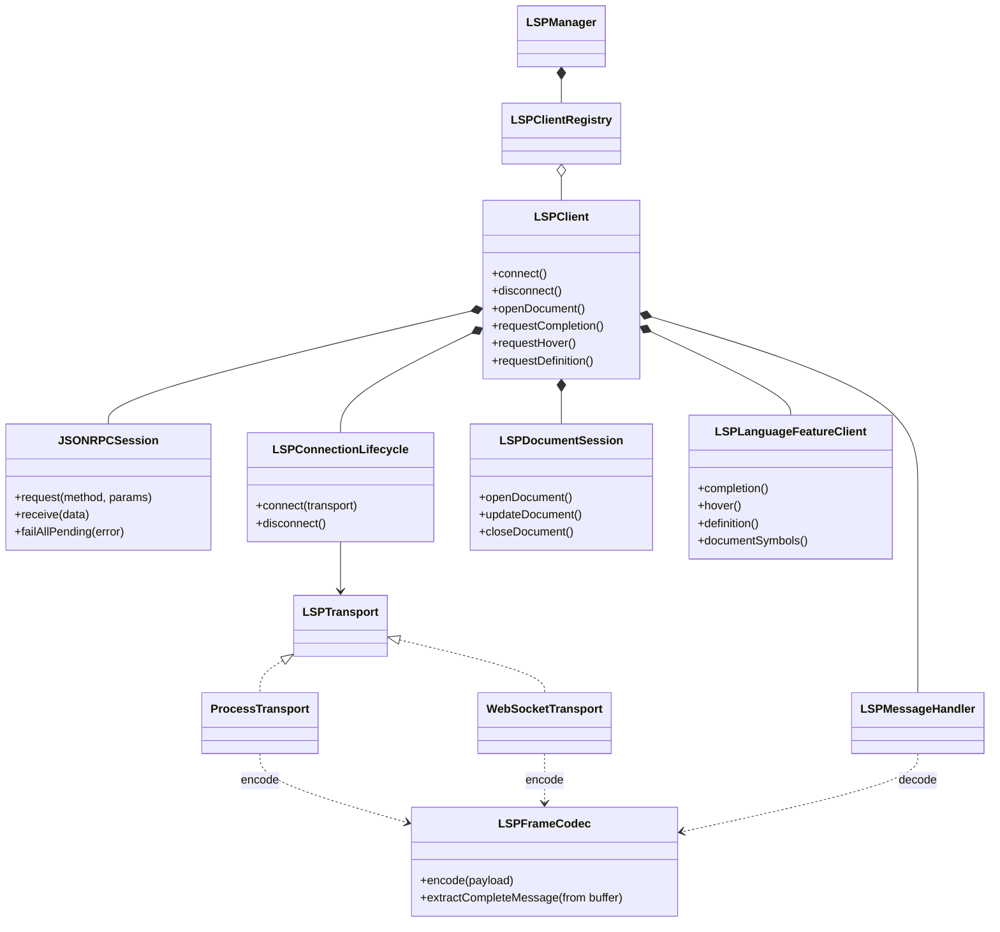

# LSP System Architecture

`LSPClient` preserves its public façade while delegating wire requests, connection state, document synchronization, and language features to focused components.

```mermaid
classDiagram
    class LSPManager
    class LSPClientRegistry
    class LSPClient {
        +connect()
        +disconnect()
        +openDocument()
        +requestCompletion()
        +requestHover()
        +requestDefinition()
    }
    class JSONRPCSession {
        +request(method, params)
        +receive(data)
        +failAllPending(error)
    }
    class LSPConnectionLifecycle {
        +connect(transport)
        +disconnect()
    }
    class LSPDocumentSession {
        +openDocument()
        +updateDocument()
        +closeDocument()
    }
    class LSPLanguageFeatureClient {
        +completion()
        +hover()
        +definition()
        +documentSymbols()
    }
    class LSPTransport
    class ProcessTransport
    class WebSocketTransport
    class LSPMessageHandler
    class LSPFrameCodec {
        +encode(payload)
        +extractCompleteMessage(from buffer)
    }

    LSPManager *-- LSPClientRegistry
    LSPClientRegistry o-- LSPClient
    LSPClient *-- JSONRPCSession
    LSPClient *-- LSPConnectionLifecycle
    LSPClient *-- LSPDocumentSession
    LSPClient *-- LSPLanguageFeatureClient
    LSPClient *-- LSPMessageHandler
    LSPConnectionLifecycle --> LSPTransport
    LSPTransport <|.. ProcessTransport
    LSPTransport <|.. WebSocketTransport
    ProcessTransport ..> LSPFrameCodec : encode
    WebSocketTransport ..> LSPFrameCodec : encode
    LSPMessageHandler ..> LSPFrameCodec : decode
```
