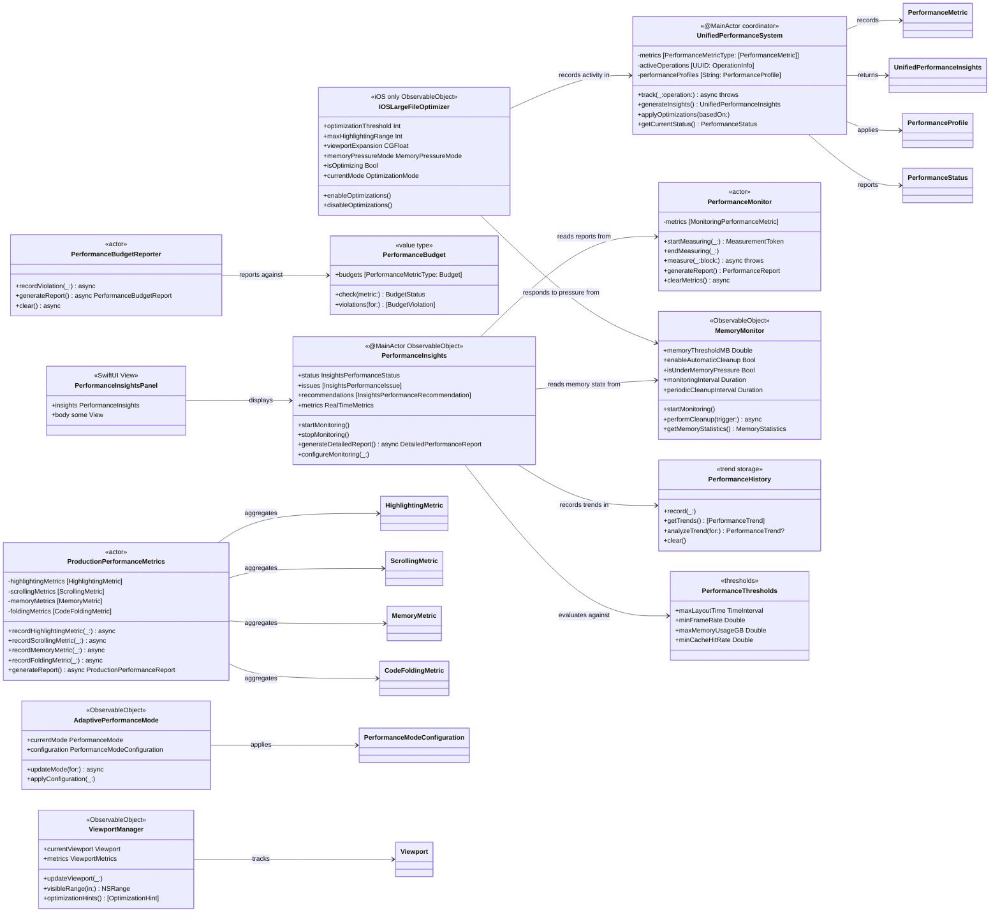
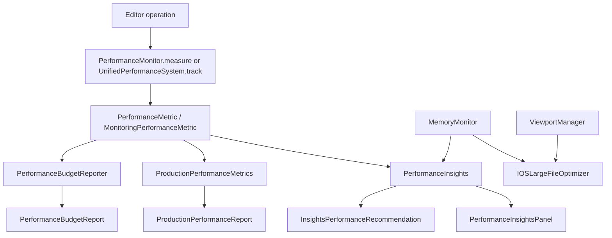

# Performance Monitoring & Optimization System

This diagram reflects the current implementation split across `Sources/CodeEditorDiagnostics/` and the view-coupled optimization helpers in `Sources/CodeEditorView/`. The system is split into low-level operation timing, user-facing insights, production aggregation, budget reporting, adaptive mode selection, viewport tracking, memory pressure handling, and iOS large-file optimization.

## Data Flow

## Current Responsibilities

| Component | Responsibility |
|---|---|
| `PerformanceMonitor` | Actor-isolated timing for named operations and report generation. |
| `UnifiedPerformanceSystem` | Main-actor aggregate metrics, issue detection, and profile-based optimization hooks. |
| `PerformanceInsights` | User-facing status, active issue detection, recommendations, and detailed reports. |
| `MemoryMonitor` | Memory pressure tracking, cleanup handlers, and memory statistics. |
| `ProductionPerformanceMetrics` | Production-oriented aggregation for highlighting, scrolling, memory, and folding metrics. |
| `PerformanceBudget` / `PerformanceBudgetReporter` | Budget definitions, violation capture, and reporting. |
| `AdaptivePerformanceMode` | Runtime mode selection for normal, low-power, high-performance, and constrained cases. |
| `ViewportManager` | Visible-range tracking and viewport optimization hints. |
| `IOSLargeFileOptimizer` | UIKit-only large-file behavior, chunk limits, and memory-pressure adaptation. |

## Notes

- `PerformanceInsights` performs its analysis internally with `PerformanceHistory`, `PerformanceThresholds`, and real-time metrics; there is no separate analyzer object in the current source.
- `IOSLargeFileOptimizer` is compiled only when UIKit is available.
- For public usage examples, see [`../Performance/monitoring.md`](../Performance/monitoring.md) and [`../Performance/optimizations.md`](../Performance/optimizations.md).
