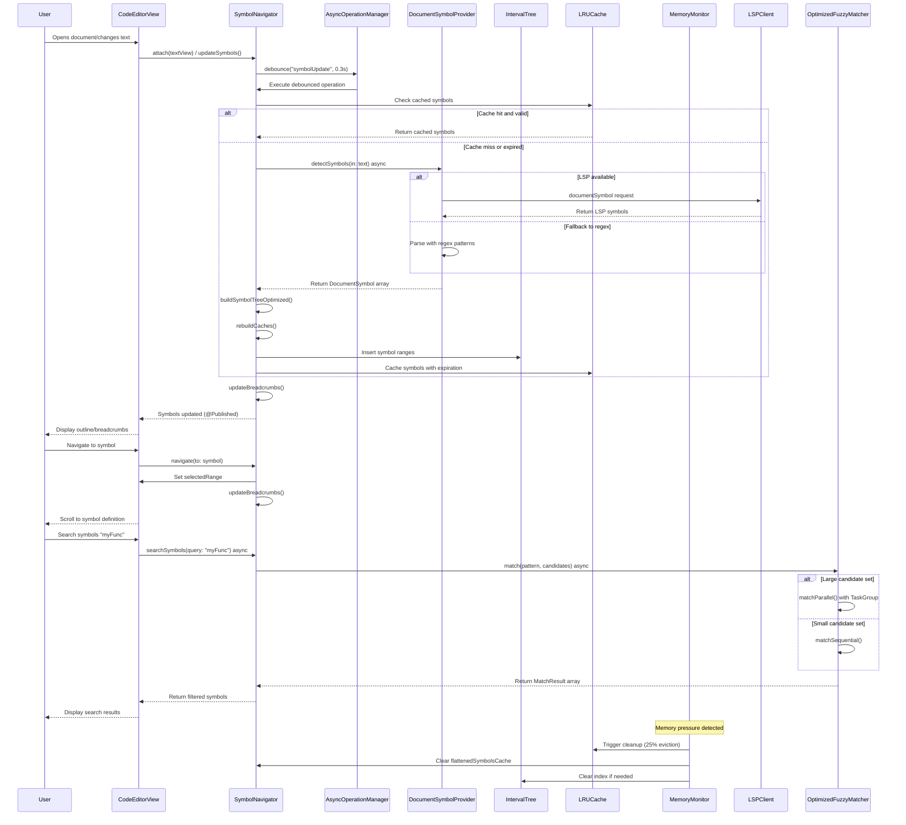

# Symbol Navigation & Code Intelligence

This diagram shows the comprehensive symbol navigation and code intelligence system that provides advanced code understanding and navigation capabilities with enhanced performance optimizations, actor-based processing, and LSP integration.

```mermaid
classDiagram
    direction LR
    
    %% Row 1 - Core Navigation System
    class SymbolNavigator {
        <<navigator>>
        +providers [Language: DocumentSymbolProvider]
        +asyncOperationManager AsyncOperationManager
        +attach(textView)
        +updateSymbols()
        +navigate(to symbol)
        +searchSymbols(query)
        +updateBreadcrumbs()
    }

    class SymbolNavigator {
        <<optimized navigator>>
        +flattenedSymbolsCache [DocumentSymbol]
        +symbolByIdCache [UUID: DocumentSymbol]
        +symbolRangeIndex IntervalTree<DocumentSymbol>
        +cacheGeneration Int
        +rebuildCaches()
        +symbolAt(location)
        +symbolsIn(range)
    }

    class DocumentSymbolProvider {
        <<protocol>>
        +detectSymbols(in text) async -> [DocumentSymbol]
    }

    %% Row 2 - Language Providers (Enhanced)
    class SwiftSymbolProvider {
        <<swift provider>>
        +detectSwiftSymbol(in line, at location)
        +extractSymbol(from line, prefix, kind)
        +detectSymbols(in text) async
    }

    class JavaScriptSymbolProvider {
        <<javascript provider>>
        +detectSymbols(in text) async
        +extractFunctions()
        +extractClasses()
        +extractObjects()
    }

    class PythonSymbolProvider {
        <<python provider>>
        +detectSymbols(in text) async
        +extractClasses()
        +extractFunctions()
        +handleIndentation()
    }

    class CStyleSymbolProvider {
        <<c-style provider>>
        +detectSymbols(in text) async
        +extractStructs()
        +extractFunctions()
        +extractEnums()
    }

    class MarkdownSymbolProvider {
        <<markdown provider>>
        +detectSymbols(in text) async
        +extractHeaders()
        +buildHierarchy()
    }

    class HTMLSymbolProvider {
        <<html provider>>
        +detectSymbols(in text) async
        +extractTags()
        +extractIds()
        +extractClasses()
    }

    class JSONSymbolProvider {
        <<json provider>>
        +detectSymbols(in text) async
        +extractObjects()
        +extractArrays()
        +buildStructure()
    }

    class LSPSymbolProvider {
        <<lsp provider>>
        +lspClient LSPClient
        +documentSymbols() async
        +workspaceSymbols() async
        +symbolInformation() async
    }

    %% Row 3 - Enhanced Symbol Models & Performance Components
    class DocumentSymbol {
        <<symbol>>
        +id UUID
        +name String
        +kind DocumentSymbolKind
        +range NSRange
        +selectionRange NSRange
        +detail String?
        +children [DocumentSymbol]
    }

    class BreadcrumbItem {
        <<breadcrumb>>
        +id UUID
        +symbol DocumentSymbol
        +level Int
    }

    class SymbolNavigationConfiguration {
        <<config>>
        +enabled Bool
        +showInGutter Bool
        +showBreadcrumbs Bool
        +maxBreadcrumbItems Int
        +updateDelay TimeInterval
        +includeAnonymousSymbols Bool
    }

    class IntervalTree {
        <<performance>>
        +insert(range, value)
        +findContaining(location) [T]
        +clear()
        -root Node?
        -insertNode()
        -findContainingInNode()
    }

    class AsyncOperationManager {
        <<actor-based>>
        +debounce(key, delay, operation) async
        +throttle(key, interval, operation) async
        +schedule(priority, operation) async
        +batch(operations) async
        +retry(maxAttempts, operation) async
    }


    %% Row 4 - Advanced Caching & Memory Management
    class LRUCache {
        <<memory-optimized>>
        +capacity Int
        +memoryMonitor MemoryMonitor
        +get(key) Value?
        +set(value, forKey)
        +removeValue(forKey)
        +statistics CacheStatistics
        +registerWithMemoryMonitor()
    }

    class MemoryMonitor {
        <<memory management>>
        +memoryThresholdMB Double
        +enableAutomaticCleanup Bool
        +startMonitoring()
        +stopMonitoring()
        +registerCleanupHandler()
        +performCleanup() async
    }

    class CacheStatistics {
        <<statistics>>
        +currentSize Int
        +maxSize Int
        +utilizationPercentage Double
        +isFull Bool
        +availableSpace Int
    }

    %% Row 5 - Fuzzy Search & Matching
    class OptimizedFuzzyMatcher {
        <<search engine>>
        +configuration Configuration
        +match(pattern, candidates) async
        +matchParallel() async
        +matchSequential()
        +preprocessCandidate()
        +calculateScoreOptimized()
    }

    class FuzzyMatchConfiguration {
        <<config>>
        +consecutiveBonus Double
        +firstCharBonus Double
        +separatorBonus Double
        +camelCaseBonus Double
        +unmatchedPenalty Double
        +enableParallelProcessing Bool
        +parallelThreshold Int
    }

    class MatchResult {
        <<result>>
        +item String
        +score Double
        +matchedRanges [NSRange]
    }

    %% Row 6 - LSP Integration & Cross-Platform Support
    class LSPClient {
        <<lsp client>>
        +sendRequest(method, params) async
        +sendNotification(method, params) async
        +documentSymbolRequest() async
        +workspaceSymbols() async
        +initialize() async
    }

    class LSPDocumentSymbolParams {
        <<lsp params>>
        +textDocument TextDocumentIdentifier
        +textDocumentIdentifier String
    }

    class LSPSymbolInformation {
        <<lsp symbol>>
        +name String
        +kind SymbolKind
        +location Location
        +containerName String?
        +deprecated Bool?
    }

    %% Row 7 - Tree Building & Navigation Logic
    class SymbolTreeBuilder {
        <<tree builder>>
        +buildSymbolTree(from symbols)
        +buildSymbolTreeOptimized()
        +updateSymbolInTree()
        +flattenSymbols()
    }

    class NavigationLogic {
        <<navigation>>
        +findNextSymbol(after location)
        +findPreviousSymbol(before location)
        +findDeepestSymbol(containing location)
        +navigate(to symbol)
        +updateBreadcrumbs()
    }

    class TextRangeUtilities {
        <<utilities>>
        +contains(range, otherRange) Bool
        +intersects(range, otherRange) Bool
        +distance(from, to) Int
    }

    %% Row 8 - Enhanced Enumerations & Supporting Types
    class DocumentSymbolKind {
        <<enumeration>>
        file, module, namespace, package
        class, method, property, field
        constructor, enum, interface
        function, variable, constant
        string, number, boolean, array
        object, key, null, enumMember
        struct, event, operator, typeParameter
    }

    class CleanupResult {
        <<cleanup result>>
        +memoryFreedMB Double
        +description String
        +success Bool
    }

    class CompletionCacheKey {
        <<cache key>>
        +text String
        +cursorPosition Int
        +languageIdentifier String
        +triggerCharacter String?
        +contextHash Int
    }

    %% Key Relationships - Enhanced Architecture
    SymbolNavigator --> DocumentSymbolProvider : uses
    SymbolNavigator --> AsyncOperationManager : coordinates async operations
    SymbolNavigator --> BreadcrumbItem : generates
    
    SymbolNavigator --> IntervalTree : uses for range queries
    SymbolNavigator --> LRUCache : caches symbols  
    SymbolNavigator --> OptimizedFuzzyMatcher : searches symbols
    
    DocumentSymbolProvider <|-- SwiftSymbolProvider : implements
    DocumentSymbolProvider <|-- JavaScriptSymbolProvider : implements
    DocumentSymbolProvider <|-- PythonSymbolProvider : implements
    DocumentSymbolProvider <|-- CStyleSymbolProvider : implements
    DocumentSymbolProvider <|-- MarkdownSymbolProvider : implements
    DocumentSymbolProvider <|-- HTMLSymbolProvider : implements
    DocumentSymbolProvider <|-- JSONSymbolProvider : implements
    DocumentSymbolProvider <|-- LSPSymbolProvider : implements

    DocumentSymbol --> DocumentSymbolKind : categorized by
    BreadcrumbItem --> DocumentSymbol : contains

    LSPSymbolProvider --> LSPClient : uses
    LSPClient --> LSPDocumentSymbolParams : sends
    LSPClient --> LSPSymbolInformation : receives

    LRUCache --> MemoryMonitor : integrates with
    MemoryMonitor --> CleanupResult : produces
    
    OptimizedFuzzyMatcher --> FuzzyMatchConfiguration : configured by
    OptimizedFuzzyMatcher --> MatchResult : produces
    
    AsyncOperationManager --> SymbolNavigator : manages debouncing
    AsyncOperationManager --> SymbolNavigator : manages operations
    
    IntervalTree --> DocumentSymbol : indexes
    SymbolTreeBuilder --> DocumentSymbol : builds hierarchy
    NavigationLogic --> TextRangeUtilities : uses utilities

    %% Styling - Dark mode friendly colors
    classDef navigator fill:#007AFF20,stroke:#007AFF,stroke-width:3px,color:#1D1D1F
    classDef provider fill:#AF52DE20,stroke:#AF52DE,stroke-width:2px,color:#1D1D1F
    classDef symbol fill:#34C75920,stroke:#34C759,stroke-width:2px,color:#1D1D1F
    classDef performance fill:#FF950020,stroke:#FF9500,stroke-width:2px,color:#1D1D1F
    classDef memory fill:#FF3B3020,stroke:#FF3B30,stroke-width:2px,color:#1D1D1F
    classDef search fill:#5856D620,stroke:#5856D6,stroke-width:2px,color:#1D1D1F
    classDef lsp fill:#32D74B20,stroke:#32D74B,stroke-width:2px,color:#1D1D1F
    classDef config fill:#8E8E9320,stroke:#8E8E93,stroke-width:2px,color:#1D1D1F
    classDef enum fill:#8E8E9320,stroke:#8E8E93,stroke-width:2px,color:#1D1D1F
    classDef utilities fill:#FFCC0020,stroke:#FFCC00,stroke-width:2px,color:#1D1D1F

    class SymbolNavigator navigator
    class SymbolNavigator navigator
    class DocumentSymbolProvider provider
    class SwiftSymbolProvider provider
    class PythonSymbolProvider provider
    class JavaScriptSymbolProvider provider
    class CStyleSymbolProvider provider
    class MarkdownSymbolProvider provider
    class HTMLSymbolProvider provider
    class JSONSymbolProvider provider
    class LSPSymbolProvider lsp
    class DocumentSymbol symbol
    class BreadcrumbItem symbol
    class IntervalTree performance
    class AsyncOperationManager performance
    class LRUCache memory
    class MemoryMonitor memory
    class CacheStatistics memory
    class OptimizedFuzzyMatcher search
    class FuzzyMatchConfiguration search
    class MatchResult search
    class LSPClient lsp
    class LSPDocumentSymbolParams lsp
    class LSPSymbolInformation lsp
    class SymbolTreeBuilder utilities
    class NavigationLogic utilities
    class TextRangeUtilities utilities
    class SymbolNavigationConfiguration config
    class DocumentSymbolKind enum
    class CleanupResult utilities
    class CompletionCacheKey utilities
```

## Enhanced Symbol Navigation Flow

## Enhanced Symbol Intelligence Features

### 1. Multi-Language Symbol Providers with LSP Integration
- **Swift Provider**: Pattern-based extraction for classes, structs, enums, functions, and properties
- **JavaScript/TypeScript Provider**: Supports functions, classes, objects with async detection
- **Python Provider**: Class and function extraction with indentation handling
- **C-Style Provider**: Unified provider for C, C++, Java, Go, Rust with struct/function detection
- **Markup Providers**: Specialized providers for Markdown (headers), HTML (tags/IDs), JSON (objects/arrays)
- **LSP Symbol Provider**: Full Language Server Protocol integration for advanced language support
- **Extensible Architecture**: Easy addition of new language providers via `DocumentSymbolProvider` protocol

### 2. Actor-Based Async Processing
- **AsyncOperationManager**: Centralized async operation coordination with debouncing and throttling
- **Non-blocking Symbol Detection**: All symbol parsing runs asynchronously without blocking UI
- **Debounced Updates**: Intelligent 300ms debouncing prevents excessive re-parsing during rapid typing
- **Parallel Processing**: TaskGroup-based parallel processing for large symbol sets
- **Memory-Safe Concurrency**: Swift 6 actor-based design ensures thread safety

### 3. Advanced Caching & Memory Management
- **LRU Cache**: Thread-safe least-recently-used cache with configurable capacity
- **Memory Monitor Integration**: Automatic cache cleanup under memory pressure
- **Multi-level Caching**: Symbol cache, flattened cache, and ID-based lookups
- **Cache Statistics**: Real-time monitoring of cache utilization and performance
- **Intelligent Invalidation**: Smart cache invalidation based on text changes and generation tracking

### 4. High-Performance Symbol Indexing
- **Interval Tree**: O(log n) range queries for efficient symbol-at-location lookups
- **Optimized Tree Building**: Single-pass symbol hierarchy construction with parent-child relationships
- **Range-based Indexing**: Fast overlap detection and containment queries
- **Flattened Symbol Cache**: Pre-computed flat symbol arrays for navigation operations
- **Generation-based Invalidation**: Efficient cache invalidation using generation counters

### 5. Intelligent Fuzzy Search
- **OptimizedFuzzyMatcher**: Advanced fuzzy matching with configurable scoring
- **Parallel Search**: Automatic parallel processing for large candidate sets (>50 items)
- **Smart Scoring**: Consecutive character bonus, camelCase detection, separator awareness
- **Configurable Thresholds**: Adjustable scoring parameters and result limits
- **Candidate Preprocessing**: Pre-computed word boundaries and separator positions for faster matching

### 6. Real-time Breadcrumb Navigation
- **Cursor-aware Updates**: Automatic breadcrumb updates based on cursor position
- **Hierarchical Context**: Shows nested symbol containment (class → method → local scope)
- **Efficient Lookups**: Uses interval tree for fast symbol-at-location queries
- **Interactive Navigation**: Click-to-navigate support for any breadcrumb level
- **Configurable Display**: Adjustable maximum breadcrumb items and display options

### 7. Cross-platform Symbol Support
- **Platform Abstraction**: Unified symbol detection across macOS and iOS
- **TextKit2 Integration**: Native integration with modern TextKit2 text processing
- **Range Utilities**: Cross-platform NSRange operations and containment checking
- **Memory-efficient Storage**: Optimized symbol storage with minimal memory footprint

## Enhanced Benefits

### Performance & Scalability
1. **Sub-millisecond Lookups**: O(log n) symbol-at-location queries via interval trees
2. **Large File Support**: Handles 500KB+ files with optimized caching and async processing
3. **Memory Efficient**: Automatic cleanup under pressure with 25% LRU eviction strategy
4. **60fps Responsiveness**: Non-blocking UI with actor-based background processing
5. **Parallel Processing**: TaskGroup-based concurrent operations for large symbol sets

### Developer Experience
6. **25 Concrete Languages + Plain Text**: Swift, JavaScript, TypeScript, Python, C/C++, C#, Kotlin, Dart, Java, Go, Rust, HTML, CSS, JSON, Markdown, and more
7. **LSP Integration**: Full Language Server Protocol support for advanced language features
8. **Real-time Updates**: 300ms debounced symbol detection with cursor-aware breadcrumbs
9. **Intelligent Search**: Fuzzy matching with camelCase, separator, and consecutive character bonuses
10. **Context Awareness**: Hierarchical breadcrumb navigation showing nested symbol containment

### Architecture & Reliability
11. **Swift 6 Concurrency**: Actor-based design ensures thread safety and memory safety
12. **Dependency Injection**: MemoryMonitor and AsyncOperationManager injection via EditorConfiguration
13. **Cross-platform**: Unified codebase supporting macOS, iOS
14. **Extensible Design**: Simple `DocumentSymbolProvider` protocol for adding new languages
15. **Production Ready**: Comprehensive error handling, memory management, and performance monitoring

### Advanced Features
16. **Smart Caching**: Multi-level caching with generation-based invalidation
17. **Memory Monitoring**: Automatic cleanup handlers with detailed statistics
18. **Performance Insights**: Cache utilization, search performance, and memory usage tracking
19. **Configurable Behavior**: Adjustable debounce delays, cache sizes, and display options
20. **Zero-allocation Paths**: Optimized hot paths minimize memory allocations during navigation
