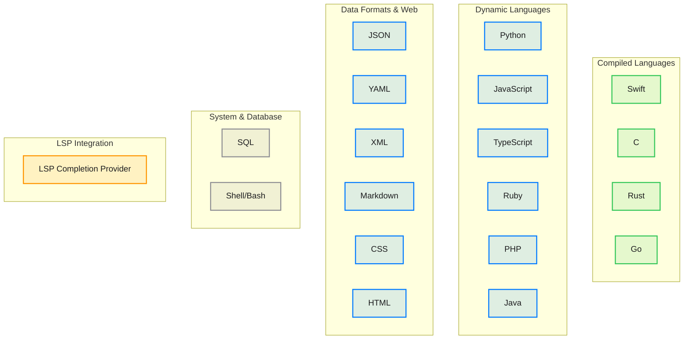

# Language Provider Complete Ecosystem

This comprehensive diagram shows the complete language provider ecosystem supporting 25 concrete languages plus plain text (and LSP) with completion, symbols, folding, and data providers.

```mermaid
classDiagram
    direction LR
    
    %% Row 1 - Core Provider Management
    class LanguageProviderFactory {
        <<factory>>
        +registry CompletionProviderRegistry
        +metadataRegistry LanguageMetadataRegistry
        +sharedBuilder SharedCompletionBuilder
        +createProvider()
        +registerCustomProvider()
        +initializeAllProviders()
    }

    class CompletionProviderRegistry {
        <<registry>>
        +providers [String: CompletionProvider]
        +symbolProviders [String: SymbolProvider]
        +foldingProviders [String: FoldingProvider]
        +universalProvider UniversalCompletionProvider
        +registerProvider()
        +getProvider()
        +validateProvider()
        +getAllSupportedLanguages()
    }

    class LanguageMetadataRegistry {
        <<metadata registry>>
        +languageMetadata [String: LanguageMetadata]
        +completionMetadata [String: CompletionMetadata]
        +getLanguageInfo()
        +updateMetadata()
    }


    %% Row 2 - Compiled Languages
    class SwiftCompletionProvider {
        <<swift provider>>
        +provideCompletions()
    }

    class CCompletionProvider {
        <<c provider>>
        +provideCompletions()
    }

    class RustCompletionProvider {
        <<rust provider>>
        +provideCompletions()
    }

    class GoCompletionProvider {
        <<go provider>>
        +provideCompletions()
    }

    %% Row 3 - Dynamic Languages
    class PythonCompletionProvider {
        <<python provider>>
        +provideCompletions()
    }

    class JavaScriptCompletionProvider {
        <<javascript provider>>
        +provideCompletions()
    }

    class TypeScriptCompletionProvider {
        <<typescript provider>>
        +provideCompletions()
    }

    class RubyCompletionProvider {
        <<ruby provider>>
        +provideCompletions()
    }

    class PHPCompletionProvider {
        <<php provider>>
        +provideCompletions()
    }

    class JavaCompletionProvider {
        <<java provider>>
        +provideCompletions()
    }

    %% Row 4 - Data Format Providers
    class JSONCompletionProvider {
        <<json provider>>
        +provideCompletions()
    }

    class YAMLCompletionProvider {
        <<yaml provider>>
        +provideCompletions()
    }

    class XMLCompletionProvider {
        <<xml provider>>
        +provideCompletions()
    }

    class MarkdownCompletionProvider {
        <<markdown provider>>
        +provideCompletions()
    }

    class CSSCompletionProvider {
        <<css provider>>
        +provideCompletions()
    }

    class HTMLCompletionProvider {
        <<html provider>>
        +provideCompletions()
    }

    class SQLCompletionProvider {
        <<sql provider>>
        +provideCompletions()
    }

    class ShellCompletionProvider {
        <<shell provider>>
        +provideCompletions()
    }

    %% Row 5 - LSP Provider
    class LSPCompletionProvider {
        <<lsp provider>>
        +provideCompletions()
    }

    %% Row 6 - Symbol & Folding Providers
    class UniversalCompletionProvider {
        <<universal provider>>
        +languageMetadata [String: LanguageMetadata]
        +provideCompletions()
    }

    class SymbolProviderRegistry {
        <<symbol registry>>
        +symbolProviders [String: SymbolProvider]
        +getSymbolProvider()
        +registerSymbolProvider()
    }

    class BraceFoldingProvider {
        <<brace folding>>
        +detectBraceRegions()
    }

    class IndentationFoldingProvider {
        <<indentation folding>>
        +detectIndentationRegions()
    }

    class MarkdownFoldingProvider {
        <<markdown folding>>
        +detectMarkdownBlocks()
    }

    class RubyFoldingProvider {
        <<ruby folding>>
        +detectRubyBlocks()
    }

    class XMLFoldingProvider {
        <<xml folding>>
        +detectXMLElements()
    }

    class ShellFoldingProvider {
        <<shell folding>>
        +detectShellBlocks()
    }

    class SQLFoldingProvider {
        <<sql folding>>
        +detectSQLBlocks()
    }

    %% Row 7 - Shared Infrastructure
    class SharedCompletionBuilder {
        <<shared builder>>
        +buildKeywordCompletions()
        +buildSnippetCompletions()
        +calculatePriorities()
    }

    class LanguageMemberCompletions {
        <<member completions>>
        +analyzeMembers()
        +resolveInheritance()
        +checkAccessibility()
    }

    %% Key Relationships
    LanguageProviderFactory --> CompletionProviderRegistry : manages
    LanguageProviderFactory --> LanguageMetadataRegistry : uses
    LanguageProviderFactory --> SharedCompletionBuilder : coordinates

    CompletionProviderRegistry --> SwiftCompletionProvider : contains
    CompletionProviderRegistry --> PythonCompletionProvider : contains
    CompletionProviderRegistry --> JavaScriptCompletionProvider : contains
    CompletionProviderRegistry --> TypeScriptCompletionProvider : contains
    CompletionProviderRegistry --> JavaCompletionProvider : contains
    CompletionProviderRegistry --> GoCompletionProvider : contains
    CompletionProviderRegistry --> RustCompletionProvider : contains
    CompletionProviderRegistry --> CCompletionProvider : contains
    CompletionProviderRegistry --> PHPCompletionProvider : contains
    CompletionProviderRegistry --> RubyCompletionProvider : contains
    CompletionProviderRegistry --> JSONCompletionProvider : contains
    CompletionProviderRegistry --> YAMLCompletionProvider : contains
    CompletionProviderRegistry --> XMLCompletionProvider : contains
    CompletionProviderRegistry --> MarkdownCompletionProvider : contains
    CompletionProviderRegistry --> CSSCompletionProvider : contains
    CompletionProviderRegistry --> HTMLCompletionProvider : contains
    CompletionProviderRegistry --> SQLCompletionProvider : contains
    CompletionProviderRegistry --> ShellCompletionProvider : contains
    CompletionProviderRegistry --> LSPCompletionProvider : contains
    
    CompletionProviderRegistry --> SymbolProviderRegistry : coordinates
    CompletionProviderRegistry --> UniversalCompletionProvider : fallback

    SymbolProviderRegistry --> BraceFoldingProvider : uses
    SymbolProviderRegistry --> IndentationFoldingProvider : uses
    SymbolProviderRegistry --> MarkdownFoldingProvider : contains
    SymbolProviderRegistry --> RubyFoldingProvider : contains
    SymbolProviderRegistry --> XMLFoldingProvider : contains
    SymbolProviderRegistry --> ShellFoldingProvider : contains
    SymbolProviderRegistry --> SQLFoldingProvider : contains

    SharedCompletionBuilder --> LanguageMemberCompletions : uses

    %% Styling - Dark mode friendly colors
    classDef factory fill:#007AFF20,stroke:#007AFF,stroke-width:3px,color:#1D1D1F
    classDef registry fill:#AF52DE20,stroke:#AF52DE,stroke-width:2px,color:#1D1D1F
    classDef compiled fill:#34C75920,stroke:#34C759,stroke-width:2px,color:#1D1D1F
    classDef dynamic fill:#007AFF20,stroke:#007AFF,stroke-width:2px,color:#1D1D1F
    classDef data fill:#007AFF20,stroke:#007AFF,stroke-width:2px,color:#1D1D1F
    classDef lsp fill:#FF950020,stroke:#FF9500,stroke-width:2px,color:#1D1D1F
    classDef universal fill:#8E8E9320,stroke:#8E8E93,stroke-width:2px,color:#1D1D1F
    classDef folding fill:#34C75920,stroke:#34C759,stroke-width:2px,color:#1D1D1F
    classDef shared fill:#8E8E9320,stroke:#8E8E93,stroke-width:2px,color:#1D1D1F

    class LanguageProviderFactory factory
    class CompletionProviderRegistry registry
    class LanguageMetadataRegistry registry
    class SwiftCompletionProvider compiled
    class CCompletionProvider compiled
    class RustCompletionProvider compiled
    class GoCompletionProvider compiled
    class PythonCompletionProvider dynamic
    class JavaScriptCompletionProvider dynamic
    class TypeScriptCompletionProvider dynamic
    class RubyCompletionProvider dynamic
    class PHPCompletionProvider dynamic
    class JavaCompletionProvider dynamic
    class JSONCompletionProvider data
    class YAMLCompletionProvider data
    class XMLCompletionProvider data
    class MarkdownCompletionProvider data
    class CSSCompletionProvider data
    class HTMLCompletionProvider data
    class SQLCompletionProvider data
    class ShellCompletionProvider dynamic
    class LSPCompletionProvider lsp
    class UniversalCompletionProvider universal
    class SymbolProviderRegistry registry
    class BraceFoldingProvider folding
    class IndentationFoldingProvider folding
    class MarkdownFoldingProvider folding
    class RubyFoldingProvider folding
    class XMLFoldingProvider folding
    class ShellFoldingProvider folding
    class SQLFoldingProvider folding
    class SharedCompletionBuilder shared
    class LanguageMemberCompletions shared
```

## Language Support Matrix

## Key Ecosystem Features

### 1. Universal Provider Factory
- **Automatic Registration**: Self-registering language providers
- **Capability Discovery**: Runtime provider capability detection
- **Dynamic Loading**: Lazy loading of language-specific providers
- **Custom Provider Support**: Plugin architecture for additional languages

### 2. Comprehensive Language Support
- **25 Concrete Languages**: Full support for major programming languages (plus plain text and LSP integration)
- **Complete Web Stack**: HTML, CSS, JavaScript, TypeScript support
- **Data Format Support**: JSON, YAML, XML, Markdown completion
- **System Languages**: Shell/Bash, SQL completion
- **Extensible Architecture**: Easy addition of new language providers

### 3. Shared Infrastructure
- **Common Completion Logic**: Reusable completion building components
- **Keyword Databases**: Centralized keyword management
- **Snippet Libraries**: Shared code snippet repositories
- **Context Analysis**: Universal context understanding

### 4. Advanced Features
- **Context-Aware Completion**: CSS rules vs selectors, HTML tag-aware attributes
- **Symbol Resolution**: Cross-file symbol navigation for all supported languages
- **Import/Module Resolution**: Automatic dependency resolution
- **Type Inference**: Intelligent type analysis where applicable
- **Language Metadata Registry**: Dynamic provider creation and validation
- **Universal Completion Provider**: Fallback completion with language metadata
- **Documentation Integration**: Inline documentation support

### 5. Performance Optimizations
- **Lazy Loading**: Providers loaded on demand
- **Caching**: Intelligent caching of parsing results
- **Background Processing**: Non-blocking completion generation
- **Incremental Parsing**: Efficient re-parsing on changes

## Benefits

1. **Complete Language Ecosystem**: Support for 25 concrete programming languages plus plain text and LSP
2. **Full-Stack Development**: Complete web development support (HTML, CSS, JS, TS)
3. **System Administration**: Shell scripting and SQL database support
4. **Consistent Experience**: Uniform completion behavior across all languages
5. **Context-Aware Intelligence**: Language-specific completion with contextual awareness
6. **High Performance**: Optimized for speed with performance monitoring
7. **Extensible Architecture**: Easy addition of new languages and providers
8. **Maintainable Codebase**: Shared infrastructure reduces code duplication
9. **Scalable Design**: Handles large codebases and complex projects efficiently
10. **Enhanced Provider Capabilities**: Symbol extraction, folding, and completion for all languages
