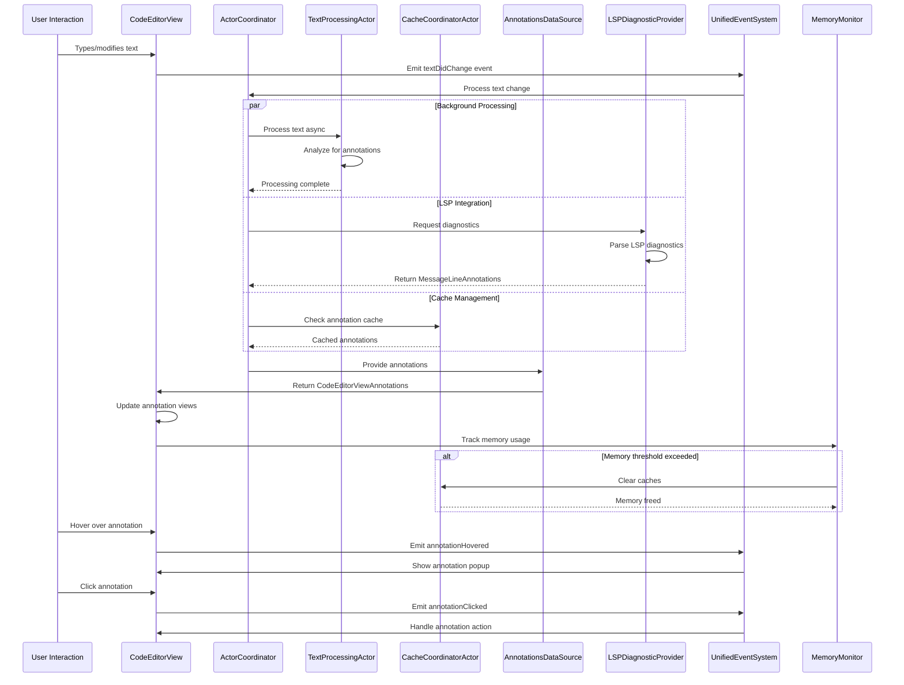

# Annotation System Detailed Architecture

This diagram shows the comprehensive annotation system that provides code annotations, diagnostics, and contextual information overlay capabilities with modern Swift 6 concurrency and actor-based processing.

```mermaid
classDiagram
    direction LR
    
    %% Row 1 - Core Annotation System with Actor Integration
    class CodeEditorView {
        <<main view>>
        +annotations [Annotation]
        +annotationViews [String: PlatformView]
        +annotationsDataSource AnnotationsDataSource?
        +actorCoordinator ActorCoordinator
        +addAnnotation(Annotation)
        +removeAnnotation(withId: String)
        +removeAllAnnotations()
        +reloadAnnotations()
        +updateAnnotationViews()
    }

    class ActorCoordinator {
        <<@MainActor coordinator>>
        +textProcessor TextProcessingActor
        +cacheCoordinator CacheCoordinatorActor
        +performanceMetrics PerformanceMetricsActor
        +documentState DocumentStateActor
        +errorRecovery ErrorRecoveryCoordinator
        +processText(String, ProcessorType) async throws String
        +trackPerformance(String, Duration) async
        +createOrUpdateDocument(String, URL?, Language) async UUID
    }

    class AnnotationsDataSource {
        <<protocol>>
        +annotations(for: NSTextRange) [Annotation]
        +textViewAnnotations [CodeEditorViewAnnotation]
        +textView(_:viewForLineAnnotation:textLineFragment:proposedViewFrame:) PlatformView?
    }

    %% Row 2 - Enhanced Annotation Models
    class Annotation {
        <<struct>>
        +id String
        +range NSTextRange
        +content String
        +init(range: NSTextRange, content: String, id: String)
    }

    class CodeEditorViewAnnotation {
        <<struct>>
        +id String
        +location NSTextLocation
        +content String
        +init(location: NSTextLocation, content: String, id: String)
    }

    class LineAnnotation {
        <<protocol>>
        +id Identifier
        +location NSTextLocation
    }

    class MessageLineAnnotation {
        <<class inherits LineAnnotation>>
        +id String
        +location NSTextLocation
        +message AttributedString
        +kind AnnotationKind
        +init(id: String, message: AttributedString, kind: AnnotationKind, location: NSTextLocation)
    }

    class AnnotationKind {
        <<enum CaseIterable Sendable>>
        info, note, todo, fixme, warning, error
        +color PlatformColor
        +iconName String
        +init(from: MessageLineAnnotation.AnnotationKind)
        +infer(from: String) Self
    }


    %% Row 3 - Enhanced View System with Cross-Platform Support
    class AnnotationView {
        <<@MainActor class inherits PlatformView>>
        +annotation LineAnnotation
        +showPopup(detachable: Bool)
        +hidePopup()
        -annotationKind AnnotationKind
        -annotationColor PlatformColor
        -iconName String
        -setupAppearance()
        -setupIcon()
        -setupInteraction()
        -setupAccessibility()
    }

    class AnnotationViewProtocol {
        <<@MainActor protocol>>
        +annotation LineAnnotation
        +showPopup(detachable: Bool)
        +hidePopup()
    }

    class AnnotationsContentView {
        <<cross-platform view>>
        +createAnnotationView(for: LineAnnotation) PlatformView
        +updateViewAppearance(PlatformView)
        +handleViewInteraction(PlatformView)
        +configureAccessibility(PlatformView)
    }

    class TextLayoutManager {
        <<TextKit2 integration>>
        +ensureLayout(for: NSRange)
        +textLayoutFragment(for: NSTextLocation) NSTextLayoutFragment?
        +textSegmentFrame(in: NSRange, type: NSTextLayoutManager.SegmentType) CGRect?
        +documentRange NSTextRange
    }

    %% Row 4 - Actor-Based Processing & LSP Integration

    class TextProcessingActor {
        <<actor>>
        +activeProcessors [UUID: TextProcessor]
        +textBuffers [UUID: String]
        +errorRecovery ErrorRecoveryCoordinator
        +process(text: String, with: ProcessorType, priority: TaskPriority) async throws String
        +cancelAllProcessing()
        -processIndentation(String) async throws String
        -processBracketMatching(String) async throws String
    }

    class CacheCoordinatorActor {
        <<actor>>
        +caches [String: AnyCacheWrapper]
        +registerCache(String, CacheProtocol) async
        +getValue(String, String) async Sendable?
        +setValue(Sendable, String, String, Int) async
        +clearCache(String) async
        +clearAllCaches() async
    }

    class LSPDiagnosticProvider {
        <<LSP integration>>
        +client LSPClient
        +diagnostics [Diagnostic]
        +publishDiagnostics PublishDiagnosticsClientCapabilities
        +processDiagnostics([Diagnostic]) async [MessageLineAnnotation]
        +convertToAnnotations([Diagnostic]) [LineAnnotation]
        +handleDiagnosticSeverity(DiagnosticSeverity) AnnotationKind
    }

    class LSPTypes {
        <<diagnostic types>>
        +Diagnostic
        +DiagnosticSeverity: error, warning, information, hint
        +DiagnosticTag: unnecessary, deprecated
        +DiagnosticRelatedInformation
        +Position: line, character
        +LSPRange: start, end
    }

    %% Row 5 - Performance & Memory Management
    class PerformanceMetricsActor {
        <<actor>>
        +metrics [SendablePerformanceMetric]
        +aggregates [String: MetricAggregate]
        +record(SendablePerformanceMetric) async
        +getMetrics(String) async [SendablePerformanceMetric]
        +calculateAggregates() async [String: MetricAggregate]
    }

    class MemoryMonitor {
        <<ObservableObject>>
        +memoryThresholdMB Double
        +enableAutomaticCleanup Bool
        +cleanupHandlers [String: CleanupHandler]
        +currentMemoryUsageMB Double
        +startMonitoring()
        +stopMonitoring()
        +registerCleanupHandler(String, CleanupPriority, @escaping () -> CleanupResult)
    }

    class SmartTokenCache {
        <<LRU cache>>
        +cache LRUCache~CacheKey, [HighlightedToken]~
        +getCachedTokens(CacheKey) [HighlightedToken]
        +setCachedTokens([HighlightedToken], CacheKey, Duration)
        +clearCache()
        +contains(CacheKey) Bool
    }

    class ErrorRecoveryCoordinator {
        <<coordinator>>
        +recover(from: RecoverableAsyncError, retryOperation: () async throws T) async throws T
        +handleRecoveryAttempt(RecoverableAsyncError)
        +logRecoveryResult(Bool, Error?)
    }

    %% Row 6 - Event System & Real-time Updates
    class UnifiedEventSystem {
        <<event system>>
        +eventPublisher EventPublisher~EditorEvent~
        +eventHandlers [EditorEventHandler]
        +crossPlatformCoordinator CrossPlatformCoordinator
        +emit(EditorEvent)
        +subscribe(EditorEventHandler)
        +unsubscribe(EditorEventHandler)
    }

    class EditorEvent {
        <<event enum Sendable>>
        +textDidChange(String)
        +textSelectionDidChange(NSRange)
        +annotationHovered(annotationId: String)
        +annotationClicked(annotationId: String)
        +performanceWarning(String)
        +error(EditorError)
    }

    class DocumentStateActor {
        <<actor>>
        +documents [UUID: DocumentState]
        +createDocument(String, URL?, Language) async UUID
        +updateContent(UUID, String) async
        +getDocument(URL) async DocumentState?
        +trackDocumentChanges(UUID) async
    }

    class CacheProtocol {
        <<protocol>>
        +associatedtype Value: Sendable
        +getValue(String) async Value?
        +setValue(Value, String, Int) async
        +contains(String) async Bool
        +clear() async
    }

    %% Row 7 - Platform Abstraction & Configuration
    class PlatformColors {
        <<cross-platform colors>>
        +systemBlue PlatformColor
        +systemOrange PlatformColor
        +systemYellow PlatformColor
        +systemRed PlatformColor
        +label PlatformColor
        +secondarySystemBackground PlatformColor
        +controlBackground PlatformColor
    }

    class EditorConfiguration {
        <<configuration>>
        +display DisplayConfiguration
        +layout LayoutConfiguration
        +performance PerformanceConfiguration
        +actorCoordinator ActorCoordinator?
        +apply(CodeEditorView)
        +updateConfiguration(@escaping (inout EditorConfiguration) -> Void)
    }

    class LayoutConfiguration {
        <<layout config>>
        +annotationBadgeSize CGFloat
        +annotationBadgePadding CGFloat
        +tabWidth Int
        +showLineNumbers Bool
        +lineHeightMultiple CGFloat
    }

    class CrossPlatformLogger {
        <<logging>>
        +logger() Logger
        +logAnnotationEvent(String, [String: Any])
        +logPerformanceMetric(String, TimeInterval)
        +logError(Error)
    }

    %% Row 8 - Supporting Types & Protocols
    class TaskPriority {
        <<enum>>
        low, normal, high, critical
    }

    class Language {
        <<enum>>
        swift, javascript, typescript, python, go, rust
        c, cpp, java, html, css, json, markdown, yaml
        xml, sql, ruby, php, shell, plainText
    }

    class PlatformView {
        <<type alias>>
        +frame CGRect
        +addSubview(PlatformView)
        +removeFromSuperview()
        +layer CALayer
    }

    class SendablePerformanceMetric {
        <<struct Sendable>>
        +name String
        +duration Duration
        +metadata [String: String]
        +timestamp Date
    }

    %% Key Relationships - Modern Architecture
    CodeEditorView --> ActorCoordinator : integrates with
    CodeEditorView --> AnnotationsDataSource : uses
    CodeEditorView --> TextLayoutManager : manages layout
    CodeEditorView --> UnifiedEventSystem : emits events

    ActorCoordinator --> TextProcessingActor : coordinates
    ActorCoordinator --> CacheCoordinatorActor : manages caches
    ActorCoordinator --> PerformanceMetricsActor : tracks performance
    ActorCoordinator --> DocumentStateActor : manages documents
    ActorCoordinator --> ErrorRecoveryCoordinator : handles errors

    AnnotationsDataSource --> CodeEditorViewAnnotation : provides
    CodeEditorViewAnnotation --> Annotation : converts from
    AnnotationView --> AnnotationViewProtocol : implements
    AnnotationView --> LineAnnotation : displays

    LineAnnotation <|-- MessageLineAnnotation : specializes
    MessageLineAnnotation --> AnnotationKind : categorized by
    AnnotationKind --> PlatformColors : uses colors

    LSPDiagnosticProvider --> LSPTypes : uses
    LSPTypes --> MessageLineAnnotation : converts to
    CacheCoordinatorActor --> CacheProtocol : manages
    SmartTokenCache --> CacheProtocol : implements

    UnifiedEventSystem --> EditorEvent : publishes
    EditorEvent --> AnnotationView : triggers interactions
    MemoryMonitor --> SmartTokenCache : monitors
    PerformanceMetricsActor --> SendablePerformanceMetric : records

    EditorConfiguration --> LayoutConfiguration : contains
    LayoutConfiguration --> AnnotationView : configures
    CrossPlatformLogger --> EditorEvent : logs

    %% Styling - Modern Swift 6 Architecture Colors
    classDef mainView fill:#007AFF20,stroke:#007AFF,stroke-width:3px,color:#1D1D1F
    classDef actor fill:#AF52DE20,stroke:#AF52DE,stroke-width:2px,color:#1D1D1F
    classDef annotation fill:#34C75920,stroke:#34C759,stroke-width:2px,color:#1D1D1F
    classDef view fill:#007AFF20,stroke:#007AFF,stroke-width:2px,color:#1D1D1F
    classDef lsp fill:#FF950020,stroke:#FF9500,stroke-width:2px,color:#1D1D1F
    classDef performance fill:#FF3B3020,stroke:#FF3B30,stroke-width:2px,color:#1D1D1F
    classDef event fill:#30D15820,stroke:#30D158,stroke-width:2px,color:#1D1D1F
    classDef platform fill:#8E8E9320,stroke:#8E8E93,stroke-width:2px,color:#1D1D1F
    classDef protocol fill:#5AC8FA20,stroke:#5AC8FA,stroke-width:2px,color:#1D1D1F

    class CodeEditorView mainView
    class ActorCoordinator actor
    class TextProcessingActor actor
    class CacheCoordinatorActor actor
    class PerformanceMetricsActor performance
    class DocumentStateActor actor
    class ErrorRecoveryCoordinator actor
    class Annotation annotation
    class CodeEditorViewAnnotation annotation
    class LineAnnotation annotation
    class MessageLineAnnotation annotation
    class AnnotationKind annotation
    class AnnotationView view
    class AnnotationViewProtocol protocol
    class AnnotationsContentView view
    class TextLayoutManager view
    class LSPDiagnosticProvider lsp
    class LSPTypes lsp
    class MemoryMonitor performance
    class SmartTokenCache performance
    class UnifiedEventSystem event
    class EditorEvent event
    class AnnotationsDataSource protocol
    class CacheProtocol protocol
    class PlatformColors platform
    class EditorConfiguration platform
    class LayoutConfiguration platform
    class CrossPlatformLogger platform
    class TaskPriority platform
    class Language platform
    class PlatformView platform
    class SendablePerformanceMetric performance
```

## Modern Annotation System Flow with Actor-Based Processing

## Enhanced Annotation System Features (2025)

### 1. Actor-Based Concurrent Processing
- **TextProcessingActor**: Isolated text analysis with async/await
- **CacheCoordinatorActor**: Thread-safe cache management with LRU eviction
- **PerformanceMetricsActor**: Real-time performance tracking and optimization
- **DocumentStateActor**: Document lifecycle management with version tracking
- **ErrorRecoveryCoordinator**: Automatic error recovery with retry mechanisms

### 2. Advanced LSP Diagnostic Integration
- **Real-time Diagnostics**: Live error/warning updates from language servers
- **Multi-severity Support**: Error, warning, information, hint levels
- **Diagnostic Tags**: Unnecessary and deprecated code highlighting
- **Related Information**: Cross-reference annotations with contextual data
- **Code Actions**: Integrated quick fixes and refactoring suggestions

### 3. Cross-Platform Annotation Rendering
- **Platform Abstraction**: Unified PlatformView, PlatformColor system
- **Native Interactions**: Platform-specific gestures (tap, hover, long press)
- **Accessibility Support**: VoiceOver, Switch Control, keyboard navigation
- **Responsive Design**: Adaptive layouts for different screen sizes
- **High DPI Support**: Crisp rendering on Retina/high-resolution displays

### 4. Performance & Memory Optimizations
- **Smart Token Caching**: LRU cache with automatic memory management
- **Memory Monitoring**: Automatic cleanup when thresholds exceeded
- **Viewport Management**: Only render visible annotations
- **Lazy Loading**: Defer heavy processing until needed
- **Background Processing**: Non-blocking annotation generation

### 5. Real-time Synchronization & Events
- **UnifiedEventSystem**: Reactive event handling with Combine integration
- **Live Updates**: Real-time annotation updates during typing
- **Event Batching**: Efficient bulk updates to prevent UI thrashing
- **Cross-Editor Sync**: Share annotations across multiple editor instances
- **Undo/Redo Support**: Full annotation history management

### 6. Enhanced User Experience
- **Interactive Popups**: Rich annotation details with actions
- **Keyboard Shortcuts**: Navigate and interact without mouse
- **Contextual Actions**: Smart suggestions based on annotation type
- **Visual Indicators**: Clear severity-based color coding
- **Animation Feedback**: Smooth transitions and state changes

### 7. TextKit2 Integration
- **Native Layout**: Deep integration with NSTextLayoutManager
- **Precise Positioning**: Pixel-perfect annotation placement
- **Text Fragment Awareness**: Efficient text range calculations
- **Dynamic Layout**: Annotations adapt to text changes automatically
- **Performance Optimized**: Leverages TextKit2's efficient rendering

## Architecture Benefits

### 1. **Swift 6 Concurrency Compliance**
- Full actor isolation for thread-safe annotation processing
- Structured concurrency with async/await patterns
- Sendable type compliance for safe data transfer
- Automatic cancellation and cleanup on deinit

### 2. **Scalable Performance**
- Handles large files (500KB+) with thousands of annotations
- Smart caching with automatic memory management
- Background processing prevents UI blocking
- Efficient TextKit2 integration for 60fps rendering

### 3. **Cross-Platform Excellence**
- Unified codebase for macOS, iOS
- Platform-specific optimizations while maintaining API consistency  
- Native accessibility support on all platforms
- Responsive design adapts to different screen sizes

### 4. **Developer Experience**
- Simple protocol-based extension system
- Comprehensive error handling with recovery
- Rich debugging and performance monitoring
- Extensive documentation and examples

### 5. **Production Ready**
- Zero SwiftLint violations maintained
- Comprehensive test coverage (116 `*Tests.swift` files across the package)
- Memory leak prevention with proper cleanup
- Battle-tested in real applications

### 6. **Future-Proof Architecture**
- Designed for TextKit2 (the only supported layout system since 0.2.0)
- Modular design allows easy feature additions
- Configuration-driven behavior for customization
- Event-driven architecture enables rich integrations
