# Advanced Text Processing & Validation Pipeline

This diagram shows the comprehensive text processing and validation system featuring actor-based coordination, TextKit2 integration, Unicode normalization, modern concurrency, sophisticated text transformation capabilities, and memory-efficient processing strategies.

```mermaid
classDiagram
    direction LR
    
    %% Row 1 - Core Text Processing Coordination Layer
    class TextProcessingCoordinator {
        <<main coordinator>>
        +actorCoordinator ActorCoordinator
        +processingPipeline TextProcessingActor
        +textKit2Helper TextKit2PerformanceHelper
        +memoryMonitor MemoryMonitor
        +validationContext ValidationContext
        +processTextAsync()
        +coordinateActors()
        +optimizeForTextKit2()
        +monitorMemoryUsage()
    }

    class TextProcessingActor {
        <<modern pipeline>>
        +operations [TextProcessingOperation]
        +validators [TextValidator]
        +transformers [TextTransformer]
        +configuration PipelineConfiguration
        +cache PipelineCache
        +processAsync()
        +processInBatches()
        +processWithCaching()
        +estimateProcessingCost()
    }

    class ActorCoordinator {
        <<swift 6 concurrency>>
        +textProcessor TextProcessingActor
        +cacheCoordinator CacheCoordinatorActor
        +fileSystem FileSystemActor
        +performanceMetrics PerformanceMetricsActor
        +documentState DocumentStateActor
        +errorRecovery ErrorRecoveryCoordinator
        +processText()
        +trackPerformance()
        +createOrUpdateDocument()
    }

    class TextKit2PerformanceHelper {
        <<textkit2 optimizer>>
        +performanceConfig PerformanceConfiguration
        +performanceMonitor TextKit2PerformanceMonitor
        +configureForOptimalPerformance()
        +enableTextKit2IfBeneficial()
        +optimizeForRealTimeEditing()  
        +configureAsyncLayout()
        +monitorFragmentRecycling()
    }

    %% Row 2 - Specialized Processing Actors
    class TextProcessingActor {
        <<actor>>
        +activeProcessors [TextProcessor]
        +textBuffers [UUID: String]
        +errorRecovery ErrorRecoveryCoordinator
        +processIndentation()
        +processBracketMatching() 
        +processLineWrapping()
        +normalizeWhitespace()
        +processEncoding()
    }

    class CacheCoordinatorActor {
        <<actor>>
        +caches [String: AnyCacheWrapper] 
        +cacheStats [String: CacheStatistics]
        +maxGlobalMemoryMB Double
        +registerCache()
        +getValue()
        +setValue()
        +performGlobalEviction()
    }

    class PerformanceMetricsActor {
        <<actor>>
        +metrics [String: [SendablePerformanceMetric]]
        +aggregatedStats [String: AggregatedStats]
        +record()
        +getStats()
        +updateAggregatedStats()
        +clearMetrics()
    }

    class DocumentStateActor {
        <<actor>>
        +documents [UUID: DocumentState]
        +documentURLs [URL: UUID]
        +createDocument()
        +updateContent()
        +getDocument()
        +markSaved()
        +closeDocument()
    }

    %% Row 3 - Advanced Text Processing Utilities
    class TextProcessingUtilities {
        <<utility hub>>
        +extractWords()
        +extractCurrentIdentifier()
        +splitIntoChunks()
        +classifyCharacter()
        +trimWhitespace()
        +normalizeWhitespace() 
        +analyzeTextComplexity()
        +estimateProcessingCost()
        +findWordBoundaries()
    }

    class TextParsingUtilities {
        <<parsing utilities>>
        +extractTarget()
        +extractCommentPrefix()
        +extractTokensMatching()
        +findWordBoundaries() 
        +extractLineIndentation()
        +normalizeLineEndings()
        +detectLanguageFromContent()
        +extractStringLiterals()
        +findMatchingBraces()
        +parseIntoSyntaxTree()
    }

    class UnicodeNormalizationProcessor {
        <<unicode processing>>
        +normalizeForm NFNormalizationForm
        +caseFoldingRules CaseFoldingRules
        +graphemeClusterHandler GraphemeClusterHandler
        +normalizeUnicode()
        +performCaseFolding()
        +processGraphemeClusters()
        +validateUnicodeConsistency()
        +handleBidirectionalText()
    }

    class CrossPlatformTextProcessor {
        <<platform abstraction>>
        +platformCapabilities PlatformCapabilities
        +textKitBridge TextKitBridge
        +memoryProvider PlatformMemoryProvider
        +processForPlatform()
        +optimizeForDevice()
        +handlePlatformSpecificText()
        +bridgeTextKitOperations()
    }

    %% Row 4 - Memory-Efficient Processing Strategies  
    class MemoryMonitor {
        <<memory management>>
        +memoryStats MemoryStatistics
        +cleanupHandlers [String: CleanupHandler]
        +memoryThresholdMB Double
        +isUnderPressure Bool
        +registerCleanupHandler()
        +performCleanup()
        +checkMemoryUsage()
        +trackPerformance()
    }

    class StreamingTextProcessor {
        <<memory efficient>>
        +chunkSize Int
        +processedChunks [String]
        +streamBuffer TextStreamBuffer
        +processInChunks()
        +handleLargeDocuments()
        +performCacheCleanupIfNeeded()
        +streamProcessing()
    }

    class TextCacheManager {
        <<intelligent caching>>
        +tokenCache SmartTokenCache
        +processingCache ProcessingCacheManager
        +lruCache LRUCache
        +hitRate Double
        +evictionPolicy EvictionPolicy
        +cacheResults()
        +evictStaleEntries()
        +optimizeCacheSize()
    }

    %% Row 5 - Processing Operations & Validators
    class TextProcessingOperation {
        <<protocol>>
        +name String
        +priority OperationPriority
        +canBeParallelized Bool
        +execute()
        +estimateComplexity()
    }

    class SyntaxHighlightingOperation {
        <<concrete operation>>
        +language Language
        +priority OperationPriority.high
        +canBeParallelized true
        +execute()
        +estimateComplexity()
    }

    class WhitespaceNormalizationOperation {
        <<concrete operation>>
        +priority OperationPriority.low
        +execute()
        +estimateComplexity()
    }

    class LineEndingNormalizationOperation {
        <<concrete operation>>
        +format LineEndingType
        +priority OperationPriority.medium
        +execute()
        +estimateComplexity()
    }

    class UnicodeNormalizationOperation { 
        <<unicode operation>>
        +normalizationForm NormalizationForm
        +priority OperationPriority.high
        +execute()
        +processGraphemes()
        +handleBidirectional()
    }

    %% Row 6 - Validators & Transformers
    class TextValidator {
        <<protocol>>
        +name String
        +validate()
    }

    class TextLengthValidator {
        <<validator>>
        +maxLength Int
        +validate()
    }

    class EncodingValidator {
        <<validator>>
        +requiredEncoding String.Encoding
        +validate()
    } 

    class UnicodeConsistencyValidator {
        <<unicode validator>>
        +normalizationForm NormalizationForm
        +allowedScripts [UnicodeScript]
        +validate()
        +checkConsistency()
    }

    class TextTransformer {
        <<protocol>>
        +name String
        +transform()
    }

    class TrimWhitespaceTransformer {
        <<transformer>>
        +mode TrimmingMode
        +transform()
    }

    class CaseTransformer {
        <<transformer>>
        +caseStyle CaseStyle
        +transform()
        +handleUnicodeCase()
    }

    %% Row 7 - TextKit2 Integration & Performance
    class TextKit2RenderingOptimizer {
        <<textkit2 integration>>
        +fragmentRecycling Bool
        +viewportOptimization Bool  
        +asyncLayoutManager NSTextLayoutManager
        +performanceMetrics TextKit2PerformanceMonitor
        +optimizeForFileSize()
        +enableFragmentRecycling()
        +configureViewportRendering()
        +monitorRenderingPerformance()
    }

    class ModernTextKitHelper {
        <<textkit bridge>>
        +textKit2Bridge ModernTextKit2Bridge
        +lineNumberHelper TextKitLineNumberHelper
        +ensureTextKit2()
        +optimizeTextContainer()
        +handleCrossPlatform()
    }

    class ValidationContext {
        <<protocol>>
        +getCurrentVersion()
        +getCurrentLength()
    }

    class ValidationContextWrapper {
        <<actor safe context>>
        +content VersionedContent
        +getCurrentVersion()
        +getCurrentLength()
    }

    %% Row 8 - Supporting Types & Results
    class ProcessingResult {
        <<result>>
        +processedText String
        +metadata ProcessingMetadata
        +operations [OperationResult]
        +duration TimeInterval
        +isSuccess Bool
        +errors [ProcessingError]
    }

    class TextComplexity {
        <<analysis>>
        +lineCount Int
        +averageLineLength Int
        +maxLineLength Int
        +uniqueCharacterCount Int
        +nestingDepth Int
        +isASCII Bool
        +complexityScore Double
    }

    class ProcessingCost {
        <<cost analysis>>
        +estimatedTimeMs Double
        +memoryRequirementMB Double
        +cpuIntensity CPUIntensity
    }

    class TextToken {
        <<parsed token>>
        +text String
        +range NSRange
        +type TokenType
        +language Language?
    }

    class SyntaxNode {
        <<syntax tree>>
        +type NodeType
        +range NSRange
        +content String
        +children [SyntaxNode]
    }

    class MemoryStatistics {
        <<memory tracking>>
        +currentUsageMB Double
        +peakUsageMB Double
        +averageUsageMB Double
        +totalCleanupOperations Int
        +memoryEfficiency Double
        +cleanupEffectiveness Double
    }

    %% Row 9 - Enumerations & Configuration
    class PipelineConfiguration {
        <<configuration>>
        +enableCaching Bool
        +maxCacheSize Int
        +operationTimeout TimeInterval
        +memoryLimit Int
        +enableParallelProcessing Bool
        +batchSize Int
    }

    class WordExtractionMode {
        <<enumeration>>
        standard
        identifier
        camelCase
        snakeCase
        whitespace
    }

    class CharacterClass {
        <<enumeration>>
        alphanumeric
        whitespace
        punctuation
        symbol
        digit
        letter
        identifier
        newline
        tab
        unknown
    }

    class ProcessingComplexity {
        <<enumeration>>
        constant
        linear
        quadratic
        exponential
    }

    class OperationPriority {
        <<enumeration>>
        low
        medium
        high
        critical
    }

    %% Key Relationships - Modern Architecture
    TextProcessingCoordinator --> TextProcessingActor : orchestrates
    TextProcessingCoordinator --> ActorCoordinator : coordinates
    TextProcessingCoordinator --> TextKit2PerformanceHelper : optimizes with
    TextProcessingCoordinator --> MemoryMonitor : monitors

    ActorCoordinator --> TextProcessingActor : manages
    ActorCoordinator --> CacheCoordinatorActor : coordinates
    ActorCoordinator --> PerformanceMetricsActor : tracks with
    ActorCoordinator --> DocumentStateActor : manages state

    TextProcessingActor --> TextProcessingOperation : executes
    TextProcessingActor --> TextValidator : validates with
    TextProcessingActor --> TextTransformer : transforms with

    TextProcessingOperation <|-- SyntaxHighlightingOperation : implements
    TextProcessingOperation <|-- WhitespaceNormalizationOperation : implements
    TextProcessingOperation <|-- LineEndingNormalizationOperation : implements
    TextProcessingOperation <|-- UnicodeNormalizationOperation : implements

    TextValidator <|-- TextLengthValidator : implements
    TextValidator <|-- EncodingValidator : implements
    TextValidator <|-- UnicodeConsistencyValidator : implements

    TextTransformer <|-- TrimWhitespaceTransformer : implements
    TextTransformer <|-- CaseTransformer : implements

    TextKit2PerformanceHelper --> TextKit2RenderingOptimizer : optimizes with
    TextKit2PerformanceHelper --> ModernTextKitHelper : bridges with

    TextProcessingUtilities --> TextParsingUtilities : utilizes
    TextProcessingUtilities --> UnicodeNormalizationProcessor : normalizes with
    
    MemoryMonitor --> StreamingTextProcessor : optimizes
    MemoryMonitor --> TextCacheManager : manages

    ValidationContext <|-- ValidationContextWrapper : implements

    %% Processing Results
    TextProcessingActor --> ProcessingResult : produces
    ProcessingResult --> TextComplexity : analyzes
    ProcessingResult --> ProcessingCost : estimates

    %% Styling - Enhanced for modern architecture
    classDef coordinator fill:#007AFF20,stroke:#007AFF,stroke-width:3px,color:#1D1D1F
    classDef actor fill:#34C75920,stroke:#34C759,stroke-width:3px,color:#1D1D1F
    classDef pipeline fill:#AF52DE20,stroke:#AF52DE,stroke-width:2px,color:#1D1D1F
    classDef textkit2 fill:#FF950020,stroke:#FF9500,stroke-width:2px,color:#1D1D1F
    classDef utility fill:#007AFF15,stroke:#007AFF,stroke-width:2px,color:#1D1D1F
    classDef unicode fill:#FF3B3020,stroke:#FF3B30,stroke-width:2px,color:#1D1D1F
    classDef memory fill:#34C75915,stroke:#34C759,stroke-width:2px,color:#1D1D1F
    classDef operation fill:#AF52DE15,stroke:#AF52DE,stroke-width:2px,color:#1D1D1F
    classDef validation fill:#FF950015,stroke:#FF9500,stroke-width:2px,color:#1D1D1F
    classDef result fill:#8E8E9320,stroke:#8E8E93,stroke-width:2px,color:#1D1D1F
    classDef config fill:#8E8E9315,stroke:#8E8E93,stroke-width:2px,color:#1D1D1F

    class TextProcessingCoordinator coordinator
    class TextProcessingActor pipeline
    class ActorCoordinator actor
    class TextProcessingActor actor
    class CacheCoordinatorActor actor
    class PerformanceMetricsActor actor
    class DocumentStateActor actor
    class TextKit2PerformanceHelper textkit2
    class TextKit2RenderingOptimizer textkit2
    class ModernTextKitHelper textkit2
    class TextProcessingUtilities utility
    class TextParsingUtilities utility
    class CrossPlatformTextProcessor utility
    class UnicodeNormalizationProcessor unicode
    class UnicodeNormalizationOperation unicode
    class UnicodeConsistencyValidator unicode
    class MemoryMonitor memory
    class StreamingTextProcessor memory
    class TextCacheManager memory
    class TextProcessingOperation operation
    class SyntaxHighlightingOperation operation
    class WhitespaceNormalizationOperation operation
    class LineEndingNormalizationOperation operation
    class TextValidator validation
    class TextLengthValidator validation
    class EncodingValidator validation
    class TextTransformer validation
    class TrimWhitespaceTransformer validation
    class CaseTransformer validation
    class ValidationContext validation
    class ValidationContextWrapper validation
    class ProcessingResult result
    class TextComplexity result
    class ProcessingCost result
    class TextToken result
    class SyntaxNode result
    class MemoryStatistics result
    class PipelineConfiguration config
    class WordExtractionMode config
    class CharacterClass config
    class ProcessingComplexity config
    class OperationPriority config
```

## Modern Text Processing Flow

```mermaid
flowchart TB
    INPUT[Text Input] --> COORD[TextProcessingCoordinator]
    
    COORD --> MEMORY{Memory Check}
    MEMORY -->|OK| PIPELINE[TextProcessingActor]
    MEMORY -->|Pressure| CLEANUP[Memory Cleanup]
    CLEANUP --> PIPELINE
    
    PIPELINE --> ACTOR[ActorCoordinator]
    ACTOR --> TEXTACTOR[TextProcessingActor]
    
    TEXTACTOR --> UNICODE[Unicode Normalization]
    UNICODE --> VALIDATE[Validation Phase]
    
    VALIDATE --> SINGLE{Single Phase?}
    SINGLE -->|Yes| BASIC[Basic Validation]
    SINGLE -->|No| COMPLEX[Complex Validation]
    
    BASIC --> TRANSFORM[Transformation Phase]
    COMPLEX --> TRANSFORM
    
    TRANSFORM --> TEXTKIT2{TextKit2 Available?}
    TEXTKIT2 -->|Yes| TK2OPT[TextKit2 Optimization]
    TEXTKIT2 -->|No| LEGACY[Legacy Processing]
    
    TK2OPT --> FRAGMENT[Fragment Recycling]
    LEGACY --> FRAGMENT
    
    FRAGMENT --> STREAM{Large Document?}
    STREAM -->|Yes| STREAMING[Streaming Processor]
    STREAM -->|No| BATCH[Batch Processing]
    
    STREAMING --> CACHE[Cache Results]
    BATCH --> CACHE
    
    CACHE --> PERF[Performance Tracking]
    PERF --> RESULT[Processing Result]
    RESULT --> OUTPUT[Processed Text Output]

    %% Styling
    classDef input fill:#007AFF20,stroke:#007AFF,stroke-width:2px,color:#1D1D1F
    classDef coordinator fill:#007AFF20,stroke:#007AFF,stroke-width:2px,color:#1D1D1F
    classDef actor fill:#34C75920,stroke:#34C759,stroke-width:2px,color:#1D1D1F
    classDef decision fill:#FF950020,stroke:#FF9500,stroke-width:2px,color:#1D1D1F
    classDef process fill:#AF52DE20,stroke:#AF52DE,stroke-width:2px,color:#1D1D1F
    classDef textkit2 fill:#FF950020,stroke:#FF9500,stroke-width:2px,color:#1D1D1F
    classDef memory fill:#34C75920,stroke:#34C759,stroke-width:2px,color:#1D1D1F
    classDef output fill:#007AFF20,stroke:#007AFF,stroke-width:2px,color:#1D1D1F
    
    class INPUT input
    class OUTPUT output
    class COORD coordinator
    class ACTOR actor
    class TEXTACTOR actor
    class MEMORY decision
    class SINGLE decision
    class TEXTKIT2 decision
    class STREAM decision
    class PIPELINE process
    class UNICODE process
    class VALIDATE process
    class BASIC process
    class COMPLEX process
    class TRANSFORM process
    class CACHE process
    class PERF process
    class RESULT process
    class TK2OPT textkit2
    class FRAGMENT textkit2
    class CLEANUP memory
    class STREAMING memory
    class BATCH memory
    class LEGACY process
```

## Key Modern Text Processing Features

### 1. Actor-Based Concurrency (Swift 6)
- **TextProcessingActor**: Isolated text manipulation operations
- **CacheCoordinatorActor**: Thread-safe cache management
- **PerformanceMetricsActor**: Concurrent performance tracking
- **DocumentStateActor**: Safe document state management
- **Error Recovery**: Automatic error recovery with actors

### 2. TextKit2 Integration & Performance
- **Dynamic Configuration**: Adaptive settings based on file size
- **Fragment Recycling**: Memory-efficient text fragment reuse
- **Viewport Optimization**: Render only visible text regions
- **Async Layout**: Non-blocking layout calculations
- **Performance Monitoring**: Real-time TextKit2 metrics

### 3. Advanced Pipeline Architecture
- **Modular Operations**: Pluggable text processing operations
- **Batch Processing**: Efficient handling of large documents
- **Intelligent Caching**: LRU cache with cost-based eviction
- **Parallel Processing**: Concurrent operation execution
- **Result Aggregation**: Comprehensive processing results

### 4. Unicode & Character Processing
- **Normalization Forms**: NFC, NFD, NFKC, NFKD support
- **Grapheme Clusters**: Proper Unicode character handling
- **Bidirectional Text**: RTL/LTR text processing
- **Case Folding**: Language-aware case transformations
- **Script Validation**: Unicode script consistency checking

### 5. Memory-Efficient Processing
- **Streaming Processor**: Process large files without loading entirely
- **Memory Monitoring**: Real-time memory usage tracking
- **Cleanup Handlers**: Automatic resource cleanup
- **Memory Pressure**: Adaptive behavior under memory constraints
- **Cost Estimation**: Predict processing resource requirements

### 6. Cross-Platform Text Processing
- **Platform Abstraction**: Unified API across macOS/iOS
- **Capability Detection**: Runtime feature detection
- **TextKit Bridge**: TextKit2-only convenience wrapper for `NSRange ↔ NSTextRange` conversion (legacy layout fallback retired in 0.2.0)
- **Memory Providers**: Platform-specific memory management
- **Performance Optimization**: Device-specific optimizations

### 7. Sophisticated Parsing & Analysis
- **Language Detection**: Content-based language identification
- **Syntax Tree Parsing**: Hierarchical text structure analysis
- **Token Classification**: Advanced token type detection
- **Indentation Analysis**: Smart indentation pattern recognition
- **Complexity Analysis**: Text complexity scoring

### 8. Validation & Transformation Pipeline
- **Multi-Phase Validation**: Single, three-phase, and token-based
- **Context-Aware Validation**: Document and language context
- **Unicode Consistency**: Encoding and normalization validation
- **Transformation Chain**: Composable text transformations
- **Error Recovery**: Graceful handling of validation failures

## Benefits

1. **Modern Concurrency**: Swift 6 actor-based isolation for thread safety
2. **TextKit2 Integration**: Native support for latest Apple text frameworks
3. **Memory Efficiency**: Intelligent memory management and cleanup
4. **Unicode Compliance**: Full Unicode normalization and validation
5. **Performance Optimization**: Adaptive processing based on content size
6. **Cross-Platform**: Unified processing across Apple platforms
7. **Extensible Architecture**: Plugin-based operations and validators
8. **Real-Time Monitoring**: Comprehensive performance and memory tracking
9. **Fault Tolerance**: Error recovery and graceful degradation
10. **Developer Experience**: Rich debugging and profiling capabilities
