# Data Models & Type System Architecture

This diagram shows the comprehensive data models and type system that forms the foundation of the CodeEditorPlugin's data structures, featuring Swift 6 concurrency patterns, actor-based coordination, and advanced performance optimization.

```mermaid
classDiagram
    direction LR
    
    %% Row 1 - Swift 6 Actor Coordination System
    class ActorCoordinator {
        <<@MainActor final class>>
        +textProcessor TextProcessingActor
        +cacheCoordinator CacheCoordinatorActor
        +fileSystem FileSystemActor
        +performanceMetrics PerformanceMetricsActor
        +documentState DocumentStateActor
        +errorRecovery ErrorRecoveryCoordinator
        +processText() async throws
        +trackPerformance() async
        +createOrUpdateDocument() async
        +static create() ActorCoordinator
    }

    class TextProcessingActor {
        <<actor>>
        -activeProcessors [UUID: TextProcessor]
        -textBuffers [UUID: String]
        -errorRecovery ErrorRecoveryCoordinator
        +process(text, processorType, priority) async throws
        +cancelAllProcessing()
        +processIndentation() async throws
        +processBracketMatching() async throws
        +processLineWrapping() async throws
        +normalizeWhitespace() async throws
    }

    class CacheCoordinatorActor {
        <<actor>>
        -caches [String: AnyCacheWrapper]
        -cacheStats [String: CacheStatistics]
        -maxGlobalMemoryMB Double
        -currentMemoryUsageMB Double
        +registerCache() async
        +getValue() async
        +setValue() async
        +performGlobalEviction() async
        +clearCache() async
    }

    class PerformanceMetricsActor {
        <<actor>>
        -metrics [String: [SendablePerformanceMetric]]
        -aggregatedStats [String: AggregatedStats]
        -maxMetricsPerCategory Int
        +record(metric) async
        +getStats(category) async
        +getAllStats() async
        +clearMetrics() async
        +updateAggregatedStats() async
    }

    class DocumentStateActor {
        <<actor>>
        -documents [UUID: DocumentState]
        -documentURLs [URL: UUID]
        +createDocument() async
        +updateContent() async
        +getDocument() async
        +markSaved() async
        +closeDocument() async
    }

    %% Row 2 - Core Sendable Data Models
    class Token {
        <<struct Sendable>>
        +name String
        +range NSRange
        +init(name, range)
        +debugDescription String
    }

    class TokenApplication {
        <<struct Sendable>>
        +tokens [Token]
        +range NSRange?
        +action Action
        +init(tokens, range, action)
        +static noChange TokenApplication
    }

    class TokenProvider {
        <<typealias>>
        HybridSyncAsyncValueProvider~NSRange, TokenApplication, Never~
        +syncValueProvider SyncValueProvider
        +asyncValueProvider AsyncValueProvider
        +async() async throws
        +sync() throws
        +static empty TokenProvider
        +static asyncOnlyNone TokenProvider
    }

    class RangeMutation {
        <<struct Sendable>>
        +range NSRange
        +delta Int
        +version Int
        +transform(set IndexSet) IndexSet
        +transform(range NSRange) NSRange?
    }

    class FoldableRegion {
        <<struct Identifiable>>
        +id UUID
        +range NSRange
        +title String
        +type FoldingType
        +level Int
        +parentId UUID?
        +foldedText String?
    }

    class MarkedText {
        <<package final class>>
        +markedText NSAttributedString
        +markedRange NSRange
        +selectedRange NSRange
        +debugDescription String
    }

    %% Row 3 - Versioning & Hybrid Systems
    class Versioned~Version, Value~ {
        <<struct Sendable>>
        +value Value
        +version Version
        +init(value, version)
    }

    class VersionedContent {
        <<protocol Sendable>>
        +associatedtype Version
        +version Version
        +currentVersion Version
        +currentLength Int
    }

    class VersionedRange~Version~ {
        <<struct Sendable>>
        +range NSRange
        +version Version
        +value NSRange
        +init(range, version)
    }

    class HybridSyncAsyncValueProvider~Input, Output, Failure~ {
        <<struct Sendable>>
        +syncValueProvider SyncValueProvider
        +asyncValueProvider AsyncValueProvider
        +async(isolation, input) async throws
        +sync(input) throws
        +init(syncValue, asyncValue)
        +init(syncValue, mainActorAsyncValue)
    }

    %% Row 4 - Advanced Configuration Models
    class EditorConfiguration {
        <<struct Sendable>>
        +layout Layout
        +display Display
        +behavior Behavior
        +performance Performance
        +eventSystem UnifiedEventSystem?
        +actorCoordinator ActorCoordinator?
        +workspaceRoot URL?
        +with(layout) Self
        +with(display) Self
        +validate() [ValidationError]
    }

    class SendableEditorEvent {
        <<struct Sendable>>
        +id UUID
        +timestamp Date
        +type EventType
        +init(type)
    }

    class SendableCompletionContext {
        <<struct Sendable>>
        +text String
        +cursorPosition Int
        +language Language
        +lineNumber Int
        +columnNumber Int
        +precedingText String
        +followingText String
    }

    class SendableResult~Success, Failure~ {
        <<enum Sendable>>
        case success(Success)
        case failure(Failure)
        +value Success?
        +error Failure?
    }

    %% Row 5 - Performance & Memory Management
    class MemoryMonitor {
        <<@MainActor final class>>
        +memoryProvider PlatformMemoryProvider
        +memoryThresholdMB Double
        +enableAutomaticCleanup Bool
        +memoryStats MemoryStatistics
        -cleanupHandlers [String: CleanupHandler]
        +registerCleanupHandler() async
        +performCleanup() async
        +startMonitoring()
        +stopMonitoring()
    }

    class SendablePerformanceMetric {
        <<struct Sendable>>
        +name String
        +duration Duration
        +metadata [String: String]
        +timestamp Date
        +init(name, duration, metadata)
    }

    class PerformanceHistory {
        <<@MainActor final class>>
        -dataPoints [PerformanceDataPoint]
        -maxDataPoints Int
        +record(metrics) async
        +getHistory(metric, duration) [PerformanceDataPoint]
        +analyzeTrend(metric) PerformanceTrend?
        +clear()
    }

    class InsightsPerformanceIssue {
        <<enum Identifiable>>
        case slowTextLayout(TimeInterval)
        case highMemoryUsage(Double, Double)
        case lowCacheHitRate(Double, Double)
        case increasingCPUUsage(PerformanceTrend)
        case unresponsiveUI(Int)
        case slowSyntaxHighlighting(TimeInterval)
        +severity IssueSeverity
        +description String
    }

    %% Row 6 - LSP & Completion Models
    class LSPRequest {
        <<struct Codable>>
        +jsonrpc String
        +id RequestId
        +method String
        +params AnyCodable
        +init(id, method, params)
    }

    class CompletionItemModel {
        <<struct Sendable>>
        +id String
        +label String
        +insertText String
        +kind CompletionItemKind
        +detail String?
        +documentation String?
        +priority Int
        +snippetSupport Bool
        +textEdit CompletionTextEdit?
        +additionalTextEdits [CompletionTextEdit]
    }

    class RequestId {
        <<enum Sendable>>
        case string(String)
        case number(Int)
        +init(from decoder) throws
        +encode(to encoder) throws
    }

    class AnyCodable {
        <<struct Sendable>>
        -value any Codable & Sendable
        +init(value)
        +init(from decoder) throws
        +encode(to encoder) throws
    }

    %% Row 7 - Enumerations & Types
    class FoldingType {
        <<enum>>
        case function
        case class
        case method
        case block
        case comment
        case imports
        case region
        case custom(String)
    }

    class NSTextSegmentType {
        <<enum>>
        case standard
        case selection
        case highlight
    }

    class EventType {
        <<enum Sendable>>
        case textChanged(String, NSRange)
        case selectionChanged(NSRange)
        case languageChanged(Language)
        case configurationChanged
        case annotationAdded(String)
        case annotationRemoved(String)
        case scrollPositionChanged(NSRange)
    }

    class EditorRuntime {
        <<@MainActor composition root>>
        +dependencies EditorRuntimeDependencies
        +featureDependencies EditorFeatureRuntimeDependencies
    }

    class CleanupPriority {
        <<enum Sendable>>
        case low
        case normal
        case high
        case critical
    }

    class IssueSeverity {
        <<enum Comparable>>
        case info
        case warning
        case critical
    }

    %% Key Relationships
    ActorCoordinator --> TextProcessingActor : manages
    ActorCoordinator --> CacheCoordinatorActor : manages
    ActorCoordinator --> PerformanceMetricsActor : manages
    ActorCoordinator --> DocumentStateActor : manages
    
    EditorRuntime --> ActorCoordinator : owns via dependencies
    EditorRuntime --> MemoryMonitor : owns via dependencies
    
    TokenProvider --> Token : provides
    TokenProvider --> TokenApplication : produces
    TokenApplication --> Token : contains
    
    Versioned --> VersionedContent : implements pattern
    VersionedRange --> Versioned : specialized version
    
    HybridSyncAsyncValueProvider --> TokenProvider : powers
    
    MemoryMonitor --> SendablePerformanceMetric : tracks
    MemoryMonitor --> PerformanceHistory : records
    
    PerformanceMetricsActor --> SendablePerformanceMetric : stores
    PerformanceHistory --> InsightsPerformanceIssue : analyzes
    
    CompletionItemModel --> SendableCompletionContext : uses
    LSPRequest --> RequestId : identifies
    LSPRequest --> AnyCodable : wraps params
    
    SendableEditorEvent --> EventType : categorizes
    
    FoldableRegion --> FoldingType : categorized by
    MarkedText --> NSTextSegmentType : uses
    
    %% Styling - Modern Swift 6 Colors
    classDef actor fill:#007AFF25,stroke:#007AFF,stroke-width:3px,color:#1D1D1F
    classDef sendable fill:#34C75925,stroke:#34C759,stroke-width:2px,color:#1D1D1F
    classDef hybrid fill:#AF52DE25,stroke:#AF52DE,stroke-width:2px,color:#1D1D1F
    classDef performance fill:#FF950025,stroke:#FF9500,stroke-width:2px,color:#1D1D1F
    classDef config fill:#FF3B3025,stroke:#FF3B30,stroke-width:2px,color:#1D1D1F
    classDef lsp fill:#5E5CE625,stroke:#5E5CE6,stroke-width:2px,color:#1D1D1F
    classDef enum fill:#8E8E9325,stroke:#8E8E93,stroke-width:2px,color:#1D1D1F

    class ActorCoordinator actor
    class TextProcessingActor actor
    class CacheCoordinatorActor actor
    class PerformanceMetricsActor actor
    class DocumentStateActor actor
    
    class Token sendable
    class TokenApplication sendable
    class RangeMutation sendable
    class Versioned sendable
    class VersionedContent sendable
    class VersionedRange sendable
    class SendableEditorEvent sendable
    class SendableCompletionContext sendable
    class SendableResult sendable
    class SendablePerformanceMetric sendable
    class CompletionItemModel sendable
    class RequestId sendable
    class AnyCodable sendable
    
    class TokenProvider hybrid
    class HybridSyncAsyncValueProvider hybrid
    
    class MemoryMonitor performance
    class PerformanceHistory performance
    class InsightsPerformanceIssue performance
    
    class EditorConfiguration config
    
    class LSPRequest lsp
    
    class FoldingType enum
    class NSTextSegmentType enum
    class EventType enum
    class CleanupPriority enum
    class IssueSeverity enum
```

## Data Model Architecture Evolution

### 1. Swift 6 Concurrency Foundation
- **Actor-Based Coordination**: `ActorCoordinator` manages specialized actors for different subsystems
- **Thread-Safe Data Models**: All models marked `Sendable` for safe cross-actor communication
- **Async/Await Integration**: Comprehensive async patterns throughout the architecture
- **Error Recovery**: Built-in error recovery coordination across actors

### 2. Advanced Type System Features
- **Generic Versioning**: `Versioned<Version, Value>` supports any comparable version type
- **Hybrid Sync/Async Providers**: `HybridSyncAsyncValueProvider` enables both synchronous and asynchronous operation modes
- **Protocol-Based Abstractions**: `VersionedContent` protocol for flexible version tracking
- **Type-Erased Wrappers**: `AnyCodable` for flexible JSON-RPC communication

### 3. Performance-Optimized Data Structures
- **Memory-Aware Caching**: `CacheCoordinatorActor` with automatic eviction and statistics
- **Performance Metrics Collection**: Real-time performance tracking with `PerformanceMetricsActor`
- **Memory Monitoring**: `MemoryMonitor` with configurable thresholds and cleanup handlers
- **Range Processing**: Optimized `RangeMutation` with efficient transformation algorithms

### 4. Cross-Platform Data Abstractions
- **Platform-Agnostic Models**: All core models work across macOS and iOS
- **Sendable Wrappers**: Specialized sendable types for cross-platform event handling
- **Configuration System**: Comprehensive `EditorConfiguration` with validation and presets
- **LSP Integration**: Full Language Server Protocol support with type-safe message handling

### 5. Modern Swift Features
- **Strict Concurrency**: All types properly marked for Swift 6 strict concurrency
- **Isolated Parameters**: Proper actor isolation in method signatures
- **Duration API**: Modern `Duration` types instead of `TimeInterval` where appropriate
- **Result Builders**: Configuration DSL support through builder patterns

### 6. Runtime Integration
- **Service Architecture**: Models designed to integrate with runtime dependency injection
- **Event System**: Unified event system with sendable event types
- **Completion Engine**: Advanced completion models with LSP compatibility
- **Document Management**: Sophisticated document state tracking with version control

## Key Benefits

1. **Concurrency Safety**: Full Swift 6 concurrency compliance with actor isolation
2. **Performance Excellence**: Optimized for 60fps rendering and large file handling
3. **Type Safety**: Comprehensive type system with validation and error handling
4. **Memory Efficiency**: Advanced memory management with automatic cleanup
5. **Cross-Platform**: Unified models work seamlessly across Apple platforms
6. **Extensibility**: Protocol-based design allows easy extension and customization
7. **Real-Time Insights**: Built-in performance monitoring and issue detection
8. **Production Ready**: Battle-tested patterns with comprehensive error recovery

This architecture represents a sophisticated, modern Swift codebase that leverages the latest language features while maintaining high performance and cross-platform compatibility.
