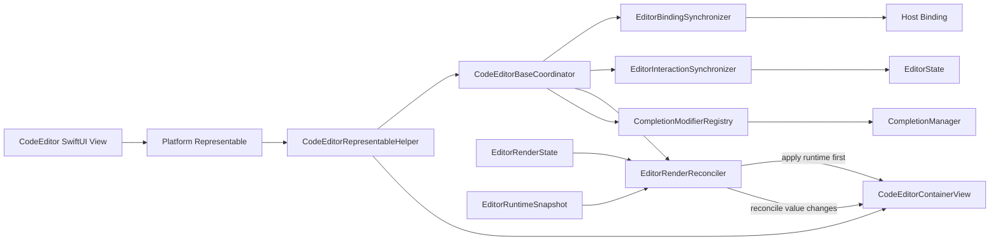

# SwiftUI Integration Ecosystem

The coordinator is now a thin host adapter. Binding, interaction, rendering, and modifier-provider reconciliation are independently testable objects.

```mermaid
flowchart LR
    VIEW[CodeEditor SwiftUI View] --> REP[Platform Representable]
    REP --> HELPER[CodeEditorRepresentableHelper]
    HELPER --> COORD[CodeEditorBaseCoordinator]
    HELPER --> CONTAINER[CodeEditorContainerView]

    COORD --> BIND[EditorBindingSynchronizer]
    COORD --> INTERACT[EditorInteractionSynchronizer]
    COORD --> RENDER[EditorRenderReconciler]
    COORD --> MODIFIERS[CompletionModifierRegistry]

    VALUE[EditorRenderState] --> RENDER
    RUNTIME[EditorRuntimeSnapshot] --> RENDER
    RENDER -->|apply runtime first| CONTAINER
    RENDER -->|reconcile value changes| CONTAINER
    INTERACT --> STATE[EditorState]
    BIND --> HOST[Host Binding]
    MODIFIERS --> COMPLETION[CompletionManager]
```
