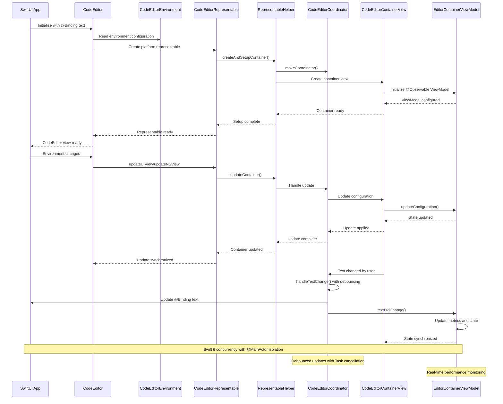

# SwiftUI Integration Complete Ecosystem

This diagram shows the comprehensive SwiftUI integration ecosystem that provides seamless integration between the CodeEditorPlugin framework and SwiftUI applications with modern Swift 6 patterns, @Observable ViewModels, and advanced performance monitoring.

```mermaid
classDiagram
    direction LR
    
    %% Row 1 - Core SwiftUI Integration
    class CodeEditor {
        <<SwiftUI View>>
        @Binding text String
        @FocusState isFocused Bool
        @State searchText String
        @State isSearching Bool
        @Environment(\.codeEditorEnvironment) environment
        @State defaultMemoryMonitor MemoryMonitor
        +initialLanguage Language?
        +initialTheme Theme?
        +onTextChange (@Sendable (String) -> Void)?
        +onSelectionChange (@Sendable (Range<String.Index>?) -> Void)?
        +completionProvider (@Sendable (SwiftUICompletionContext) async -> [SwiftUICompletionItem])?
        +textDebounceInterval Duration
        +body some View
    }

    class CodeEditorEnvironment {
        <<Sendable environment>>
        +language Language
        +theme Theme
        +configuration EditorConfiguration
        +becomeFirstResponder Bool
        +memoryMonitor MemoryMonitor?
        +eventSystem UnifiedEventSystem?
        +with() CodeEditorEnvironment
        +static default CodeEditorEnvironment
    }

    class CodeEditorRepresentableHelper {
        <<@MainActor helper>>
        +ContainerParameters struct
        +UpdateParameters struct
        +createAndSetupContainer() CodeEditorContainerView
        +updateContainer() Void
        +calculateSize() CGSize?
        +dismantle() Void
        +applyCommonSizeConstraints() CGSize
        +makeCoordinator() CodeEditorCoordinator
    }

    %% Row 2 - Platform Representables
    class CodeEditorRepresentable {
        <<cross-platform representable>>
        @Binding text String
        +language Language
        +theme Theme
        +configuration EditorConfiguration
        +memoryMonitor MemoryMonitor
        @Binding isFocused Bool
        +textDebounceInterval Duration
        +onTextChange ((String) -> Void)?
        +onSelectionChange ((NSRange) -> Void)?
        +typealias Coordinator CodeEditorCoordinator
    }

    class AppKitCodeEditorRepresentable {
        <<NSViewRepresentable macOS 26.3+>>
        +makeNSView(context) CodeEditorContainerView
        +updateNSView(nsView, context) Void
        +dismantleNSView(_, coordinator) Void
        +sizeThatFits(proposal, nsView, context) CGSize?
        +makeCoordinator() CodeEditorCoordinator
    }

    class UIKitCodeEditorRepresentable {
        <<UIViewRepresentable iOS 26.3+>>
        +makeUIView(context) CodeEditorContainerView
        +updateUIView(uiView, context) Void
        +dismantleUIView(_, coordinator) Void
        +sizeThatFits(proposal, uiView, context) CGSize?
        +makeCoordinator() CodeEditorCoordinator
    }

    %% Row 3 - Modern Coordination System
    class CodeEditorBaseCoordinator {
        <<@MainActor ObservableObject>>
        @Published currentText String
        @Published currentLanguage Language
        @Published currentConfiguration EditorConfiguration
        +onTextChange ((String) -> Void)?
        +onSelectionChange ((NSRange) -> Void)?
        +textBinding Binding<String>?
        +textUpdateTask Task<Void, Never>?
        +textDebounceInterval Duration
        +hasFocusBeenRequested Bool
        +requestFocusIfNeeded() Void
        +handleTextChange() Void
        +setupTextChangeObservers() Void
        +updateTextView() Void
    }

    class CodeEditorCoordinator {
        <<platform-specific coordinator>>
        +init(text, onTextChange, onSelectionChange)
        +setupContainer() Void
        +updateContainer() Void
        +requestFocusIfNeeded() Void
        +resetFocusTracking() Void
        +removeNotificationObservers() Void
        +cleanup() Void
    }

    class SwiftUICompletionContext {
        <<Sendable completion context>>
        +text String
        +cursorPosition Int
        +language Language
        +init(text, cursorPosition, language)
    }

    class SwiftUICompletionItem {
        <<completion item>>
        +label String
        +kind CompletionKind
        +detail String?
        +insertText String
        +documentation String?
        +init(label, kind, detail?, insertText?, documentation?)
    }

    %% Row 4 - Modern Environment System
    class CodeEditorEnvironmentKey {
        <<EnvironmentKey>>
        +static defaultValue CodeEditorEnvironment
        +typealias Value CodeEditorEnvironment
    }

    class EnvironmentValues {
        <<SwiftUI EnvironmentValues extension>>
        +codeEditorEnvironment CodeEditorEnvironment
        +codeEditorTheme Theme
        +codeEditorLanguage Language
        +codeEditorConfiguration EditorConfiguration
        +codeEditorBecomeFirstResponder Bool
        +codeEditorMemoryMonitor MemoryMonitor?
        +codeEditorEventSystem UnifiedEventSystem?
    }

    class CodeEditorEnvironmentBuilder {
        <<@resultBuilder>>
        +buildBlock() CodeEditorEnvironment
        +buildExpression() CodeEditorEnvironment
    }

    class BecomeFirstResponderOption {
        <<Sendable enum>>
        +yes
        +no
        +unchanged
    }

    %% Row 5 - SwiftUI View Modifiers
    class ViewModifiers {
        <<View extensions>>
        +codeTheme() some View
        +codeLanguage() some View
        +codeWorkspaceRoot() some View
        +lineNumbers() some View
        +becomeFirstResponder() some View
        +codeEditorEnvironment() some View
        +transformEnvironment() some View
    }

    class CodeEditorModifiers {
        <<CodeEditor extensions>>
        +isSelectedLineHighlighted() some View
        +editable() some View
        +onTextChange() CodeEditor
        +onSelectionChange() CodeEditor
        +codeCompletion() CodeEditor
        +codeFontSize() some View
        +tabWidth() some View
        +areInvisibleCharactersVisible() some View
        +isMinimapVisible() some View
        +autoScrollToCursor() some View
        +isCodeFoldingEnabled() some View
        +areFoldingControlsVisible() some View
        +minimumFoldableLines() some View
        +animateCodeFolding() some View
        +memoryMonitor() some View
        +eventSystem() some View
    }

    class CompletionKind {
        <<completion kind enum>>
        +keyword
        +function
        +method
        +variable
        +constant
        +class
        +struct
        +enum
        +interface
        +module
        +property
        +value
        +reference
        +snippet
        +text
    }

    %% Row 6 - @Observable State Management
    class EditorContainerViewModel {
        <<@Observable @MainActor>>
        +editorState EditorState
        +componentVisibility ComponentVisibility
        +configuration EditorConfiguration
        +layoutFrames EditorLayoutService.ComponentFrames?
        +errorMessage String?
        +isLoading Bool
        +statusText String
        +businessLogicServices BusinessLogicServiceRegistry
        +updateTask Task<Void, Never>?
        +configure() Void
        +updateConfiguration() Void
        +updateLayout() Void
        +textDidChange() Void
        +selectionDidChange() Void
        +scrollPositionDidChange() Void
        +configurationBinding Binding<EditorConfiguration>
        +errorBinding Binding<String?>
        +loadingBinding Binding<Bool>
    }

    class EditorState {
        <<nested state struct>>
        +isEditing Bool
        +hasUnsavedChanges Bool
        +lineCount Int
        +characterCount Int
        +selectedRange NSRange
        +visibleRange NSRange
        +scrollPosition CGPoint
    }

    class ComponentVisibility {
        <<visibility state struct>>
        +showGutter Bool
        +isMinimapVisible Bool
        +showScrollbar Bool
        +showStatusBar Bool
        +showCompletionPopup Bool
    }

    %% Row 7 - Performance & Accessibility
    class PerformanceInsights {
        <<@ObservedObject>>
        +metrics PerformanceMetrics
        +issues [InsightsPerformanceIssue]
        +recommendations [InsightsPerformanceRecommendation]
        +status PerformanceStatus
        +reset() Void
    }

    class PerformanceStatusView {
        <<SwiftUI View>>
        @ObservedObject insights PerformanceInsights
        +body some View
    }

    class PerformanceInsightsPanel {
        <<SwiftUI View>>
        @ObservedObject insights PerformanceInsights
        @State showingDetailedReport Bool
        +body some View
    }

    class CodeEditorAccessibility {
        <<accessibility extensions>>
        +setupAccessibility() Void
        +updateAccessibilityLabel() Void
        +announceChange() Void
        +notifyAccessibilityTextDidChange() Void
        +applyDynamicTypeScaling() Void
        +setAccessibilityFileName() Void
        +adjustsFontForContentSizeCategory Bool
        +accessibilityTextualContext String
    }

    %% Row 8 - Business Logic Integration
    class BusinessLogicServiceRegistry {
        <<@MainActor dependency injection>>
        +lineNumberCalculationService LineNumberCalculationService
        +gutterSizingService GutterSizingService
        +codeFoldingCoordinatorService CodeFoldingCoordinatorService
        +editorLayoutService EditorLayoutService
        +syntaxHighlightingService SyntaxHighlightingService
        +languageDetectionService LanguageDetectionService
        +textEditingService TextEditingService
        +completionProviderRegistry CompletionProviderRegistry
        +configureForEditor() Void
        +clearAllCaches() Void
    }

    class GutterViewModel {
        <<@Observable @MainActor>>
        +configuration EditorConfiguration
        +businessLogicServices BusinessLogicServiceRegistry
        +configure() Void
        +updateConfiguration() Void
        +textDidChange() Void
        +selectionDidChange() Void
        +scrollPositionDidChange() Void
        +updateFrame() Void
        +clearCache() Void
    }

    class CompletionViewModel {
        <<@Observable @MainActor>>
        +configuration EditorConfiguration
        +businessLogicServices BusinessLogicServiceRegistry
        +showPopup() Void
        +hidePopup() Void
        +textDidChange() Void
        +selectionDidChange() Void
        +clearCache() Void
    }

    class MinimapViewModel {
        <<@Observable @MainActor>>
        +configuration EditorConfiguration
        +businessLogicServices BusinessLogicServiceRegistry
        +configure() Void
        +updateFrame() Void
        +textDidChange() Void
        +scrollPositionDidChange() Void
        +clearCache() Void
    }

    %% Key Relationships
    CodeEditor --> CodeEditorEnvironment : reads environment
    CodeEditor --> CodeEditorRepresentable : creates representable
    CodeEditor --> MemoryMonitor : manages default monitor
    
    CodeEditorRepresentable <|-- AppKitCodeEditorRepresentable : platform-specific
    CodeEditorRepresentable <|-- UIKitCodeEditorRepresentable : platform-specific
    
    CodeEditorRepresentableHelper --> CodeEditorCoordinator : creates coordinator
    CodeEditorRepresentableHelper --> CodeEditorContainerView : manages container
    
    CodeEditorCoordinator --|> CodeEditorBaseCoordinator : inherits from
    CodeEditorBaseCoordinator --> SwiftUICompletionContext : provides context
    CodeEditorBaseCoordinator --> SwiftUICompletionItem : handles completions
    
    EnvironmentValues --> CodeEditorEnvironment : contains consolidated config
    CodeEditorEnvironmentKey --> CodeEditorEnvironment : provides key
    CodeEditorEnvironmentBuilder --> CodeEditorEnvironment : builds declaratively
    
    ViewModifiers --> EnvironmentValues : transforms environment
    CodeEditorModifiers --> CodeEditor : returns modified view
    CompletionKind --> SwiftUICompletionItem : categorizes items
    
    EditorContainerViewModel --> EditorState : manages nested state
    EditorContainerViewModel --> ComponentVisibility : controls UI visibility
    EditorContainerViewModel --> BusinessLogicServiceRegistry : injects services
    
    PerformanceInsights --> PerformanceStatusView : provides data
    PerformanceInsights --> PerformanceInsightsPanel : provides metrics
    CodeEditorAccessibility --> CodeEditorView : extends with accessibility
    
    BusinessLogicServiceRegistry --> GutterViewModel : provides services
    BusinessLogicServiceRegistry --> CompletionViewModel : provides services
    BusinessLogicServiceRegistry --> MinimapViewModel : provides services
    
    EditorContainerViewModel --> GutterViewModel : manages child
    EditorContainerViewModel --> CompletionViewModel : manages child
    EditorContainerViewModel --> MinimapViewModel : manages child

    %% Styling - Modern SwiftUI colors
    classDef swiftui fill:#007AFF20,stroke:#007AFF,stroke-width:3px,color:#1D1D1F
    classDef environment fill:#34C75920,stroke:#34C759,stroke-width:2px,color:#1D1D1F
    classDef representable fill:#AF52DE20,stroke:#AF52DE,stroke-width:2px,color:#1D1D1F
    classDef coordinator fill:#FF950020,stroke:#FF9500,stroke-width:2px,color:#1D1D1F
    classDef observable fill:#FF3B3020,stroke:#FF3B30,stroke-width:2px,color:#1D1D1F
    classDef modifier fill:#5AC8FA20,stroke:#5AC8FA,stroke-width:2px,color:#1D1D1F
    classDef performance fill:#FFCC0020,stroke:#FFCC00,stroke-width:2px,color:#1D1D1F
    classDef service fill:#8E8E9320,stroke:#8E8E93,stroke-width:2px,color:#1D1D1F

    class CodeEditor swiftui
    class CodeEditorEnvironment environment
    class CodeEditorEnvironmentKey environment
    class EnvironmentValues environment
    class CodeEditorEnvironmentBuilder environment
    class BecomeFirstResponderOption environment
    
    class CodeEditorRepresentable representable
    class AppKitCodeEditorRepresentable representable
    class UIKitCodeEditorRepresentable representable
    class CodeEditorRepresentableHelper representable
    
    class CodeEditorBaseCoordinator coordinator
    class CodeEditorCoordinator coordinator
    class SwiftUICompletionContext coordinator
    class SwiftUICompletionItem coordinator
    
    class ViewModifiers modifier
    class CodeEditorModifiers modifier
    class CompletionKind modifier
    
    class EditorContainerViewModel observable
    class EditorState observable
    class ComponentVisibility observable
    class GutterViewModel observable
    class CompletionViewModel observable
    class MinimapViewModel observable
    
    class PerformanceInsights performance
    class PerformanceStatusView performance
    class PerformanceInsightsPanel performance
    class CodeEditorAccessibility performance
    
    class BusinessLogicServiceRegistry service
```



## Modern SwiftUI Integration Flow



## Key SwiftUI Integration Features

### 1. Modern SwiftUI Architecture
- **Swift 6 Concurrency**: Full @MainActor isolation and Sendable compliance
- **@Observable ViewModels**: Modern state management with @Observable macro
- **Environment Consolidation**: Single consolidated `CodeEditorEnvironment` 
- **@FocusState Integration**: Native SwiftUI focus management
- **Searchable Support**: Built-in search functionality with `.searchable()`

### 2. Advanced Environment System
- **Consolidated Configuration**: Single `CodeEditorEnvironment` struct for all settings
- **Result Builder Support**: Declarative environment configuration with `@CodeEditorEnvironmentBuilder`
- **Legacy Compatibility**: Computed properties maintain backward compatibility
- **Environment Transformations**: Efficient environment updates with `transformEnvironment`
- **Dependency Injection**: Memory monitor and event system injection

### 3. Cross-Platform Representables
- **Platform Detection**: Automatic AppKit vs UIKit representable selection
- **Shared Helper Logic**: `CodeEditorRepresentableHelper` for common operations
- **Size Calculation**: Platform-optimized size calculations with `sizeThatFits`
- **Lifecycle Management**: Proper setup, update, and dismantling
- **Focus Coordination**: Cross-platform focus management

### 4. Performance-Optimized Coordination
- **Debounced Updates**: Configurable text change debouncing with Swift concurrency
- **Task Cancellation**: Proper task lifecycle management
- **Update Batching**: Efficient state synchronization
- **Memory Monitoring**: Real-time performance insights
- **Change Detection**: Smart update detection to prevent unnecessary work

### 5. Rich Modifier Ecosystem
- **Fluent API**: 20+ chainable view modifiers for comprehensive configuration
- **Type Safety**: Strongly-typed parameters with proper defaults
- **Environment Integration**: Modifiers update environment values efficiently
- **Code Completion**: Custom completion provider support
- **Advanced Features**: Code folding, minimap, accessibility integration

### 6. @Observable State Management
- **EditorContainerViewModel**: Central state coordination with @Observable
- **Child ViewModels**: Specialized ViewModels for gutter, completion, minimap
- **SwiftUI Bindings**: Direct binding support for reactive UI updates
- **Business Logic Integration**: Clean separation with service registry injection
- **Real-time Metrics**: Performance monitoring and error handling

### 7. Accessibility & Performance
- **Dynamic Type**: Full Dynamic Type scaling support
- **VoiceOver**: Comprehensive accessibility labels and announcements
- **Reduce Motion**: Respects accessibility preferences
- **Performance Views**: Real-time performance monitoring UI components
- **Memory Pressure**: Adaptive behavior under memory constraints

## Usage Examples

### Modern Basic Implementation
```swift
struct ContentView: View {
    @State private var code = """
        func greet(name: String) {
            logger.debug("Hello, \\(name)!")
        }
        """
    
    var body: some View {
        CodeEditor(text: $code)
            .codeLanguage(.swift)
            .lineNumbers(true)
            .isSelectedLineHighlighted(true)
            .frame(height: 400)
    }
}
```

### Consolidated Environment Configuration
```swift
struct AdvancedCodeEditor: View {
    @State private var code = "// Enter code here"
    @State private var customMemoryMonitor = MemoryMonitor()
    
    var body: some View {
        CodeEditor(text: $code)
            .codeEditorEnvironment {
                CodeEditorEnvironment(
                    language: .swift,
                    theme: .monokai,
                    configuration: .presentation,
                    memoryMonitor: customMemoryMonitor
                )
            }
    }
}
```

### Advanced Configuration with Performance Monitoring
```swift
struct PerformanceAwareEditor: View {
    @State private var code = ""
    @State private var memoryMonitor = MemoryMonitor()
    @State private var eventSystem = UnifiedEventSystem()
    
    var body: some View {
        VStack {
            CodeEditor(text: $code, debounceInterval: .milliseconds(300))
                .codeLanguage(.swift)
                .lineNumbers(true)
                .isCodeFoldingEnabled(true)
                .isMinimapVisible(true)
                .memoryMonitor(memoryMonitor)
                .eventSystem(eventSystem)
                .onTextChange { newText in
                    // Handle with custom debouncing
                    performExpensiveOperation(newText)
                }
                .codeCompletion { context in
                    await fetchCompletions(for: context)
                }
            
            PerformanceInsightsPanel(insights: memoryMonitor.performanceInsights)
        }
    }
}
```

### @Observable ViewModel Integration
```swift
@Observable
final class CodeEditorAppState {
    var code: String = ""
    var language: Language = .swift
    var theme: Theme = .default
    var configuration = EditorConfiguration()
    
    func updateConfiguration(updates: (inout EditorConfiguration) -> Void) {
        updates(&configuration)
    }
}

struct ObservableCodeEditor: View {
    @State private var appState = CodeEditorAppState()
    
    var body: some View {
        CodeEditor(text: $appState.code)
            .codeLanguage(appState.language)
            .codeTheme(appState.theme)
            .environment(\.codeEditorConfiguration, appState.configuration)
    }
}
```

### Factory Methods and Custom Completion
```swift
struct FactoryExampleView: View {
    @State private var code = "// Swift code"
    
    var body: some View {
        // Using factory method
        CodeEditor.withLanguage(
            $code, 
            language: .swift, 
            theme: .dark,
            debounceInterval: .milliseconds(200)
        )
        .codeCompletion { context in
            // Custom async completion provider
            let items = await myCompletionService.getCompletions(
                for: context.language,
                at: context.cursorPosition,
                in: context.text
            )
            
            return items.map { item in
                SwiftUICompletionItem(
                    label: item.label,
                    kind: .function,
                    detail: item.signature,
                    insertText: item.template,
                    documentation: item.documentation
                )
            }
        }
    }
}
```

## Benefits

1. **Modern Swift 6**: Full concurrency safety with @MainActor isolation and Sendable compliance
2. **@Observable Integration**: Latest SwiftUI state management patterns with @Observable ViewModels
3. **Performance Excellence**: Real-time monitoring, adaptive behavior, and 60fps rendering targets
4. **Cross-Platform**: Unified API across macOS, iOS, iPadOS
5. **Developer Experience**: Rich modifier ecosystem, factory methods, and comprehensive completion support
6. **Accessibility First**: Dynamic Type, VoiceOver, and accessibility preference awareness
7. **Business Logic Separation**: Clean architecture with dependency injection and service registry
8. **Memory Efficient**: Smart memory monitoring with adaptive performance modes
9. **Environment Consolidation**: Single environment configuration with result builder support
10. **Extensible Architecture**: Plugin-ready with event system and custom completion providers

## Technical Highlights

- **401 Source Files** with comprehensive SwiftUI integration
- **66 Test Files** ensuring reliability across all platforms
- **20+ View Modifiers** for declarative configuration
- **Zero SwiftLint Violations** maintained for code quality
- **Swift 6 Ready** with full concurrency compliance
- **@Observable ViewModels** for modern state management
- **Real-time Performance Monitoring** with adaptive behavior
- **Cross-platform Representables** with shared helper logic
