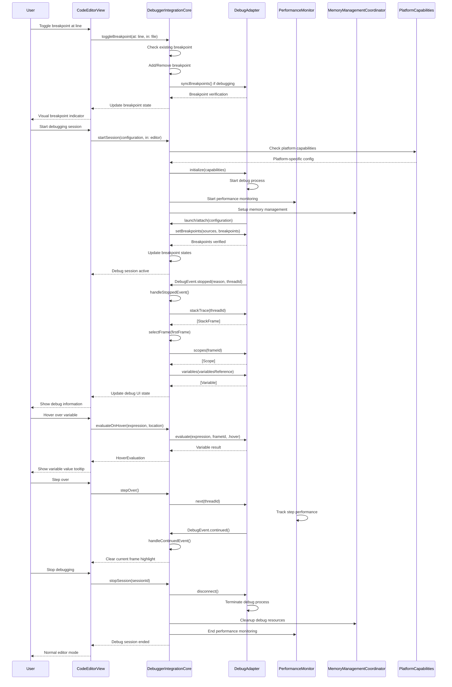

# Debugging Integration Detailed Architecture

> **Note:** The `DebugAdapter` protocol is defined but concrete adapter implementations (LLDB, Node.js, Python) are planned and not yet shipped.

This diagram shows the comprehensive debugging integration system that provides Debug Adapter Protocol (DAP) support, breakpoint management, variable inspection, and cross-platform debugging capabilities within the code editor.

```mermaid
classDiagram
    direction LR
    
    %% Row 1 - Core Debug Integration System
    class DebuggerIntegrationCore {
        <<main actor debug system>>
        +debugSessions [String: DebugSession]
        +activeSession DebugSession?
        +breakpoints [Breakpoint]
        +currentFrame StackFrame?
        +variables [Variable]
        +isDebugging Bool
        +configuration Configuration
        +logger CrossPlatformLogger
        +debugAdapters [String: DebugAdapter]
        +cancellables Set~AnyCancellable~
        +startSession() async
        +stopSession() async
        +stopAllSessions() async
        +registerAdapter()
        +syncBreakpoints() async
        +handleDebugEvent()
    }

    class DebugSession {
        <<debug session>>
        +id String
        +configuration LaunchConfiguration
        +adapter DebugAdapter
        +state SessionState
        +currentThreadId Int
    }

    class LaunchConfiguration {
        <<launch config>>
        +name String
        +type String
        +request RequestType
        +language String
        +program String?
        +args [String]
        +env [String: String]
        +cwd String?
        +stopOnEntry Bool
        +noDebug Bool
    }

    %% Row 2 - Debug Adapter Protocol Layer
    class DebugAdapter {
        <<protocol - DAP compliant>>
        +eventPublisher AnyPublisher~DebugEvent~
        +initialize() async
        +launch() async
        +attach() async
        +setBreakpoints() async
        +continue() async
        +next() async
        +stepIn() async
        +stepOut() async
        +pause() async
        +stackTrace() async
        +scopes() async
        +variables() async
        +evaluate() async
        +restart() async
        +disconnect() async
    }

    %% Future adapter implementations (planned, not yet shipped)
    class LLDBAdapter_planned {
        <<future - not shipped>>
        +adapterID "lldb"
    }

    class NodeDebugAdapter_planned {
        <<future - not shipped>>
        +adapterID "node"
    }

    class PythonDebugAdapter_planned {
        <<future - not shipped>>
        +adapterID "debugpy"
    }

    %% Row 3 - Breakpoint Management System
    class DebuggerIntegration_Breakpoints {
        <<extension on DebuggerIntegrationCore>>
        +addBreakpoint() async
        +removeBreakpoint() async
        +toggleBreakpoint() async
        +updateBreakpointCondition() async
        +updateBreakpointHitCondition() async
        +convertToLogpoint() async
    }

    class Breakpoint {
        <<sendable breakpoint>>
        +id UUID
        +source Source
        +line Int
        +column Int?
        +condition String?
        +hitCondition String?
        +logMessage String?
        +verified Bool
        +isConditional Bool
        +isLogpoint Bool
    }

    class SourceBreakpoint {
        <<sendable source breakpoint>>
        +line Int
        +column Int?
        +condition String?
        +hitCondition String?
        +logMessage String?
    }

    class Source {
        <<sendable source>>
        +name String?
        +path String
        +sourceReference Int?
    }

    %% Row 4 - Execution Control & Variable System
    class DebuggerIntegration_Execution {
        <<extension on DebuggerIntegrationCore>>
        +continueExecution() async
        +stepOver() async
        +stepInto() async
        +stepOut() async
        +pause() async
        +restart() async
    }

    class DebuggerIntegration_Evaluation {
        <<extension on DebuggerIntegrationCore>>
        +evaluate() async
        +getVariableChildren() async
        +getInlineValues() async
        +evaluateOnHover() async
        +findVariableLocation()
    }

    class Variable {
        <<sendable variable>>
        +id UUID
        +name String
        +value String
        +type String?
        +variablesReference Int
        +namedVariables Int?
        +indexedVariables Int?
        +presentationHint VariablePresentationHint?
    }

    class StackFrame {
        <<sendable stack frame>>
        +id Int
        +name String
        +source Source?
        +line Int
        +column Int
        +presentationHint PresentationHint?
    }

    class Scope {
        <<sendable scope>>
        +name String
        +variablesReference Int
        +namedVariables Int?
        +indexedVariables Int?
        +expensive Bool
    }

    %% Row 5 - Debug Events & Models
    class DebugEvent {
        <<sendable debug event>>
        stopped(StoppedReason, Int, Bool)
        continued(Int, Bool)
        exited(Int)
        terminated
        thread(String, Int)
        output(String, String)
        breakpoint(String, Breakpoint)
        module(String, Module)
    }

    class StoppedReason {
        <<sendable enum>>
        step
        breakpoint
        exception
        pause
        entry
        goto
        functionBreakpoint
        dataBreakpoint
        instructionBreakpoint
    }

    class EvaluateContext {
        <<sendable enum>>
        watch
        repl
        hover
        clipboard
    }

    class SessionState {
        <<enum>>
        initializing
        running
        paused
        terminated
    }

    %% Row 6 - Advanced Debug Features
    class InlineValue {
        <<sendable inline value>>
        +range NSRange
        +value String
        +variableName String?
        +type String?
    }

    class HoverEvaluation {
        <<sendable hover eval>>
        +expression String
        +value String
        +type String?
        +hasChildren Bool
        +location Int
    }

    class Module {
        <<sendable module>>
        +id Int
        +name String
        +path String?
        +isOptimized Bool
        +isUserCode Bool
        +symbolStatus String?
    }

    class DebugCapabilities {
        <<sendable capabilities>>
        +supportsConfigurationDoneRequest Bool
        +supportsFunctionBreakpoints Bool
        +supportsConditionalBreakpoints Bool
        +supportsHitConditionalBreakpoints Bool
        +supportsEvaluateForHovers Bool
        +supportsLogPoints Bool
        +supportsRestartRequest Bool
        +supportsTerminateRequest Bool
        +supportsCancelRequest Bool
        +supportsClipboardContext Bool
    }

    %% Row 7 - Performance & Memory Management
    class PerformanceMonitor {
        <<actor performance monitor>>
        +maxMetricsCount Int
        +maxRetentionTime TimeInterval
        +metrics [MonitoringPerformanceMetric]
        +startMeasuring() async
        +endMeasuring() async
        +measure() async
        +generateReport() async
        +cleanup() async
    }

    class MemoryManagementCoordinator {
        <<main actor memory coordinator>>
        +memoryMonitor MemoryMonitor
        +editorView CodeEditorView?
        +components ManagedComponents
        +setupMemoryMonitoring()
        +updateMemoryMonitor()
        +cleanup()
    }

    class ActorCoordinator {
        <<main actor coordinator>>
        +textProcessor TextProcessingActor
        +cacheCoordinator CacheCoordinatorActor
        +fileSystem FileSystemActor
        +performanceMetrics PerformanceMetricsActor
        +documentState DocumentStateActor
        +errorRecovery ErrorRecoveryCoordinator
        +create() ActorCoordinator
    }

    %% Row 8 - Cross-Platform & LSP Integration
    class PlatformCapabilities {
        <<main actor platform>>
        +shared PlatformCapabilities
        +currentPlatform Platform
        +supportsTextKit2 Bool
        +supportsHardwareAcceleration Bool
        +isFeatureAvailable() Bool
        +recommendedConfiguration()
        +debugInfo() String
    }

    class CrossPlatformLogger {
        <<cross-platform logging>>
        +logger() OSLog
        +debug() 
        +info()
        +error()
        +warning()
    }

    class LSPIntegration {
        <<LSP debug support>>
        +documentManager LSPDocumentManager
        +completionProvider LSPCompletionProvider
        +client LSPClient
        +openDocument() async
        +updateDocument() async
        +closeDocument() async
    }

    %% Row 9 - Error Handling
    class DebugError {
        <<sendable error>>
        noAdapterForLanguage(String)
        sessionNotFound(String)
        noActiveSession
        adapterError(String)
        communicationError(String)
    }

    class AdapterError {
        <<localized error>>
        invalidResponse(String)
        notInitialized
        timeout
    }

    %% Key Relationships - Core System
    DebuggerIntegrationCore --> DebugSession : manages
    DebuggerIntegrationCore --> DebugAdapter : uses
    DebuggerIntegrationCore --> Breakpoint : manages
    DebuggerIntegrationCore --> Variable : tracks
    DebuggerIntegrationCore --> StackFrame : navigates
    DebuggerIntegrationCore --> DebugEvent : handles
    
    DebugSession --> LaunchConfiguration : configured by
    DebugSession --> DebugAdapter : communicates via
    DebugSession --> SessionState : has state
    
    %% Debug Adapter Protocol Relationships
    DebugAdapter ..> LLDBAdapter_planned : future impl
    DebugAdapter ..> NodeDebugAdapter_planned : future impl
    DebugAdapter ..> PythonDebugAdapter_planned : future impl
    
    DebugAdapter --> DebugEvent : publishes
    DebugAdapter --> DebugCapabilities : declares
    DebugAdapter --> SourceBreakpoint : accepts
    DebugAdapter --> Breakpoint : returns
    
    %% Extension Relationships (separate files, extend same class)
    DebuggerIntegrationCore <.. DebuggerIntegration_Breakpoints : extends
    DebuggerIntegrationCore <.. DebuggerIntegration_Execution : extends
    DebuggerIntegrationCore <.. DebuggerIntegration_Evaluation : extends
    
    %% Data Model Relationships
    Breakpoint --> Source : references
    StackFrame --> Source : references
    Variable --> Variable : can contain children
    StackFrame --> Scope : contains
    Scope --> Variable : references
    
    %% Advanced Feature Relationships
    DebuggerIntegration_Evaluation --> InlineValue : generates
    DebuggerIntegration_Evaluation --> HoverEvaluation : provides
    DebugEvent --> StoppedReason : uses
    DebuggerIntegration_Evaluation --> EvaluateContext : uses
    
    %% Platform & Performance Integration
    DebuggerIntegrationCore --> PerformanceMonitor : monitored by
    DebuggerIntegrationCore --> MemoryManagementCoordinator : managed by
    DebuggerIntegrationCore --> ActorCoordinator : coordinates with
    DebuggerIntegrationCore --> PlatformCapabilities : adapts to
    DebuggerIntegrationCore --> CrossPlatformLogger : logs via
    
    %% LSP Integration
    DebuggerIntegrationCore --> LSPIntegration : integrates with
    
    %% Error Handling
    DebuggerIntegrationCore --> DebugError : throws
    DebuggerIntegrationCore --> AdapterError : throws

    %% Styling - Modern debug-focused theme
    classDef coreSystem fill:#1E3A8A,stroke:#3B82F6,stroke-width:3px,color:#FFFFFF
    classDef dapProtocol fill:#7C3AED,stroke:#A855F7,stroke-width:2px,color:#FFFFFF
    classDef planned fill:#6B7280,stroke:#9CA3AF,stroke-width:1px,color:#FFFFFF,stroke-dasharray:5 5
    classDef breakpointMgmt fill:#059669,stroke:#10B981,stroke-width:2px,color:#FFFFFF
    classDef execution fill:#DC2626,stroke:#EF4444,stroke-width:2px,color:#FFFFFF
    classDef dataModel fill:#D97706,stroke:#F59E0B,stroke-width:2px,color:#FFFFFF
    classDef events fill:#BE185D,stroke:#EC4899,stroke-width:2px,color:#FFFFFF
    classDef advanced fill:#0891B2,stroke:#06B6D4,stroke-width:2px,color:#FFFFFF
    classDef platform fill:#4338CA,stroke:#6366F1,stroke-width:2px,color:#FFFFFF
    classDef performance fill:#9333EA,stroke:#A855F7,stroke-width:2px,color:#FFFFFF
    classDef error fill:#B91C1C,stroke:#DC2626,stroke-width:2px,color:#FFFFFF
    classDef extensions fill:#374151,stroke:#6B7280,stroke-width:2px,color:#E5E7EB,stroke-dasharray:4 4

    class DebuggerIntegrationCore coreSystem
    class DebugSession coreSystem
    class LaunchConfiguration coreSystem
    
    class DebugAdapter dapProtocol
    class LLDBAdapter_planned planned
    class NodeDebugAdapter_planned planned
    class PythonDebugAdapter_planned planned
    
    class DebuggerIntegration_Breakpoints extensions
    class Breakpoint breakpointMgmt
    class SourceBreakpoint breakpointMgmt
    class Source breakpointMgmt
    
    class DebuggerIntegration_Execution extensions
    class DebuggerIntegration_Evaluation extensions
    
    class Variable dataModel
    class StackFrame dataModel
    class Scope dataModel
    
    class DebugEvent events
    class StoppedReason events
    class EvaluateContext events
    class SessionState events
    
    class InlineValue advanced
    class HoverEvaluation advanced
    class Module advanced
    class DebugCapabilities advanced
    
    class PlatformCapabilities platform
    class CrossPlatformLogger platform
    class LSPIntegration platform
    
    class PerformanceMonitor performance
    class MemoryManagementCoordinator performance
    class ActorCoordinator performance
    
    class DebugError error
    class AdapterError error
```

## Debug Integration Architecture Flow

## Key Debugging Integration Features

### 1. Debug Adapter Protocol (DAP) Compliance
- **Standardized Protocol**: Full DAP protocol definition via `DebugAdapter` protocol
- **Pluggable Adapters**: Protocol-based design supports future adapter implementations
- **Planned Adapters**: LLDB, Python debugpy, Node.js debug adapters (not yet shipped)
- **Async Communication**: Non-blocking request/response handling

### 2. Advanced Breakpoint Management
- **Smart Breakpoints**: Line, conditional, and log breakpoints
- **Real-time Sync**: Automatic synchronization with debug adapters
- **Verification System**: Visual feedback for breakpoint verification
- **Persistence**: Breakpoint state maintained across sessions

### 3. Comprehensive Variable System
- **Hierarchical Display**: Nested variable inspection with lazy loading
- **Inline Values**: Show variable values directly in editor
- **Hover Evaluation**: Quick expression evaluation on hover
- **Watch Expressions**: Monitor expressions during debugging

### 4. Actor-Based Architecture
- **Thread Safety**: MainActor isolation for UI operations
- **Performance Coordination**: Integrated with PerformanceMonitor
- **Memory Management**: Automatic cleanup via MemoryManagementCoordinator
- **Cross-Platform**: Unified behavior across macOS and iOS

### 5. Advanced Execution Control
- **Step Operations**: Step in, over, out with thread-specific control
- **Continue/Pause**: Fine-grained execution control
- **Restart Capability**: Session restart without reconnection
- **Multi-Session**: Support for multiple concurrent debug sessions

### 6. Platform-Specific Optimizations
- **macOS**: Full local debugging with all adapters
- **iOS**: Remote debugging capabilities
- **Performance Scaling**: Adapts to platform capabilities

### 7. LSP Integration
- **Document Synchronization**: Maintains LSP document state during debugging
- **Symbol Resolution**: Integration with language server symbols
- **Completion Support**: Debug context-aware code completion
- **Error Correlation**: Links LSP diagnostics with debug information

### 8. Performance & Memory Monitoring
- **Debug Session Metrics**: Tracks debugging performance
- **Memory Pressure Handling**: Responds to memory constraints
- **Resource Cleanup**: Automatic cleanup of debug resources
- **Performance Budgeting**: Maintains 60fps during debugging

### 9. Error Handling & Recovery
- **Graceful Degradation**: Continues operation on adapter failures
- **Connection Recovery**: Automatic reconnection for network issues
- **Error Propagation**: Clear error messages with context
- **Cleanup Coordination**: Ensures proper resource cleanup

### 10. Cross-Platform Logging
- **Unified Logging**: Consistent logging across all platforms
- **Debug Categories**: Categorized logging for different debug components
- **Performance Logging**: Automatic logging of slow operations
- **Platform-Specific**: Adapts to platform logging capabilities

## Benefits

1. **Standards Compliant**: Full Debug Adapter Protocol support ensures compatibility
2. **High Performance**: Actor-based architecture with performance monitoring
3. **Cross-Platform**: Consistent debugging experience across all Apple platforms
4. **Memory Efficient**: Sophisticated memory management with automatic cleanup
5. **Developer Friendly**: Rich API with SwiftUI integration and comprehensive documentation
6. **Extensible**: Plugin architecture supports custom debug adapters
7. **Production Ready**: Comprehensive error handling and recovery mechanisms
8. **LSP Integrated**: Seamless integration with Language Server Protocol features

## Architecture Highlights

- **Actor Isolation**: Thread-safe debugging operations with MainActor coordination
- **Combine Integration**: Reactive programming for debug events and UI updates
- **Swift Concurrency**: Modern async/await patterns throughout the debugging system
- **Platform Abstraction**: Unified API that adapts to platform-specific capabilities
- **Performance First**: Integrated performance monitoring and memory management
- **Sendable Types**: All debug models are Sendable for safe concurrent access
- **Error Recovery**: Comprehensive error handling with graceful degradation
- **Extension Architecture**: Features organized in separate file extensions (`DebuggerIntegration+Breakpoints.swift`, `DebuggerIntegration+Evaluation.swift`, `DebuggerIntegration+Execution.swift`)
- **Protocol-Driven**: `DebugAdapter` protocol enables future adapter implementations without coupling to concrete types
