# Utility Systems & Extensions Network

This diagram shows the comprehensive utility systems and extensions network that provides shared utilities, cross-platform helpers, and extensibility infrastructure throughout the CodeEditorKit framework.

```mermaid
classDiagram
    direction LR
    
    %% Row 1 - Core Actor-Based Utility System
    class ActorCoordinator {
        <<main coordinator>>
        +cacheCoordinator CacheCoordinatorActor
        +fileSystem FileSystemActor
        +performanceMetrics PerformanceMetricsActor
        +documentState DocumentStateActor
        +errorRecovery ErrorRecoveryCoordinator
        +trackPerformance() async
        +createOrUpdateDocument() async
    }

    class AsyncOperationManager {
        <<operation manager>>
        +scheduledOperations [UUID: ScheduledOperation]
        +debounceTasks [String: Task]
        +throttleInfo [String: Date]
        +activeOperations Set<UUID>
        +maxConcurrentOperations Int
        +debounce() async
        +throttle() async
        +schedule() async
        +retry() async
        +cleanup()
    }

    class CrossPlatformLogger {
        <<logging utility>>
        +subsystem String
        +category String
        +debug()
        +info()
        +warning()
        +error()
        +fault()
    }

    %% Row 2 - Specialized Actors
    class CacheCoordinatorActor {
        <<cache coordinator>>
        +caches [String: AnyCacheWrapper]
        +cacheStats [String: CacheStatistics]
        +maxGlobalMemoryMB Double
        +currentMemoryUsageMB Double
        +registerCache()
        +getValue() async
        +setValue() async
        +clearCache() async
        +performGlobalEviction() async
    }

    class FileSystemActor {
        <<file system actor>>
        +fileManager FileManager
        +fileHandles [URL: FileHandle]
        +watchers [URL: FileWatcher]
        +readFile() async
        +writeFile() async
        +openFile()
        +watchFile()
        +unwatchFile()
    }

    class PerformanceMetricsActor {
        <<metrics actor>>
        +metrics [String: [SendablePerformanceMetric]]
        +aggregatedStats [String: AggregatedStats]
        +maxMetricsPerCategory Int
        +record()
        +getStats()
        +getAllStats()
        +clearMetrics()
        +updateAggregatedStats()
    }

    %% Row 3 - Memory & Performance Utilities
    class MemoryMonitor {
        <<memory monitor>>
        +memoryProvider PlatformMemoryProvider
        +memoryThresholdMB Double
        +enableAutomaticCleanup Bool
        +cleanupHandlers [String: CleanupHandler]
        +memoryStats MemoryStatistics
        +monitoringTask Task?
        +registerCleanupHandler()
        +performCleanup() async
        +startMonitoring()
        +stopMonitoring()
        +getCurrentMemoryUsage()
    }

    class LRUCache {
        <<cache implementation>>
        +capacity Int
        +cache [Key: Node]
        +head Node?
        +tail Node?
        +memoryMonitor MemoryMonitor
        +get()
        +set()
        +removeValue()
        +removeAll()
        +contains()
        +statistics CacheStatistics
    }

    class TextMetricsCalculator {
        <<metrics calculator>>
        +calculateLineHeight()
        +measureText()
        +measureTextWidth()
        +estimateMemoryUsage()
        +calculateVisibleLines()
        +calculateAverageCharacterWidth()
        +calculateTabWidth()
        +calculateLineNumberWidth()
        +estimateRenderingComplexity()
    }

    class PlatformMemoryProvider {
        <<protocol>>
        +getCurrentMemoryUsage() Double
        +getPhysicalMemory() UInt64
        +getMemoryPressure() MemoryPressure
        +isUnderMemoryPressure() Bool
    }

    %% Row 4 - Extension System with +Extensions Pattern
    class ExtensionPattern {
        <<extension pattern>>
        +AsyncOperationManager+DebouncingExtensions
        +AsyncOperationManager+ThrottlingExtensions
        +AsyncOperationManager+RetryExtensions
        +AsyncOperationManager+BatchExtensions
        +AsyncOperationManager+SchedulingExtensions
        +NSRange+Extensions
        +String+Extensions
        +Duration+Extensions
        +CGRect+Extensions
        +PlatformColor+Extensions
    }

    class TypeExtensions {
        <<type extensions>>
        +NSTextView+Extensions
        +NSTextLayoutManager+Extensions
        +NSTextRange+Extensions
        +CodeEditorView+EditingActions
        +CodeEditorView+SelectionScrolling
        +Bundle+Extensions
        +IndexSet+Extensions
        +EdgeInsets+Extensions
        +View+Extensions
    }

    class CoreExtensions {
        <<core extensions>>
        +CodeEditorView+CoreExtensions
        +CodeEditorView+ConfigurationExtensions
        +CodeEditorView+PerformanceExtensions
        +CodeEditorView+SyntaxHighlightingExtensions
        +CodeEditorView+CompletionExtensions
        +CodeEditorView+AnnotationsExtensions
        +CodeEditorView+AccessibilityExtensions
        +CodeEditorView+LayoutExtensions
    }

    class PlatformExtensions {
        <<platform extensions>>
        +CrossPlatformCoordinator+AppKitExtensions
        +CrossPlatformCoordinator+UIKitExtensions
        +PlatformCapabilities+InputExtensions
        +PlatformCapabilities+UIExtensions
        +PlatformCapabilities+PerformanceExtensions
        +PlatformAdjustments+Extensions
    }

    %% Row 5 - Async Operation Extensions
    class AsyncOperationDebouncing {
        <<debouncing extensions>>
        +debounce() async
        +makeDebounced()
        +storeDebounceResult()
        +storeDebounceError()
        +cleanupDebounceTask()
    }

    class AsyncOperationThrottling {
        <<throttling extensions>>
        +throttle() async
        +makeThrottled()
        +shouldExecute() Bool
        +updateLastRun()
    }

    class AsyncOperationRetry {
        <<retry extensions>>
        +retry() async
        +retryWithBackoff() async
        +exponentialBackoff()
        +jitteredBackoff()
        +isRetryableError() Bool
    }

    class AsyncOperationBatch {
        <<batch extensions>>
        +batch() async
        +batchWithConcurrency() async
        +processBatch() async
        +mergeBatchResults()
        +handleBatchErrors()
    }

    %% Row 6 - Document State Management
    class DocumentStateActor {
        <<document actor>>
        +documents [UUID: DocumentState]
        +documentURLs [URL: UUID]
        +createDocument()
        +updateContent()
        +getDocument()
        +markSaved()
        +closeDocument()
    }

    class DocumentState {
        <<document state>>
        +id UUID
        +url URL?
        +content String
        +isDirty Bool
        +version Int
        +language Language
        +lastModified Date
        +metadata [String: String]
    }

    class ErrorRecoveryCoordinator {
        <<error recovery>>
        +recover() async
        +shouldRetry() Bool
        +getRecoveryStrategy()
        +reportError()
        +clearErrorState()
    }

    %% Row 7 - Utility Integration Types
    class SendablePerformanceMetric {
        <<performance metric>>
        +name String
        +duration Duration
        +metadata [String: String]
        +timestamp Date
    }

    class CleanupResult {
        <<cleanup result>>
        +memoryFreedMB Double
        +description String?
    }

    class MemoryStatistics {
        <<memory stats>>
        +currentUsageMB Double
        +peakUsageMB Double
        +averageUsageMB Double
        +totalCleanupOperations Int
        +totalMemoryFreed Double
        +usageHistory [Double]
    }

    class CacheStatistics {
        <<cache stats>>
        +currentSize Int
        +maxSize Int
        +utilizationPercentage Double
        +isFull Bool
        +availableSpace Int
    }

    %% Row 8 - Utility Enumerations
    class Priority {
        <<enumeration>>
        low
        medium
        high
        critical
    }

    class CleanupPriority {
        <<enumeration>>
        low
        normal
        high
        critical
    }

    class MemoryPressure {
        <<enumeration>>
        normal
        warning
        urgent
        critical
    }

    class RenderingComplexity {
        <<enumeration>>
        low
        medium
        high
    }

    %% Key Relationships
    ActorCoordinator --> CacheCoordinatorActor : coordinates
    ActorCoordinator --> FileSystemActor : coordinates
    ActorCoordinator --> PerformanceMetricsActor : coordinates
    ActorCoordinator --> DocumentStateActor : coordinates
    ActorCoordinator --> ErrorRecoveryCoordinator : coordinates
    
    AsyncOperationManager --> AsyncOperationDebouncing : extends
    AsyncOperationManager --> AsyncOperationThrottling : extends
    AsyncOperationManager --> AsyncOperationRetry : extends
    AsyncOperationManager --> AsyncOperationBatch : extends
    
    MemoryMonitor --> PlatformMemoryProvider : uses
    MemoryMonitor --> CleanupResult : produces
    MemoryMonitor --> MemoryStatistics : maintains
    
    LRUCache --> MemoryMonitor : integrates
    LRUCache --> CacheStatistics : provides
    
    CacheCoordinatorActor --> LRUCache : manages
    CacheCoordinatorActor --> CacheStatistics : tracks
    
    PerformanceMetricsActor --> SendablePerformanceMetric : processes
    
    DocumentStateActor --> DocumentState : manages
    
    TextMetricsCalculator --> RenderingComplexity : calculates
    
    ExtensionPattern --> TypeExtensions : organizes
    ExtensionPattern --> CoreExtensions : organizes
    ExtensionPattern --> PlatformExtensions : organizes
    
    TypeExtensions --> CoreExtensions : enhances
    CoreExtensions --> PlatformExtensions : supports

    %% Styling - Dark mode friendly colors
    classDef coordinator fill:#007AFF20,stroke:#007AFF,stroke-width:3px,color:#1D1D1F
    classDef actor fill:#34C75920,stroke:#34C759,stroke-width:2px,color:#1D1D1F
    classDef utility fill:#AF52DE20,stroke:#AF52DE,stroke-width:2px,color:#1D1D1F
    classDef performance fill:#FF950020,stroke:#FF9500,stroke-width:2px,color:#1D1D1F
    classDef extension fill:#FF3B3020,stroke:#FF3B30,stroke-width:2px,color:#1D1D1F
    classDef platform fill:#007AFF20,stroke:#007AFF,stroke-width:2px,color:#1D1D1F
    classDef types fill:#8E8E9320,stroke:#8E8E93,stroke-width:2px,color:#1D1D1F
    classDef enum fill:#6C6C7020,stroke:#6C6C70,stroke-width:2px,color:#1D1D1F

    class ActorCoordinator coordinator
    class AsyncOperationManager coordinator
    class CrossPlatformLogger utility
    class CacheCoordinatorActor actor
    class FileSystemActor actor
    class PerformanceMetricsActor actor
    class DocumentStateActor actor
    class MemoryMonitor performance
    class LRUCache performance
    class TextMetricsCalculator performance
    class PlatformMemoryProvider platform
    class ExtensionPattern extension
    class TypeExtensions extension
    class CoreExtensions extension
    class PlatformExtensions extension
    class AsyncOperationDebouncing extension
    class AsyncOperationThrottling extension
    class AsyncOperationRetry extension
    class AsyncOperationBatch extension
    class ErrorRecoveryCoordinator utility
    class DocumentState types
    class SendablePerformanceMetric types
    class CleanupResult types
    class MemoryStatistics types
    class CacheStatistics types
    class Priority enum
    class CleanupPriority enum
    class MemoryPressure enum
    class RenderingComplexity enum
```



## Actor-Based Utility System Integration Flow

```mermaid
flowchart TB
    INIT[System Initialization] --> CREATE_COORD[Create ActorCoordinator]
    CREATE_COORD --> INIT_ACTORS[Initialize Specialized Actors]
    INIT_ACTORS --> SETUP_MEM[Setup Memory Management]
    
    SETUP_MEM --> READY[System Ready]
    
    subgraph "Core Actors"
        direction TB
        CACHE_ACTOR[CacheCoordinatorActor]
        FILE_ACTOR[FileSystemActor]
        PERF_ACTOR[PerformanceMetricsActor]
        DOC_ACTOR[DocumentStateActor]
    end
    
    subgraph "Utility Operations"
        direction TB
        ASYNC_OP[AsyncOperationManager]
        MEM_MON[MemoryMonitor]
        CACHE[LRUCache]
        METRICS[TextMetricsCalculator]
        LOGGER[CrossPlatformLogger]
    end
    
    subgraph "Extension System"
        direction TB
        EXT_PATTERN[+Extensions Pattern]
        TYPE_EXT[Type Extensions]
        CORE_EXT[Core Extensions]
        PLATFORM_EXT[Platform Extensions]
    end
    
    READY --> CACHE_ACTOR
    READY --> FILE_ACTOR
    READY --> PERF_ACTOR
    READY --> DOC_ACTOR
    
    READY --> ASYNC_OP
    READY --> MEM_MON
    READY --> CACHE
    READY --> METRICS
    READY --> LOGGER
    
    READY --> EXT_PATTERN
    
    CACHE_ACTOR --> PROVIDE[Provide Services to Framework]
    FILE_ACTOR --> PROVIDE
    PERF_ACTOR --> PROVIDE
    DOC_ACTOR --> PROVIDE
    ASYNC_OP --> PROVIDE
    MEM_MON --> PROVIDE
    CACHE --> PROVIDE
    METRICS --> PROVIDE
    LOGGER --> PROVIDE
    EXT_PATTERN --> PROVIDE

    %% Styling - Dark mode friendly colors
    classDef init fill:#007AFF20,stroke:#007AFF,stroke-width:2px,color:#1D1D1F
    classDef process fill:#AF52DE20,stroke:#AF52DE,stroke-width:2px,color:#1D1D1F
    classDef actor fill:#34C75920,stroke:#34C759,stroke-width:2px,color:#1D1D1F
    classDef utility fill:#FF950020,stroke:#FF9500,stroke-width:2px,color:#1D1D1F
    classDef extension fill:#FF3B3020,stroke:#FF3B30,stroke-width:2px,color:#1D1D1F
    classDef result fill:#8E8E9320,stroke:#8E8E93,stroke-width:2px,color:#1D1D1F

    class INIT init
    class READY init
    class CREATE_COORD process
    class INIT_ACTORS process
    class SETUP_MEM process
    class CACHE_ACTOR actor
    class FILE_ACTOR actor
    class PERF_ACTOR actor
    class DOC_ACTOR actor
    class ASYNC_OP utility
    class MEM_MON utility
    class CACHE utility
    class METRICS utility
    class LOGGER utility
    class EXT_PATTERN extension
    class TYPE_EXT extension
    class CORE_EXT extension
    class PLATFORM_EXT extension
    class PROVIDE result
```



## Key Utility System Features

### 1. Actor-Based Architecture (Swift 6 Concurrency)
- **ActorCoordinator**: Central coordination of all specialized actors with dependency injection
- **CacheCoordinatorActor**: Thread-safe cache management with global eviction policies
- **FileSystemActor**: Async file operations with integrated file watching capabilities
- **PerformanceMetricsActor**: Real-time performance tracking with aggregated statistics

### 2. Advanced Async Operation Management
- **Debouncing Extensions**: Sophisticated debouncing with delayed execution and result caching
- **Throttling Extensions**: Rate-limiting operations with configurable intervals
- **Retry Extensions**: Exponential backoff retry logic with jittered timing
- **Batch Extensions**: Concurrent batch processing with error handling
- **Priority Scheduling**: Four-tier priority system (low, medium, high, critical)

### 3. Memory-Optimized Performance System
- **MemoryMonitor**: Dependency-injectable memory monitoring with automatic cleanup handlers
- **LRUCache**: Thread-safe LRU cache with memory monitor integration
- **TextMetricsCalculator**: Precise text measurement with rendering complexity estimation
- **PlatformMemoryProvider**: Cross-platform memory usage detection with pressure monitoring
- **Smart Cleanup**: Priority-based cleanup with memory pressure detection

### 4. Modern Extension Pattern (+Extensions)
- **Type Extensions**: Comprehensive extensions for NSRange, String, Duration, CGRect, and platform types
- **Core Extensions**: CodeEditorView extensions for configuration, performance, and features
- **Platform Extensions**: Cross-platform coordinator extensions for AppKit/UIKit compatibility
- **Utility Extensions**: AsyncOperationManager extensions for debouncing, throttling, retry, and batching

### 5. Cross-Platform Logging System
- **CrossPlatformLogger**: Unified logging interface using os.log on Apple platforms
- **Structured Logging**: Subsystem and category-based organization
- **Fallback Support**: Print-based logging for non-Apple platforms
- **Debug Integration**: Seamless integration with Xcode debugging tools

### 6. Document State Management
- **DocumentStateActor**: Centralized document lifecycle management
- **Version Tracking**: Automatic versioning with dirty state detection
- **URL Management**: File URL to document ID mapping
- **Metadata Support**: Extensible metadata storage per document

## Usage Examples

### Actor Coordination
```swift
// Create ActorCoordinator via dependency injection
var config = EditorConfiguration()
let setup = EditorSetup(runtimeDependencies: EditorRuntimeDependencies(actorCoordinator: ActorCoordinator.create()))

// Attach concrete smart-editing behavior to the editor surface.
let smartEditing = SmartEditingEngine()
smartEditing.attach(to: editorView)

// Direct actor usage
let coordinator = ActorCoordinator()
await coordinator.trackPerformance(
    name: "syntax_highlighting",
    duration: .milliseconds(150),
    metadata: ["lines": "1000", "language": "swift"]
)
```

### Async Operation Management
```swift
let operationManager = AsyncOperationManager(maxConcurrentOperations: 4)

// Debounce search operations
try await operationManager.debounce(key: "search", delay: 0.3) {
    try await performSearch(query: searchText)
}

// Throttle API calls
let data = try await operationManager.throttle(key: "api-call", interval: 1.0) {
    try await apiClient.fetchData()
}

// Retry with exponential backoff
let result = try await operationManager.retry(
    operation: { try await unreliableNetworkCall() },
    maxAttempts: 3,
    delay: 1.0,
    backoffMultiplier: 2.0
)
```

### Memory Management
```swift
// Create and configure memory monitor
let monitor = MemoryMonitor()
monitor.memoryThresholdMB = 150.0
monitor.enableAutomaticCleanup = true

// Register cleanup handler
monitor.registerCleanupHandler(
    identifier: "syntax-cache",
    priority: .high
) { @MainActor in
    let freed = syntaxCache.clear()
    return CleanupResult(
        memoryFreedMB: Double(freed) / 1_048_576,
        description: "Cleared syntax cache"
    )
}

// Start monitoring
monitor.startMonitoring()

// Inject via configuration
let setup = EditorSetup(runtimeDependencies: EditorRuntimeDependencies(memoryMonitor: monitor))
```

### Text Metrics & Performance
```swift
// Calculate text metrics
let lineHeight = TextMetricsCalculator.calculateLineHeight(for: font)
let textSize = TextMetricsCalculator.measureText(
    "Sample text",
    attributes: [.font: font],
    constrainingSize: availableSize
)

// Estimate rendering complexity
let complexity = TextMetricsCalculator.estimateRenderingComplexity(
    text: document.content,
    visibleRange: visibleRange,
    attributeRuns: syntaxTokens.count
)

// Calculate optimal batch sizes
let batchSize = TextMetricsCalculator.calculateOptimalBatchSize(
    totalCharacters: document.content.count
)
```

### Cross-Platform Logging
```swift
let logger = CrossPlatformLogger.logger(
    subsystem: "com.myapp.editor",
    category: "syntax-highlighting"
)

logger.debug("Starting syntax highlighting for \(language)")
logger.info("Highlighting completed in \(duration)ms")
logger.warning("Performance threshold exceeded: \(actualTime)ms > \(threshold)ms")
logger.error("Failed to highlight document: \(error.localizedDescription)")
```

## Benefits

1. **Swift 6 Concurrency**: Modern actor-based architecture with built-in thread safety and data isolation
2. **Dependency Injection**: No singletons - all utilities support dependency injection for better testability
3. **Memory Optimized**: Sophisticated memory monitoring with automatic cleanup and pressure detection
4. **Extension-First Design**: Comprehensive +Extensions pattern for organized, discoverable functionality
5. **Cross-Platform Logger**: Unified logging that uses os.log on Apple platforms with fallback support
6. **Performance Focused**: Text metrics calculation, rendering complexity estimation, and async operations
7. **Actor Coordination**: Centralized coordination of specialized actors with error recovery
8. **Modern Async Patterns**: Debouncing, throttling, retry logic, and batch processing with Swift concurrency
9. **Type Safety**: Comprehensive use of Sendable types and actor isolation for data safety
10. **Production Ready**: Real-world tested with 60fps performance requirements and 500KB+ file support
