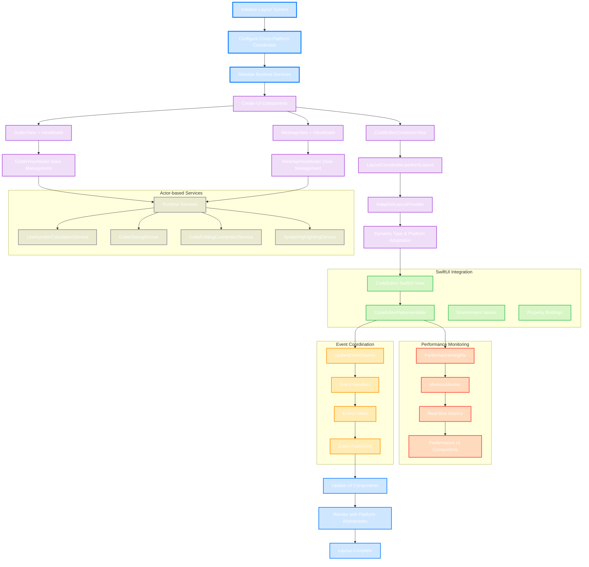

# Advanced Layout & UI Components Architecture

This diagram shows the comprehensive layout system and UI component architecture that handles advanced positioning, responsive design, and complex component interactions within the CodeEditorKit. The architecture emphasizes cross-platform compatibility, actor-based coordination, and modern UI patterns.

```mermaid
classDiagram
    direction LR
    
    %% Row 1 - Core Layout Coordination System
    class LayoutCoordinator {
        <<@MainActor layout coordinator>>
        -isPerformingLayout Bool
        -pendingLayoutOperations [() -> Void]
        -view PlatformView?
        +performLayout(_ operation: @escaping () -> Void)
        +performAnimatedLayout(duration: TimeInterval, options: AnimationOptions)
        +invalidateLayout()
        +isLayoutInProgress Bool
        +cancelPendingLayout()
    }

    class AdaptiveLayoutProvider {
        <<adaptive layout system>>
        -scaleFactor(for: DynamicTypeSize) CGFloat
        +sectionSpacing(for: DynamicTypeSize) CGFloat
        +controlSpacing(for: DynamicTypeSize) CGFloat
        +horizontalPadding(for: DynamicTypeSize) CGFloat
        +verticalPadding(for: DynamicTypeSize) CGFloat
        +fontSize(base: CGFloat, for: DynamicTypeSize) CGFloat
        +isCompactLayout(for: DynamicTypeSize) Bool
        +cornerRadius(for: DynamicTypeSize) CGFloat
    }

    class ContainerViewInitializer {
        <<container setup coordinator>>
        +InitializationParameters
        +ViewComponents
        +createViews(with: InitializationParameters) ViewComponents
        +performCommonSetup(for: CodeEditorContainerView, with: ViewComponents)
        +setupPlatformViews(for: CodeEditorContainerView, with: ViewComponents)
    }

    %% Row 2 - Modern UI Component Framework
    class BaseUIComponents {
        <<component infrastructure>>
        +ConfigurableUIComponent protocol
        +ThemeableUIComponent protocol
        +ReusableUIComponent protocol
        +BaseConfigurableView<Config, Theme>
        +BaseReusableTableCellView<Config, Theme>
        +StandardUITheme
    }

    class CodeEditorContainerView {
        <<@MainActor container view>>
        +textView CodeEditorView
        +gutterView GutterView
        +minimapView MinimapView
        +configuration EditorConfiguration
        +businessLogicServices EditorRuntime
        +layoutViews()
        +updateTextContainerInsets()
        +showsLineNumbers Bool
    }

    class GutterView {
        <<gutter component>>
        +viewModel GutterViewModel
        +gutterViewRenderer GutterViewRenderer
        +interactionHandler GutterInteractionHandler
        +isHidden Bool
        +setNeedsDisplayLineNumbers()
        +handlePointerEvents(at: CGPoint)
    }

    class MinimapView {
        <<minimap component>>
        +viewModel MinimapViewModel
        +dataProvider MinimapDataProvider
        +viewportIndicator ViewportIndicator
        +frame CGRect
        +updateMinimap()
        +scrollToPosition(CGFloat)
        +syncWithMainView()
    }

    %% Row 3 - Advanced UI Component ViewModels
    class GutterViewModel {
        <<@MainActor @Observable view model>>
        +displayState GutterDisplayState
        +interactionState GutterInteractionState
        +visibleLineNumbers [LineNumberDisplayInfo]
        +configuration EditorConfiguration
        +businessLogicServices EditorRuntime
        +configure(with: CodeEditorView)
        +updateConfiguration(_ EditorConfiguration)
        +handlePointerDown(at: CGPoint) Bool
        +getLineNumberStyle(for: Int) LineNumberStyle
    }

    class MinimapViewModel {
        <<@MainActor @Observable view model>>
        +minimapState MinimapState
        +interaction MinimapInteraction
        +renderInfo [MinimapRenderInfo]
        +viewportIndicator ViewportIndicator?
        +showSyntaxHighlighting Bool
        +handlePointerDown(at: CGPoint) Bool
        +scrollToPosition(CGFloat)
        +getLineNumber(at: CGPoint) Int?
    }

    class EditorContainerViewModel {
        <<@MainActor view model>>
        +configuration EditorConfiguration
        +layoutContext LayoutContext
        +memoryMonitor MemoryMonitor
        +performanceInsights PerformanceInsights
        +updateLayout()
        +applyConfiguration()
    }

    class ContentView {
        <<platform content view>>
        +editorView CodeEditorView
        +configuration EditorConfiguration
        +layoutContext LayoutContext
        +performanceMetrics PerformanceMetrics
        +updateContent()
        +handleLayout()
    }

    %% Row 4 - SwiftUI Integration & Adaptive Components
    class CodeEditor {
        <<@available SwiftUI view>>
        @Binding +text String
        @FocusState +isFocused Bool
        @Environment +codeEditorEnvironment
        +initialLanguage Language?
        +initialTheme Theme?
        +onTextChange (@Sendable (String) -> Void)?
        +completionProvider (@Sendable (SwiftUICompletionContext) async -> [SwiftUICompletionItem])?
        +textDebounceInterval Duration
    }

    class AdaptiveVStack {
        <<adaptive SwiftUI container>>
        +alignment HorizontalAlignment
        @Environment +dynamicTypeSize
        +adaptiveSpacing CGFloat
        +init(alignment:content:)
    }

    class AdaptiveHStack {
        <<adaptive SwiftUI container>>
        +alignment VerticalAlignment
        @Environment +dynamicTypeSize
        +adaptiveSpacing CGFloat
        +init(alignment:content:)
    }

    class AdaptiveSection {
        <<themed section container>>
        +title String?
        @Environment +dynamicTypeSize
        +adaptiveSpacing CGFloat
        +adaptivePadding CGFloat
        +adaptiveCornerRadius CGFloat
    }

    %% Row 5 - Cross-Platform Coordination System
    class CrossPlatformCoordinator {
        <<@MainActor observable object>>
        +capabilities PlatformCapabilities
        +inputCoordinator InputCoordinator
        +toolbarCoordinator ToolbarCoordinator
        +contextMenuCoordinator ContextMenuCoordinator
        +platformAdjustments PlatformAdjustments
        +isFeatureAvailable(_ EditorFeature) Bool
        +optimizeTextView(_ CodeEditorView)
        +createToolbarItems() [ToolbarItem]
    }

    class LayoutContext {
        <<layout context>>
        +bounds CGRect
        +safeAreaInsets EdgeInsets
        +configuration EditorConfiguration
        +isRTL Bool
        +contentBounds CGRect
        +init(bounds:safeAreaInsets:configuration:isRTL:)
    }

    class UIComponentFactory {
        <<component factory>>
        @MainActor -themeRegistry [String: Any]
        +registerTheme<T>(_ theme: T, for: String)
        +getTheme<T>(for: String, as: T.Type) T?
        +UISpacing
        +UIMargins
        +AccessibilityHelper
    }

    class UnifiedEventSystem {
        <<@MainActor event system>>
        -eventSubject PassthroughSubject<EditorEvent, Never>
        +events AnyPublisher<EditorEvent, Never>
        -eventFilters [EventFilter]
        -eventHandlers [UUID: EventHandler]
        +publish(_ EditorEvent)
        +subscribe<T>(to: T.Type, handler:) AnyCancellable
        +registerHandler(_ EventHandler) EventHandlerToken
    }

    %% Row 6 - Performance & Runtime Integration
    class PerformanceInsights {
        <<@ObservableObject performance monitoring>>
        +metrics PerformanceMetrics
        +status PerformanceStatus
        +issues [InsightsPerformanceIssue]
        +recommendations [InsightsPerformanceRecommendation]
        +updateMetrics(_ PerformanceMetrics)
        +reset()
    }

    class PerformanceViews {
        <<SwiftUI performance components>>
        +PerformanceStatusView
        +PerformanceInsightsPanel
        +DetailedPerformanceReportView
        +MetricRow
        +IssueRow
        +RecommendationRow
    }

    class EditorRuntime {
        <<runtime dependencies>>
        +lineNumberCalculationService LineNumberCalculationService
        +gutterSizingService GutterSizingService
        +codeFoldingCoordinatorService CodeFoldingCoordinatorService
        +syntaxHighlightingService SyntaxHighlightingService
        +textEditingService TextEditingService
        +languageDetectionService LanguageDetectionService
    }

    class MemoryMonitor {
        <<@ObservableObject memory tracking>>
        +currentMemoryUsage Double
        +peakMemoryUsage Double
        +isMonitoring Bool
        +startMonitoring()
        +stopMonitoring()
        +updateMemoryUsage()
    }

    %% Row 7 - Advanced Layout Features
    class InsertionPointView {
        <<insertion point component>>
        +insertionPointIndicating InsertionPointIndicating
        +isVisible Bool
        +position CGPoint
        +animate()
        +hide()
        +show(at: CGPoint)
    }

    class LineHighlightView {
        <<line highlight component>>
        +highlightedRange NSRange
        +highlightColor PlatformColor
        +isVisible Bool
        +updateHighlight(for: NSRange)
        +clearHighlight()
    }

    class CompletionCellComponents {
        <<completion UI components>>
        +CompletionTableViewCell
        +CompletionHeaderView
        +CompletionFooterView
        +iconImageView UIImageView
        +titleLabel UILabel
        +detailLabel UILabel
    }

    %% Row 8 - Supporting Types & Extensions
    class AnimationOptions {
        <<OptionSet @Sendable>>
        +curveEaseIn
        +curveEaseOut
        +curveEaseInOut
        +curveLinear
        +allowUserInteraction
        +uiKitOptions UIView.AnimationOptions
    }

    class LineNumberStyle {
        <<styling information>>
        +font PlatformFont
        +textColor PlatformColor
        +backgroundColor PlatformColor
        +alignment NSTextAlignment
        +init(font:textColor:backgroundColor:alignment:)
    }

    class ViewportIndicator {
        <<minimap viewport indicator>>
        +frame CGRect
        +isVisible Bool
        +opacity CGFloat
        +init(frame:isVisible:opacity:)
    }

    class PlatformAbstractions {
        <<cross-platform types>>
        +PlatformView
        +PlatformColor
        +PlatformFont
        +PlatformScrollView
        +PlatformContextMenu
        +EdgeInsets
    }

    %% Key Relationships - Modern Architecture
    LayoutCoordinator --> CodeEditorContainerView : coordinates
    AdaptiveLayoutProvider --> AdaptiveVStack : provides spacing
    AdaptiveLayoutProvider --> AdaptiveHStack : provides spacing
    AdaptiveLayoutProvider --> AdaptiveSection : provides styling
    ContainerViewInitializer --> CodeEditorContainerView : initializes
    
    BaseUIComponents --> GutterView : implements protocols
    BaseUIComponents --> MinimapView : implements protocols
    CodeEditorContainerView --> GutterView : contains
    CodeEditorContainerView --> MinimapView : contains
    CodeEditorContainerView --> EditorRuntime : uses services
    
    GutterView --> GutterViewModel : manages state
    MinimapView --> MinimapViewModel : manages state
    GutterViewModel --> EditorRuntime : accesses services
    MinimapViewModel --> EditorRuntime : accesses services
    
    CodeEditor --> CodeEditorContainerView : represents
    CodeEditor --> MemoryMonitor : monitors memory
    CodeEditor --> PerformanceInsights : tracks performance
    
    CrossPlatformCoordinator --> LayoutContext : provides context
    CrossPlatformCoordinator --> UnifiedEventSystem : coordinates events
    UIComponentFactory --> BaseUIComponents : creates components
    UnifiedEventSystem --> PerformanceInsights : publishes events
    
    PerformanceViews --> PerformanceInsights : observes
    EditorRuntime --> MemoryMonitor : provides service
    EditorContainerViewModel --> LayoutContext : uses
    ContentView --> PerformanceViews : integrates
    
    InsertionPointView --> LineHighlightView : coordinates with
    CompletionCellComponents --> UIComponentFactory : styled by
    
    GutterViewModel --> LineNumberStyle : produces
    MinimapViewModel --> ViewportIndicator : manages
    LayoutCoordinator --> AnimationOptions : uses for animations
    CrossPlatformCoordinator --> PlatformAbstractions : abstracts platforms

    %% Styling - Modern dark mode friendly colors with enhanced contrast
    classDef coordinator fill:#007AFF25,stroke:#007AFF,stroke-width:3px,color:#1D1D1F
    classDef adaptive fill:#34C75925,stroke:#34C759,stroke-width:2px,color:#1D1D1F
    classDef component fill:#AF52DE25,stroke:#AF52DE,stroke-width:2px,color:#1D1D1F
    classDef viewmodel fill:#FF950025,stroke:#FF9500,stroke-width:2px,color:#1D1D1F
    classDef swiftui fill:#007AFF25,stroke:#007AFF,stroke-width:2px,color:#1D1D1F
    classDef platform fill:#8E8E9325,stroke:#8E8E93,stroke-width:2px,color:#1D1D1F
    classDef performance fill:#FF3B3025,stroke:#FF3B30,stroke-width:2px,color:#1D1D1F
    classDef feature fill:#34C75925,stroke:#34C759,stroke-width:2px,color:#1D1D1F
    classDef support fill:#8E8E9325,stroke:#8E8E93,stroke-width:2px,color:#1D1D1F

    class LayoutCoordinator coordinator
    class AdaptiveLayoutProvider adaptive
    class ContainerViewInitializer coordinator
    class BaseUIComponents component
    class CodeEditorContainerView component
    class GutterView component
    class MinimapView component
    class GutterViewModel viewmodel
    class MinimapViewModel viewmodel
    class EditorContainerViewModel viewmodel
    class ContentView component
    class CodeEditor swiftui
    class AdaptiveVStack swiftui
    class AdaptiveHStack swiftui
    class AdaptiveSection swiftui
    class CrossPlatformCoordinator platform
    class LayoutContext platform
    class UIComponentFactory platform
    class UnifiedEventSystem platform
    class PerformanceInsights performance
    class PerformanceViews performance
    class EditorRuntime performance
    class MemoryMonitor performance
    class InsertionPointView feature
    class LineHighlightView feature
    class CompletionCellComponents feature
    class AnimationOptions support
    class LineNumberStyle support
    class ViewportIndicator support
    class PlatformAbstractions support
```

## Modern Layout System Architecture Flow

## Key Architecture Enhancements

### 1. Modern Swift Concurrency Integration
- **@MainActor Components**: All UI components are properly marked with `@MainActor` for thread safety
- **Actor-based Services**: Business logic services use Swift's actor model for safe concurrent access
- **Observable Architecture**: ViewModels use Swift 5.9's `@Observable` macro for efficient state management
- **Async/Await**: Event handling and updates use modern async patterns

### 2. Cross-Platform Layout Coordination
- **LayoutCoordinator**: Prevents recursive layout cycles with centralized coordination
- **Platform Abstractions**: Unified types (`PlatformView`, `PlatformColor`, etc.) for seamless cross-platform support
- **CrossPlatformCoordinator**: Specialized coordinators for input, toolbar, and context menu handling
- **Dynamic Adaptation**: Real-time adaptation to platform capabilities and device characteristics

### 3. Advanced Component Architecture
- **MVVM with Observable**: Clean separation of UI and business logic using modern MVVM patterns
- **Protocol-based Components**: Flexible component system with `ConfigurableUIComponent`, `ThemeableUIComponent`, and `ReusableUIComponent` protocols
- **Dependency Injection**: `EditorRuntime` provides clean service access without singletons
- **Component Lifecycle**: Proper initialization, configuration, and cleanup patterns

### 4. SwiftUI Integration Excellence
- **Native SwiftUI Components**: `CodeEditor` provides idiomatic SwiftUI API with environment integration
- **Adaptive Layout System**: Dynamic type size adaptation with consistent spacing and sizing
- **Declarative Configuration**: Fluent modifier API for easy configuration
- **Environment-based Settings**: Leverages SwiftUI's environment system for configuration propagation

### 5. Performance-Optimized Architecture
- **Real-time Monitoring**: `PerformanceInsights` and `MemoryMonitor` provide comprehensive performance tracking
- **SwiftUI Performance Views**: Dedicated UI components for performance visualization
- **Throttled Updates**: Smart update throttling in ViewModels to prevent excessive redraws
- **Memory Management**: Proper weak references and cleanup to prevent retain cycles

### 6. Event-Driven Coordination
- **UnifiedEventSystem**: Centralized event handling with filtering and throttling
- **Type-safe Events**: Strongly-typed event system with compile-time safety
- **Publisher Integration**: Combine publishers for reactive programming patterns
- **Event Metrics**: Built-in event system performance monitoring

### 7. Advanced Layout Features
- **Insertion Point Visualization**: Smooth cursor and insertion point indicators
- **Line Highlighting**: Dynamic line highlighting with customizable colors
- **Code Completion UI**: Rich completion interface with icons and detailed information
- **Minimap Integration**: Interactive minimap with viewport indicators and scroll synchronization

### 8. Accessibility & Internationalization
- **AccessibilityHelper**: Comprehensive accessibility configuration utilities
- **Right-to-Left Support**: Native RTL layout support in `LayoutContext`
- **Dynamic Type**: Full dynamic type support throughout the component hierarchy
- **Localization Ready**: Architecture supports easy localization integration

## Benefits of Modern Architecture

1. **Type Safety**: Swift 6 concurrency and strong typing prevent common UI bugs
2. **Performance**: Actor-based services and throttled updates ensure 60fps performance
3. **Maintainability**: Clean separation of concerns with MVVM and dependency injection
4. **Testability**: Protocol-based architecture enables comprehensive unit testing
5. **Cross-Platform**: Single codebase with platform-specific optimizations
6. **Extensibility**: Focused modules and protocol surfaces allow feature additions
7. **Memory Efficiency**: Proper memory management with real-time monitoring
8. **Developer Experience**: SwiftUI integration provides excellent developer ergonomics

This architecture represents a sophisticated, production-ready layout system that balances performance, maintainability, and developer experience while supporting the complex requirements of a modern code editor.
