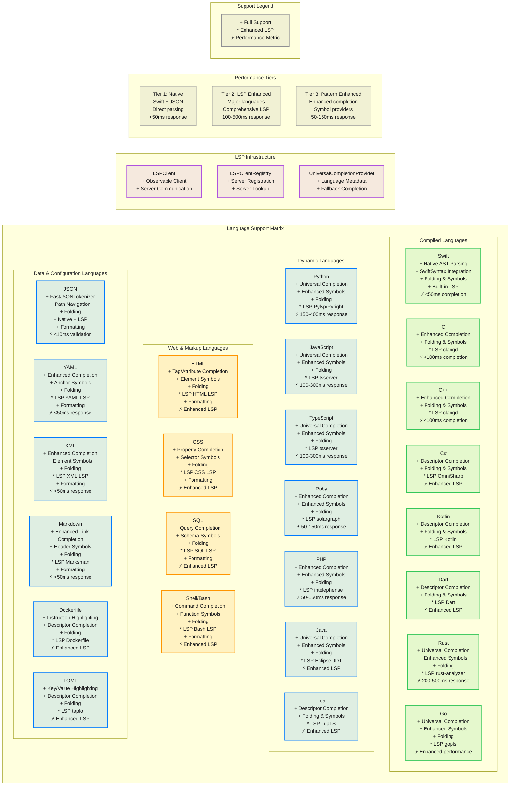
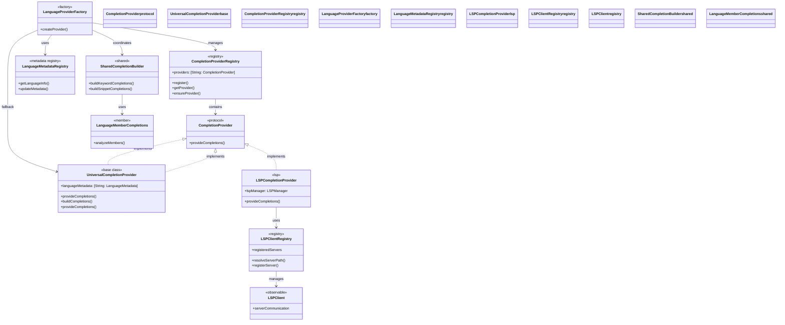

# Multi-Language Support Matrix

This diagram provides a comprehensive matrix view of language support capabilities across all 25 concrete supported languages plus plain text in the CodeEditorPlugin framework.

## Language Capability Details

## Language Support Tiers

### Tier 1: Native Support (High Performance Integration)
- **Swift**: Complete native integration with SwiftSyntax, direct AST parsing, <50ms completion
- **JSON**: FastJSONTokenizer with native parsing, <10ms validation

### Tier 2: LSP Enhanced (Comprehensive External Server Integration)
- **TypeScript/JavaScript**: Enhanced LSP with client registry, 100-300ms response time
- **Python**: Enhanced LSP with retry configuration and health monitoring, 150-400ms response time
- **Rust**: Enhanced LSP with rust-analyzer, 200-500ms response time
- **Go**: Enhanced LSP with gopls and automatic path resolution
- **Java**: Enhanced LSP with Eclipse JDT and universal completion provider
- **HTML/CSS**: Enhanced LSP with tag/property validation
- **SQL**: Enhanced LSP with query validation and schema symbol support
- **Shell/Bash**: Enhanced LSP with command completion and function symbol navigation

### Tier 3: Enhanced Pattern-Based (Improved Completion and Symbol Providers)
- **Ruby**: Enhanced pattern matching with symbol providers and universal completion
- **PHP**: Enhanced pattern-based completion with member completion features
- **YAML**: Enhanced schema validation with folding and anchor symbol support
- **XML**: Enhanced element completion with symbol navigation and validation
- **Markdown**: Enhanced link resolution with header symbols

### Tier 4: Basic LSP Support
- **C**: Enhanced completion with clangd LSP integration

## Feature Comparison Matrix

| Language | Completion | Symbols | Folding | LSP |
|----------|------------|---------|---------|-----|
| Swift | ✅ Native AST | ✅ Full | ✅ Full | ✅ Built-in |
| JavaScript | ✅ Universal | ✅ Enhanced | ✅ Full | ⚡ tsserver |
| TypeScript | ✅ Universal | ✅ Enhanced | ✅ Full | ⚡ tsserver |
| Python | ✅ Universal | ✅ Enhanced | ✅ Full | ⚡ Pylsp/Pyright |
| Go | ✅ Universal | ✅ Enhanced | ✅ Full | ⚡ gopls |
| Rust | ✅ Universal | ✅ Enhanced | ✅ Full | ⚡ rust-analyzer |
| C | ✅ Enhanced | ✅ Full | ✅ Full | ⚡ clangd |
| Java | ✅ Universal | ✅ Enhanced | ✅ Full | ⚡ Eclipse JDT |
| HTML | ✅ Tag/Attr | ✅ Element | ✅ Full | ⚡ HTML LSP |
| CSS | ✅ Property | ✅ Selector | ✅ Full | ⚡ CSS LSP |
| SQL | ✅ Query | ✅ Schema | ✅ Full | ⚡ SQL LSP |
| Shell | ✅ Command | ✅ Function | ✅ Full | ⚡ Bash LSP |
| Ruby | ✅ Enhanced | ✅ Enhanced | ✅ Full | ⚡ Solargraph |
| PHP | ✅ Enhanced | ✅ Enhanced | ✅ Full | ⚡ Intelephense |
| JSON | ✅ FastToken | ✅ Path | ✅ Full | ✅ Native+LSP |
| YAML | ✅ Enhanced | ✅ Anchor | ✅ Full | ⚡ YAML LSP |
| XML | ✅ Enhanced | ✅ Element | ✅ Full | ⚡ XML LSP |
| Markdown | ✅ Enhanced | ✅ Header | ✅ Full | ⚡ Marksman |

## Performance Characteristics

### High Performance Languages (Native Integration)
- **Swift**: Direct SwiftSyntax AST parsing, <50ms completion response
- **JSON**: FastJSONTokenizer with native parsing, <10ms validation

### Enhanced Performance Languages (LSP Integration)
- **TypeScript**: LSP with client registry, 100-300ms response time
- **Python**: LSP with retry configuration, 150-400ms response time
- **Rust**: rust-analyzer with health monitoring, 200-500ms response time
- **Go/Java/HTML/CSS/SQL/Shell**: LSP infrastructure with automatic path resolution

### Optimized Performance Languages (Pattern-Based)
- **Ruby/PHP**: Pattern matching with universal completion provider, 50-150ms response time
- **YAML/XML/Markdown**: Parsing with symbol providers, <50ms response time
- **C**: Clang-based parsing, <100ms completion response

## LSP Infrastructure

### LSP Client Registry
- **Server Registration**: Management of language server instances
- **Server Lookup**: Resolution of language server paths
- **LSPClient**: Observable client for server communication

### Universal Completion Provider
- **Language Metadata Support**: Rich metadata for enhanced completion contexts
- **Fallback Completion**: Unified completion experience when language-specific providers are unavailable

### Shared Infrastructure
- **CompletionProviderRegistry**: Central registration and lookup of completion providers
- **LanguageProviderFactory**: Factory for creating language-specific providers
- **SharedCompletionBuilder**: Common completion building logic
- **LanguageMemberCompletions**: Member completion resolution

## Extension Strategy

### Adding New Languages
1. **Assess Support Level**: Determine appropriate tier based on available tooling
2. **Implementation Path**: Choose native, enhanced LSP, or pattern-based approach
3. **Capability Mapping**: Define supported capabilities and performance targets
4. **Infrastructure Integration**: Leverage universal completion and symbol providers
5. **Testing Strategy**: Create comprehensive test suite with performance benchmarks

### LSP Integration Process
1. **LSPClientRegistry**: Automatic discovery and path resolution for language servers
2. **LSPClient**: Observable client for server communication
3. **UniversalCompletionProvider**: Unified completion system with language metadata support
4. **SharedCompletionBuilder**: Reusable keyword and snippet completion infrastructure

## Benefits

1. **Comprehensive Coverage**: Support for 25 concrete programming languages with enhanced capabilities
2. **Performance Tiers**: Native integration for Swift/JSON, enhanced LSP for major languages, improved pattern-based for others
3. **LSP Infrastructure**: Client registry with server registration and lookup
4. **Universal Completion System**: Unified completion provider with language metadata
5. **Extensible Design**: Easy addition of new languages
6. **Standards Compliant**: LSP integration ensures compatibility with ecosystem tools
7. **Performance Optimized**: Appropriate performance targets for each language tier
8. **Consistent Experience**: Unified API and user experience across all supported languages
