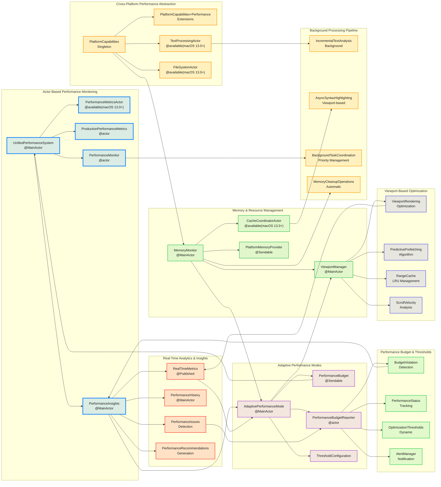
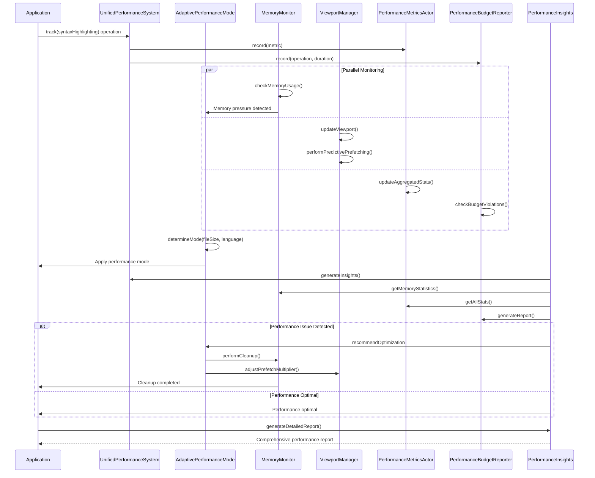

# Performance Optimization Pipeline

This diagram shows the comprehensive performance optimization pipeline that monitors, analyzes, and continuously optimizes performance across all aspects of the CodeEditorPlugin framework, featuring actor-based concurrency, adaptive performance modes, cross-platform abstractions, and real-time analytics.

## Overview Architecture



## Detailed Actor-Based Architecture

```mermaid
classDiagram
    %% Core Performance Actors
    class UnifiedPerformanceSystem {
        <<@MainActor>>
        +shared: UnifiedPerformanceSystem
        -metrics: [PerformanceMetricType: [PerformanceMetric]]
        -activeOperations: [UUID: OperationInfo]
        -performanceProfiles: [String: PerformanceProfile]
        +track(MetricType, operation: () async throws -> T) async throws -> T
        +generateInsights() UnifiedPerformanceInsights
        +applyOptimizations(basedOn: PerformanceProfile)
        +getCurrentStatus() PerformanceStatus
    }

    class PerformanceMonitor {
        <<@actor>>
        -metrics: [String: MonitoringPerformanceMetric]
        -cleanupTask: Task<Void, Never>?
        +startMeasuring(String) MeasurementToken
        +endMeasuring(MeasurementToken)
        +measure(String, block: () async throws -> T) async throws -> T
        +generateReport() PerformanceReport
        +clearMetrics()
    }

    class ProductionPerformanceMetrics {
        <<@actor>>
        +shared: ProductionPerformanceMetrics
        -thresholds: ProductionThresholds
        -metrics: AggregatedMetrics
        -eventHandlers: [PerformanceEventHandler]
        +trackHighlighting(duration: TimeInterval, fileSize: Int, language: Language)
        +trackScrolling(frameRate: Double, viewportSize: Int, fileSize: Int)
        +trackMemoryUsage(currentUsage: Double, peakUsage: Double, fileSize: Int)
        +generateReport() ProductionPerformanceReport
    }

    class PerformanceMetricsActor {
        <<@actor>>
        -metrics: [String: [SendablePerformanceMetric]]
        -aggregatedStats: [String: AggregatedStats]
        +record(SendablePerformanceMetric)
        +getStats(for: String) AggregatedStats?
        +getAllStats() [String: AggregatedStats]
        +clearMetrics(for: String)
    }

    %% Memory Management System
    class MemoryMonitor {
        <<@MainActor>>
        -memoryProvider: PlatformMemoryProvider
        +memoryThresholdMB: Double
        +enableAutomaticCleanup: Bool
        -cleanupHandlers: [String: CleanupHandler]
        -monitoringTask: Task<Void, Never>?
        +registerCleanupHandler(identifier: String, handler: @escaping @MainActor @Sendable () async -> CleanupResult)
        +performCleanup(targetReduction: Double?) async -> Double
        +startMonitoring()
        +getCurrentMemoryUsage() Double
    }

    class CacheCoordinatorActor {
        <<@actor>>
        -caches: [String: AnyCacheWrapper]
        -cacheStats: [String: CacheStatistics]
        -maxGlobalMemoryMB: Double
        +registerCache<T: CacheProtocol>(T, identifier: String)
        +getValue<T: Sendable>(for: String, from: String) async -> T?
        +setValue<T: Sendable>(T, for: String, in: String, cost: Int) async
        +clearCache(String) async
    }

    class ViewportManager {
        <<@MainActor>>
        -textView: PlatformTextView?
        -textKitBridge: TextKitBridge
        -memoryMonitor: MemoryMonitor
        -rangeCache: LRUCache<ViewportManagerCacheKey, CachedViewportData>
        -renderingTasks: [UUID: Task<Void, Never>]
        -scrollVelocity: Double
        +updateViewport()
        +getOptimizationHints() [OptimizationHint]
        +invalidateCache()
    }

    class PlatformMemoryProvider {
        <<protocol: Sendable>>
        +getCurrentMemoryUsage() Double
        +getPhysicalMemory() UInt64
        +getMemoryPressure() MemoryPressure
        +isUnderMemoryPressure() Bool
    }

    %% Adaptive Performance System
    class AdaptivePerformanceMode {
        <<@MainActor>>
        +currentMode: PerformanceMode
        +configuration: PerformanceModeConfiguration
        -fileSizeThresholds: FileSizeThresholds
        -memoryMonitor: MemoryMonitor
        +updateMode(for: Int, language: Language)
        +applyConfiguration(to: inout EditorConfiguration)
        +forceMode(PerformanceMode)
    }

    class PerformanceBudget {
        <<struct: Sendable>>
        +budgets: [String: Budget]
        +budget(for: String) Budget?
        +checkBudgets([String: TimeInterval]) [BudgetViolation]
    }

    class PerformanceBudgetReporter {
        <<@actor>>
        -measurements: [String: [TimeInterval]]
        +record(operation: String, duration: TimeInterval)
        +averageMeasurements() [String: TimeInterval]
        +generateReport() PerformanceBudgetReport
        +reset()
    }

    %% Platform Capabilities
    class PlatformCapabilities {
        <<singleton>>
        +shared: PlatformCapabilities
        +performanceCapabilities: PerformanceCapabilities
        +supportsHardwareAcceleration: Bool
        +supportsBackgroundProcessing: Bool
        +supportsSmoothScrolling: Bool
        +processorArchitecture: ProcessorArchitecture
        +memoryProfile: MemoryProfile
        +recommendedPerformanceConfiguration() PerformanceConfiguration
    }

    class TextProcessingActor {
        <<@actor>>
        -activeProcessors: [UUID: TextProcessor]
        -textBuffers: [UUID: String]
        +process(text: String, with: ProcessorType, priority: TaskPriority) async throws -> String
        +cancelAllProcessing()
    }

    class FileSystemActor {
        <<@actor>>
        -fileHandles: [URL: FileHandle]
        -watchers: [URL: FileWatcher]
        +readFile(at: URL) async throws -> String
        +writeFile(String, to: URL) async throws
        +watchFile(at: URL, handler: @escaping @Sendable (FileChangeNotification) async -> Void) throws
    }

    %% Performance Insights
    class PerformanceInsights {
        <<@MainActor>>
        +status: InsightsPerformanceStatus
        +issues: [InsightsPerformanceIssue]
        +recommendations: [InsightsPerformanceRecommendation]
        +metrics: RealTimeMetrics
        +generateDetailedReport() async -> DetailedPerformanceReport
        +configureMonitoring(MonitoringConfiguration)
    }

    %% Relationships
    UnifiedPerformanceSystem --> PerformanceMonitor : uses
    UnifiedPerformanceSystem --> ProductionPerformanceMetrics : integrates
    UnifiedPerformanceSystem --> PerformanceMetricsActor : coordinates
    
    MemoryMonitor --> PlatformMemoryProvider : depends on
    MemoryMonitor --> CacheCoordinatorActor : manages
    
    ViewportManager --> MemoryMonitor : uses
    ViewportManager --> CacheCoordinatorActor : caches in
    
    AdaptivePerformanceMode --> MemoryMonitor : monitors
    AdaptivePerformanceMode --> PerformanceBudget : applies
    AdaptivePerformanceMode --> PerformanceBudgetReporter : reports to
    
    PerformanceInsights --> MemoryMonitor : observes
    PerformanceInsights --> PerformanceMonitor : collects from
    
    PlatformCapabilities --> MemoryMonitor : configures
    PlatformCapabilities --> AdaptivePerformanceMode : optimizes
    
    %% Styling - Dark mode friendly colors
    classDef actorClass fill:#007AFF20,stroke:#007AFF,stroke-width:3px,color:#1D1D1F
    classDef mainActorClass fill:#34C75920,stroke:#34C759,stroke-width:3px,color:#1D1D1F
    classDef protocolClass fill:#AF52DE20,stroke:#AF52DE,stroke-width:2px,color:#1D1D1F
    classDef structClass fill:#FF950020,stroke:#FF9500,stroke-width:2px,color:#1D1D1F
    classDef singletonClass fill:#FF3B3020,stroke:#FF3B30,stroke-width:2px,color:#1D1D1F
    
    class PerformanceMonitor actorClass
    class ProductionPerformanceMetrics actorClass
    class PerformanceMetricsActor actorClass
    class CacheCoordinatorActor actorClass
    class PerformanceBudgetReporter actorClass
    class TextProcessingActor actorClass
    class FileSystemActor actorClass
    class UnifiedPerformanceSystem mainActorClass
    class MemoryMonitor mainActorClass
    class ViewportManager mainActorClass
    class AdaptivePerformanceMode mainActorClass
    class PerformanceInsights mainActorClass
    class PlatformMemoryProvider protocolClass
    class PerformanceBudget structClass
    class PlatformCapabilities singletonClass
```



## Performance Optimization Flow



## Key Performance Features

### 1. Actor-Based Concurrency
- **Thread-Safe Operations**: All performance monitoring uses Swift actors for safe concurrent access
- **Isolated State Management**: Performance metrics isolated per actor for data integrity
- **Background Processing**: Syntax highlighting, text processing, and file operations run on dedicated actors
- **MainActor Integration**: UI-related performance components properly isolated to main thread

### 2. Adaptive Performance Modes
- **Dynamic Mode Selection**: Automatically switches between High Quality, Balanced, and Performance modes
- **File Size Awareness**: Adjusts settings based on document size and language complexity
- **Memory Pressure Response**: Automatically reduces features when memory is constrained
- **Cross-Platform Optimization**: Platform-specific performance tuning for macOS and iOS

### 3. Comprehensive Performance Monitoring
- **Real-Time Metrics**: Continuous collection of CPU, memory, rendering, and I/O metrics
- **Performance Budgets**: Predefined thresholds for critical operations with violation tracking
- **Historical Analysis**: Trend analysis and predictive performance issue detection
- **Production Telemetry**: Lightweight telemetry system for production performance tracking

### 4. Intelligent Memory Management
- **Automatic Cleanup**: Proactive memory cleanup based on configurable thresholds
- **Cleanup Handlers**: Extensible system for registering custom memory cleanup operations
- **Memory Pressure Detection**: Platform-specific memory pressure monitoring
- **Cache Coordination**: Global cache management with LRU eviction policies

### 5. Viewport-Based Optimization
- **Incremental Rendering**: Only render visible and prefetch areas for large documents
- **Predictive Prefetching**: Algorithm predicts scroll direction and preloads content
- **Range Caching**: LRU cache for viewport calculations and text ranges
- **Scroll Velocity Analysis**: Optimizes prefetching based on user scroll behavior

### 6. Cross-Platform Performance Abstractions
- **Platform Capabilities**: Runtime detection of hardware acceleration, SIMD support, display refresh rates
- **Architecture-Specific Optimizations**: Apple Silicon vs Intel optimizations
- **Memory Profile Classification**: Automatic device memory classification (Low/Medium/High/Ultra)
- **Battery and Thermal Awareness**: Respects device thermal state and power constraints

### 7. Performance Budget Management
- **Operation Budgets**: Time budgets for syntax highlighting (16ms), scrolling (8ms), text layout (16ms)
- **Violation Tracking**: Automatic detection and reporting of budget violations
- **Dynamic Thresholds**: Adaptive thresholds based on file size and device capabilities
- **Real-Time Alerts**: Immediate notification of performance degradation

### 8. Real-Time Analytics & Insights
- **Performance Status**: Overall health scoring (Optimal/Suboptimal/Degraded/Critical)
- **Issue Detection**: Automatic detection of slow text layout, high memory usage, low cache hit rates
- **Smart Recommendations**: Context-aware suggestions for performance improvements
- **Historical Trends**: Long-term performance trend analysis with confidence scoring

## Performance Targets

- **60fps Rendering**: Maintain 60fps during scrolling and text editing
- **<16ms Text Layout**: Text layout operations complete within single frame budget
- **<8ms Scrolling**: Ultra-smooth scrolling on ProMotion displays
- **Memory Efficiency**: Automatic cleanup keeps memory usage under configured thresholds
- **Large File Support**: Optimized for files up to 100MB on high-memory devices
- **Background Processing**: Non-blocking syntax highlighting and file operations

## Integration Points

### With EditorConfiguration
```swift
var config = EditorConfiguration()
let setup = EditorSetup(runtimeDependencies: EditorRuntimeDependencies(actorCoordinator: ActorCoordinator.create()))
let setup = EditorSetup(runtimeDependencies: EditorRuntimeDependencies(memoryMonitor: MemoryMonitor()))
let adaptiveMode = AdaptivePerformanceMode(memoryMonitor: runtime.dependencies.memoryMonitor)
```

### With CodeEditorView
```swift
CodeEditor(text: $code)
    .adaptivePerformance(memoryMonitor: memoryMonitor)
    .environment(\.performanceInsights, insights)
```

### With Background Processing
```swift
// Syntax highlighting actor coordination
let textProcessor = TextProcessingActor()
await textProcessor.process(text: content, with: .syntaxHighlighting, priority: .high)
```

## Benefits

1. **Proactive Optimization**: Performance issues prevented before impacting users
2. **Adaptive Behavior**: System automatically adjusts to device capabilities and usage patterns
3. **Cross-Platform Consistency**: Unified performance experience across macOS and iOS
4. **Actor Safety**: Thread-safe performance monitoring with no data races
5. **Memory Intelligence**: Smart memory management prevents OOM crashes
6. **Developer Insights**: Comprehensive performance analytics for optimization decisions
7. **Production Ready**: Lightweight telemetry suitable for App Store distribution
8. **Extensible Architecture**: Injected runtime dependencies and protocol surfaces for custom performance monitoring
