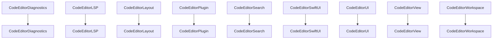

# Package Dependencies - CodeEditorPlugin

Generated from `swift package describe --type json`.

```mermaid
graph TD
    product_CodeEditorDiagnostics["CodeEditorDiagnostics"]
    product_CodeEditorDiagnostics --> target_CodeEditorDiagnostics["CodeEditorDiagnostics"]
    product_CodeEditorLSP["CodeEditorLSP"]
    product_CodeEditorLSP --> target_CodeEditorLSP["CodeEditorLSP"]
    product_CodeEditorLayout["CodeEditorLayout"]
    product_CodeEditorLayout --> target_CodeEditorLayout["CodeEditorLayout"]
    product_CodeEditorPlugin["CodeEditorPlugin"]
    product_CodeEditorPlugin --> target_CodeEditorPlugin["CodeEditorPlugin"]
    product_CodeEditorSearch["CodeEditorSearch"]
    product_CodeEditorSearch --> target_CodeEditorSearch["CodeEditorSearch"]
    product_CodeEditorSwiftUI["CodeEditorSwiftUI"]
    product_CodeEditorSwiftUI --> target_CodeEditorSwiftUI["CodeEditorSwiftUI"]
    product_CodeEditorUI["CodeEditorUI"]
    product_CodeEditorUI --> target_CodeEditorUI["CodeEditorUI"]
    product_CodeEditorView["CodeEditorView"]
    product_CodeEditorView --> target_CodeEditorView["CodeEditorView"]
    product_CodeEditorWorkspace["CodeEditorWorkspace"]
    product_CodeEditorWorkspace --> target_CodeEditorWorkspace["CodeEditorWorkspace"]
```
