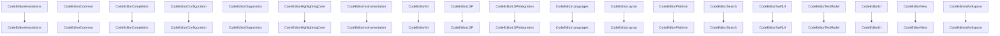

# Package Dependencies - CodeEditorKit

Generated from `swift package describe --type json`.

```mermaid
graph TD
    product_CodeEditorAnnotations["CodeEditorAnnotations"]
    product_CodeEditorAnnotations --> target_CodeEditorAnnotations["CodeEditorAnnotations"]
    product_CodeEditorCommon["CodeEditorCommon"]
    product_CodeEditorCommon --> target_CodeEditorCommon["CodeEditorCommon"]
    product_CodeEditorCompletion["CodeEditorCompletion"]
    product_CodeEditorCompletion --> target_CodeEditorCompletion["CodeEditorCompletion"]
    product_CodeEditorConfiguration["CodeEditorConfiguration"]
    product_CodeEditorConfiguration --> target_CodeEditorConfiguration["CodeEditorConfiguration"]
    product_CodeEditorDiagnostics["CodeEditorDiagnostics"]
    product_CodeEditorDiagnostics --> target_CodeEditorDiagnostics["CodeEditorDiagnostics"]
    product_CodeEditorHighlightingCore["CodeEditorHighlightingCore"]
    product_CodeEditorHighlightingCore --> target_CodeEditorHighlightingCore["CodeEditorHighlightingCore"]
    product_CodeEditorInstrumentation["CodeEditorInstrumentation"]
    product_CodeEditorInstrumentation --> target_CodeEditorInstrumentation["CodeEditorInstrumentation"]
    product_CodeEditorKit["CodeEditorKit"]
    product_CodeEditorKit --> target_CodeEditorKit["CodeEditorKit"]
    product_CodeEditorLSP["CodeEditorLSP"]
    product_CodeEditorLSP --> target_CodeEditorLSP["CodeEditorLSP"]
    product_CodeEditorLSPIntegration["CodeEditorLSPIntegration"]
    product_CodeEditorLSPIntegration --> target_CodeEditorLSPIntegration["CodeEditorLSPIntegration"]
    product_CodeEditorLanguages["CodeEditorLanguages"]
    product_CodeEditorLanguages --> target_CodeEditorLanguages["CodeEditorLanguages"]
    product_CodeEditorLayout["CodeEditorLayout"]
    product_CodeEditorLayout --> target_CodeEditorLayout["CodeEditorLayout"]
    product_CodeEditorPlatform["CodeEditorPlatform"]
    product_CodeEditorPlatform --> target_CodeEditorPlatform["CodeEditorPlatform"]
    product_CodeEditorSearch["CodeEditorSearch"]
    product_CodeEditorSearch --> target_CodeEditorSearch["CodeEditorSearch"]
    product_CodeEditorSwiftUI["CodeEditorSwiftUI"]
    product_CodeEditorSwiftUI --> target_CodeEditorSwiftUI["CodeEditorSwiftUI"]
    product_CodeEditorTextModel["CodeEditorTextModel"]
    product_CodeEditorTextModel --> target_CodeEditorTextModel["CodeEditorTextModel"]
    product_CodeEditorUI["CodeEditorUI"]
    product_CodeEditorUI --> target_CodeEditorUI["CodeEditorUI"]
    product_CodeEditorView["CodeEditorView"]
    product_CodeEditorView --> target_CodeEditorView["CodeEditorView"]
    product_CodeEditorWorkspace["CodeEditorWorkspace"]
    product_CodeEditorWorkspace --> target_CodeEditorWorkspace["CodeEditorWorkspace"]
```
