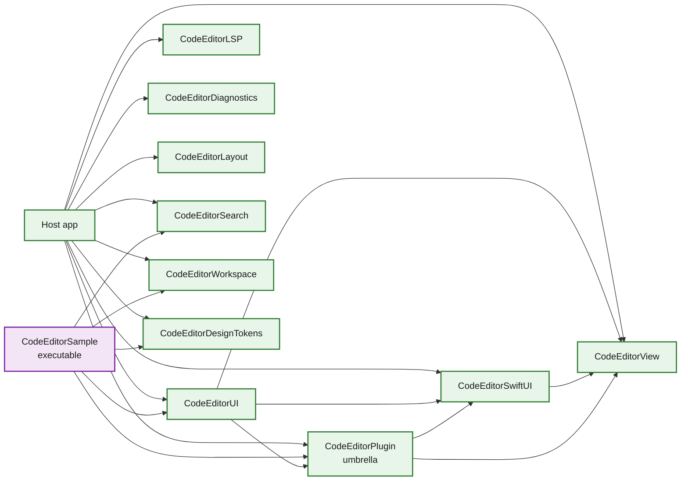
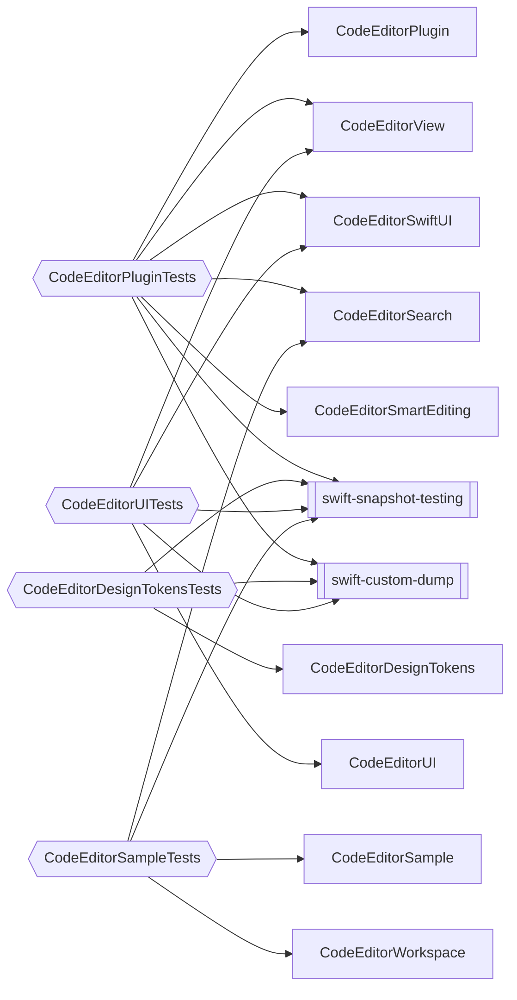

# Package Dependencies - CodeEditorPlugin

This diagram reflects the current `Package.swift` product and target layout. The package now exposes focused library products in addition to the `CodeEditorPlugin` umbrella product.

## Overview

**Runtime dependencies:**
- **SwiftSyntax 602.0.0+** - Swift source parsing and syntax APIs.
- **SwiftParser** - Swift parser product from `swift-syntax`.
- **swift-dependencies** - Point-Free dependency injection utilities.
- **xctest-dynamic-overlay / IssueReporting** - runtime issue reporting.

**Test-only dependencies:**
- **swift-custom-dump** - test diffing and diagnostics.
- **swift-snapshot-testing** - snapshot tests, currently using the `ajmcclary/fix-swift-6.3-attachable` fork documented in `Package.swift`.

**Platform support:** macOS 26.3+, iOS 26.3+ (Mac Catalyst retired in 0.2.0).

## Product View

## Umbrella Target View

```mermaid
flowchart TB
    Plugin["CodeEditorPlugin target<br/>1 Swift re-export file"]

    Plugin --> Common["CodeEditorCommon"]
    Plugin --> Configuration["CodeEditorConfiguration"]
    Plugin --> Languages["CodeEditorLanguages"]
    Plugin --> SwiftUI["CodeEditorSwiftUI"]
    Plugin --> Theming["CodeEditorTheming"]
    Plugin --> View["CodeEditorView"]

    Plugin -. "build dependency" .-> Annotations["CodeEditorAnnotations"]
    Plugin -. "build dependency" .-> Completion["CodeEditorCompletion"]
    Plugin -. "build dependency" .-> DesignTokens["CodeEditorDesignTokens"]
    Plugin -. "build dependency" .-> Diagnostics["CodeEditorDiagnostics"]
    Plugin -. "build dependency" .-> Folding["CodeEditorFolding"]
    Plugin -. "build dependency" .-> LSP["CodeEditorLSP"]
    Plugin -. "build dependency" .-> Layout["CodeEditorLayout"]
    Plugin -. "build dependency" .-> Platform["CodeEditorPlatform"]
    Plugin -. "build dependency" .-> SmartEditing["CodeEditorSmartEditing"]
    Plugin -. "build dependency" .-> Symbols["CodeEditorSymbols"]
    Plugin -. "build dependency" .-> Syntax["CodeEditorSyntaxHighlighting"]
    Plugin -. "build dependency" .-> TextModel["CodeEditorTextModel"]

    Syntax --> SwiftSyntax[[SwiftSyntax]]
    Syntax --> SwiftParser[[SwiftParser]]
    Common --> Dependencies[[swift-dependencies]]
    Common --> IssueReporting[[IssueReporting]]
    View --> Dependencies
    View --> IssueReporting

    classDef target fill:#e8f5e9,stroke:#2e7d32,stroke-width:2px,color:#1b1b1b
    classDef external fill:#e1f5fe,stroke:#0277bd,stroke-width:2px,color:#1b1b1b
    class Plugin,Common,Configuration,Languages,SwiftUI,Theming,View,Annotations,Completion,DesignTokens,Diagnostics,Folding,LSP,Layout,Platform,SmartEditing,Symbols,Syntax,TextModel target
    class SwiftSyntax,SwiftParser,Dependencies,IssueReporting external
```

## Test Target View

## Platform Compatibility Matrix

| Dependency | macOS | iOS | Notes |
|---|:---:|:---:|---|
| SwiftSyntax | yes | yes | 602.0.0+ |
| SwiftParser | yes | yes | Included with SwiftSyntax |
| swift-dependencies | yes | yes | Point-Free |
| IssueReporting | yes | yes | xctest-dynamic-overlay |
| swift-custom-dump | yes | yes | Test-only |
| swift-snapshot-testing | yes | yes | Test-only, ajmcclary fork for Swift 6.3 compatibility |

## Notes

- `CodeEditorSearch` and `CodeEditorWorkspace` are opt-in products; the `CodeEditorPlugin` umbrella does not depend on them.
- `CodeEditorPlugin.swift` re-exports the common host-facing modules, but subsystem-specific modules can still be imported directly by tests and clients that need lower-level APIs.
- Tree-sitter grammar packaging is not an SPM target yet; `Sources/CodeEditorTreeSitterLanguages/` is a reserved namespace placeholder.
