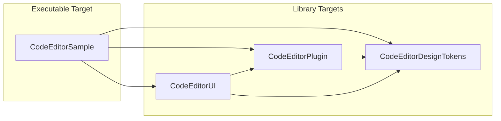
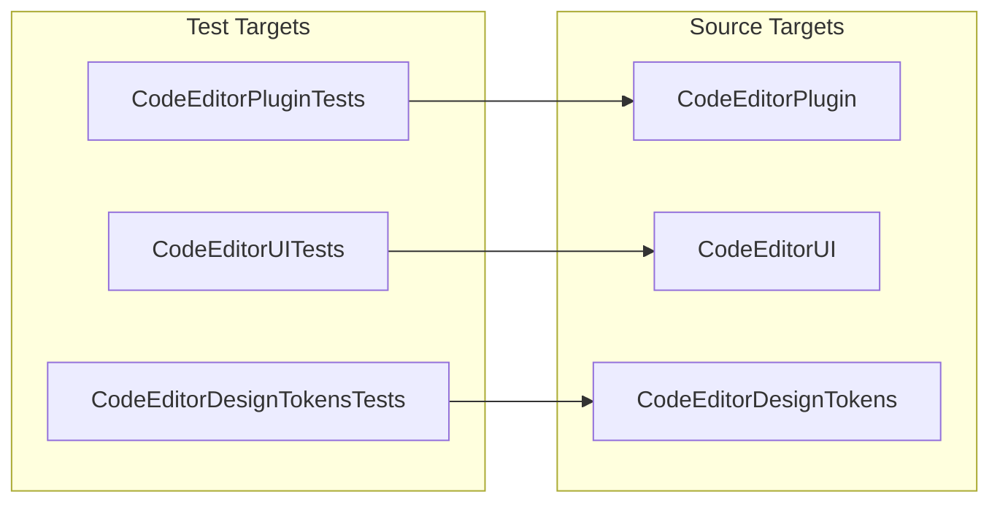
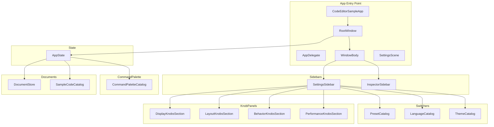

# CodeEditorSample — Package Dependencies & Architecture

The CodeEditorSample executable demonstrates CodeEditorPlugin integration. It lives in `Sources/CodeEditorSample/` and depends on the three framework targets.

## Dependency Graph

## Test Targets

## Sample App Internal Structure

## Cross-Platform Support

The sample app (and all library targets) target three Apple platforms:

| Platform | Minimum Version |
|----------|----------------|
| macOS | 26.3+ |
| iOS | 26.3+ |
| 26.3+ |

Platform-specific code uses `#if canImport(AppKit)` / `#if canImport(UIKit)` rather than `#if os()`, following the repo's conventions. The sample app is a single codebase that adapts at compile time — there are no separate platform directories.
