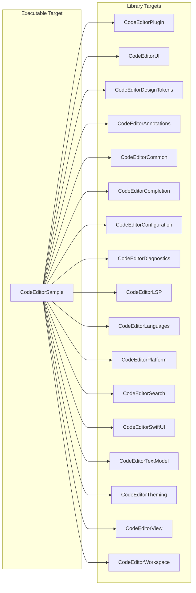
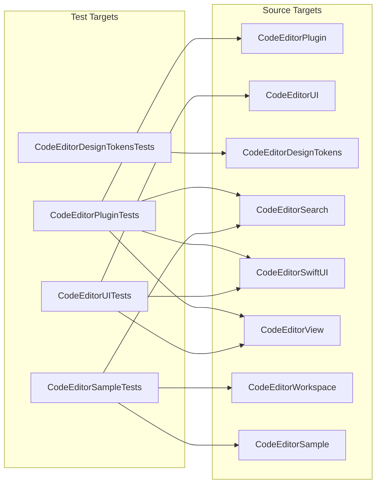

# CodeEditorSample — Package Dependencies & Architecture

The CodeEditorSample executable demonstrates CodeEditorPlugin integration. It lives in `Sources/CodeEditorSample/` and depends on the umbrella editor product plus the focused products it exercises directly.

## Dependency Graph

## Test Targets

## Sample App Internal Structure

```mermaid
flowchart TB
    subgraph "App Entry Point"
        App[CodeEditorSampleApp]
        Delegate[AppDelegate]
        RootWindow[RootWindow]
        WindowBody[WindowBody]
        SettingsScene[SettingsScene]
    end

    subgraph "State"
        AppState[AppState]
    end

    subgraph "Documents"
        DocStore["EditorDocuments<br/>(framework + sample extras)"]
        Catalog[SampleCodeCatalog]
    end

    subgraph "KnobPanels"
        Display[DisplayKnobsSection]
        Layout[LayoutKnobsSection]
        Behavior[BehaviorKnobsSection]
        Perf[PerformanceKnobsSection]
        Workspace[WorkspaceKnobsSection]
        AnnotationsKnobs[AnnotationsKnobsSection]
    end

    subgraph "EditorActions"
        FindReplace[FindReplaceOverlay]
        GotoLine[GotoLineSheet]
        GotoSymbol[GotoSymbolSheet]
        AnnotationsHub[AnnotationsHub]
    end

    subgraph "Sidebars"
        Settings[SettingsSidebar]
        Inspector[InspectorSidebar]
        LSPStatus[LSPStatusPanel]
        AnnotationInspector[AnnotationsInspectorPanel]
    end

    subgraph "Switchers"
        Presets[PresetCatalog]
        Languages[LanguageCatalog]
        Themes[ThemeCatalog]
    end

    subgraph "CommandPalette"
        CmdPalette[CommandPaletteCatalog]
    end

    App --> RootWindow
    RootWindow --> AppState
    RootWindow --> WindowBody
    WindowBody --> Settings
    WindowBody --> Inspector
    Settings --> Display
    Settings --> Layout
    Settings --> Behavior
    Settings --> Perf
    Settings --> Workspace
    Settings --> AnnotationsKnobs
    Settings --> Presets
    Settings --> Languages
    Settings --> Themes
    WindowBody --> FindReplace
    WindowBody --> GotoLine
    WindowBody --> GotoSymbol
    Inspector --> LSPStatus
    Inspector --> AnnotationInspector
    AppState --> DocStore
    AppState --> Catalog
    AppState --> CmdPalette
    AppState --> AnnotationsHub
```

## Cross-Platform Support

The sample app and all library targets use the two package platforms declared in `Package.swift`:

| Platform | Minimum Version |
|----------|----------------|
| macOS | 26.3+ |
| iOS / iPadOS | 26.3+ |

Platform-specific code uses `#if canImport(AppKit)` / `#if canImport(UIKit)` rather than `#if os()`, following the repo's conventions. The sample app has a macOS shell (`RootWindow`, `WindowBody`, `SettingsScene`) and an iOS shell (`IOSRootView`) over shared state and catalog types.
