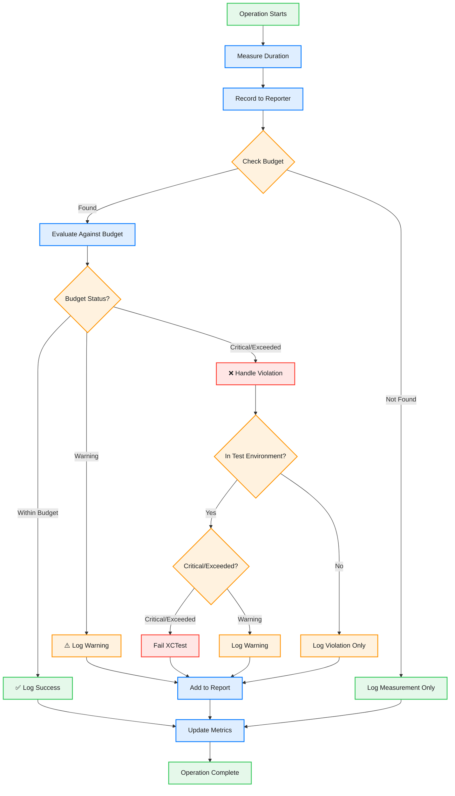

# Performance Budget System

This diagram shows the performance budget system implementation in CodeEditorPlugin, which currently focuses on test-driven performance regression detection with planned expansion to production runtime enforcement.

```mermaid
classDiagram
    direction LR
    
    %% Core Budget System
    class PerformanceBudget {
        <<budget configuration>>
        +budgets [String: Budget]
        +budget(for: String) Budget?
        +checkBudgets() [BudgetViolation]
    }

    class Budget {
        <<budget definition>>
        +operation String
        +targetTime TimeInterval
        +warningTime TimeInterval
        +criticalTime TimeInterval
        +init(operation, targetTime, warningTime?, criticalTime?)
        +check(duration) BudgetStatus
    }

    class BudgetStatus {
        <<enumeration>>
        withinBudget "✅ Within Budget"
        warning "⚠️ Warning"
        critical "❌ Critical"
        exceeded "🚨 Exceeded"
        +isAcceptable Bool
    }

    %% Reporting System
    class PerformanceBudgetReporter {
        <<actor, budget reporter>>
        -measurements [String: [TimeInterval]]
        -logger CrossPlatformLogger
        +init()
        +record(operation: String, duration: TimeInterval)
        +averageMeasurements() [String: TimeInterval]
        +generateReport() PerformanceBudgetReport
        +reset()
    }

    class PerformanceBudgetReport {
        <<report>>
        +measurements [String: [TimeInterval]]
        +averages [String: TimeInterval]
        +violations [BudgetViolation]
        +summary String
    }

    class BudgetViolation {
        <<violation>>
        +operation String
        +budget Budget
        +actualTime TimeInterval
        +status BudgetStatus
        +percentageOverBudget Double
        +description String
    }

    %% Test Integration
    class XCTestCaseBudget {
        <<test extension>>
        +budgetReporter PerformanceBudgetReporter
        +measureAgainstBudget()
        +measureAsyncAgainstBudget()
        +assertFileSizePerformance()
        +generatePerformanceReport()
    }

    class PerformanceBudgetTestObserver {
        <<test observer>>
        +testBundleDidFinish()
    }

    %% Static Budget Configuration
    class StaticBudgets {
        <<static implementation>>
        +budgets [String: Budget]
        +budget(for: String) Budget?
        +checkBudgets([String: TimeInterval]) [BudgetViolation]
        Note: 14 predefined operations with time thresholds
        Note: Implemented as static properties in PerformanceBudget
    }

    %% Test-based Enforcement (Current Implementation)
    class TestEnforcement {
        <<test integration only>>
        +simulatorMultiplier 6.0
        +failTestOnCritical Bool
        +logWarningOnExceeded Bool
        Note: Only enforced in XCTest environment
        Note: No production enforcement mechanism
    }

    %% Integration Status (Not Yet Implemented)
    class PerformanceMonitor {
        <<independent system>>
        +metrics [String: MonitoringPerformanceMetric]
        +measure(name, block)
        Note: No budget integration implemented
    }

    class UnifiedPerformanceSystem {
        <<independent system>>
        +track(metricType, operation)
        +generateInsights()
        Note: Has own performance tracking, no budget integration
    }

    %% Relationships
    PerformanceBudget --> Budget : "contains"
    Budget --> BudgetStatus : "evaluates to"
    
    PerformanceBudgetReporter --> PerformanceBudget : "uses"
    PerformanceBudgetReporter --> PerformanceBudgetReport : "generates"
    PerformanceBudgetReporter --> BudgetViolation : "reports"
    
    PerformanceBudgetReport --> BudgetViolation : "contains"
    BudgetViolation --> Budget : "references"
    BudgetViolation --> BudgetStatus : "has"
    
    XCTestCaseBudget --> PerformanceBudgetReporter : "uses"
    XCTestCaseBudget --> PerformanceBudget : "checks against"
    
    PerformanceBudgetTestObserver --> XCTestCaseBudget : "triggers report"
    
    StaticBudgets --> Budget : "contains"
    PerformanceBudget --> StaticBudgets : "implements"
    
    TestEnforcement --> BudgetViolation : "handles in tests"
    
    %% Note: Integration relationships are planned but not implemented
    PerformanceMonitor ..> PerformanceBudgetReporter : "planned integration"
    UnifiedPerformanceSystem ..> PerformanceBudget : "planned integration"

    %% Styling - Dark mode friendly colors
    classDef budget fill:#34C75920,stroke:#34C759,stroke-width:2px,color:#1D1D1F
    classDef reporter fill:#007AFF20,stroke:#007AFF,stroke-width:2px,color:#1D1D1F
    classDef test fill:#AF52DE20,stroke:#AF52DE,stroke-width:2px,color:#1D1D1F
    classDef enforcement fill:#FF3B3020,stroke:#FF3B30,stroke-width:2px,color:#1D1D1F
    classDef integration fill:#FF950020,stroke:#FF9500,stroke-width:2px,color:#1D1D1F
    classDef enum fill:#8E8E9320,stroke:#8E8E93,stroke-width:2px,color:#1D1D1F
    
    class PerformanceBudget budget
    class Budget budget
    class StaticBudgets budget
    class PerformanceBudgetReporter reporter
    class PerformanceBudgetReport reporter
    class BudgetViolation reporter
    class XCTestCaseBudget test
    class PerformanceBudgetTestObserver test
    class TestEnforcement enforcement
    class PerformanceMonitor integration
    class UnifiedPerformanceSystem integration
    class BudgetStatus enum
```



## Budget Flow Diagram



## Pre-defined Performance Budgets

| Operation | Target Time | Warning Time | Critical Time |
|-----------|------------|--------------|---------------|
| **Rendering** |
| syntax_highlighting | 16ms (60fps) | 33ms (30fps) | 100ms |
| text_layout | 16ms | 50ms | 100ms |
| scrolling | 8ms (120fps) | 16ms (60fps) | 33ms |
| line_number_update | 16ms | 33ms | 100ms |
| **Completion** |
| completion_request | 50ms | 100ms | 200ms |
| completion_cancellation | 10ms | 50ms | 100ms |
| **File Operations** |
| file_open_small (<10KB) | 100ms | 200ms | 500ms |
| file_open_medium (10KB-1MB) | 500ms | 1s | 2s |
| file_open_large (>1MB) | 2s | 5s | 10s |
| **Search** |
| find_in_file | 50ms | 100ms | 200ms |
| fuzzy_search (10k items) | 100ms | 200ms | 500ms |
| **Memory** |
| memory_pressure_recovery | 500ms | 1s | 2s |
| **UI** |
| context_menu_creation | 50ms | 100ms | 500ms |
| **Test Operations** |
| test_setup | 100ms | 500ms | 1s |
| test_teardown | 100ms | 500ms | 1s |

## Usage Examples

### Basic Performance Tracking
```swift
// In production code
let reporter = PerformanceBudgetReporter()

// Record an operation
let startTime = CFAbsoluteTimeGetCurrent()
performSyntaxHighlighting()
let duration = CFAbsoluteTimeGetCurrent() - startTime

await reporter.record(operation: "syntax_highlighting", duration: duration)
```

### Test Integration
```swift
// In test code
class MyPerformanceTests: XCTestCase {
    func testSyntaxHighlightingPerformance() {
        measureAgainstBudget("syntax_highlighting") {
            // Perform syntax highlighting
            highlighter.highlight(text: largeDocument)
        }
    }
    
    func testAsyncCompletionPerformance() async throws {
        try await measureAsyncAgainstBudget("completion_request") {
            let results = try await completionManager.requestCompletions(for: context)
            XCTAssertFalse(results.isEmpty)
        }
    }
}
```

### Test Environment Configuration
```swift
// Enforcement is currently only available in test environment
// Tests automatically apply 6x multiplier for simulator performance
class PerformanceRegressionTests: XCTestCase {
    func testSyntaxHighlighting() {
        // Will fail test if critical/exceeded, log warning otherwise
        measureAgainstBudget("syntax_highlighting") {
            performSyntaxHighlighting()
        }
    }
}
```

### Report Generation
```swift
let report = await reporter.generateReport()
CrossPlatformLogger.logger().info(report.summary)

// Output:
// Performance Budget Report
// ==================================================
// Total Operations: 15
// Total Violations: 2
//
// Violations:
//   ❌ Critical syntax_highlighting: 0.125s (150.0% over budget of 0.050s)
//   ⚠️ Warning completion_request: 0.085s (70.0% over budget of 0.050s)
//
// All Measurements (Average):
//   completion_request: 0.085s ⚠️ Warning
//   syntax_highlighting: 0.125s ❌ Critical
//   text_layout: 0.012s ✅ Within Budget
```

## Benefits (Current Implementation)

1. **Test-Driven Performance Regression Detection**: Automatically catch performance regressions in test suite
2. **Simulator Performance Adjustment**: 6x multiplier accounts for simulator overhead
3. **Detailed Reporting**: Comprehensive performance reports with violation details
4. **Real-time Logging**: Immediate feedback on budget violations during operations
5. **XCTest Integration**: Seamless integration with existing test infrastructure
6. **Static Budget Configuration**: 14 pre-defined operation budgets covering core functionality

## Current Integration Status

**✅ Fully Integrated:**
- **XCTest Framework**: Complete test integration with automatic reporting
- **Static Budget System**: Pre-defined budgets for all major operations
- **Logging System**: Real-time budget violation logging

**🔄 Planned Integrations:**
- **UnifiedPerformanceSystem**: No current integration (separate tracking systems)
- **PerformanceMonitor**: No current integration (independent metric collection)
- **Production Enforcement**: No runtime enforcement mechanism implemented

**❌ Missing Components:**
- **Runtime Budget Enforcement**: Only available in test environment
- **Adaptive Budget Adjustment**: No dynamic budget modification based on conditions
- **Cross-Platform Budget Scaling**: Only simulator adjustment implemented

## Current Architecture

The performance budget system is implemented as a focused testing tool with these key characteristics:

### Core Components
- **PerformanceBudget**: Static struct with 14 predefined operation budgets
- **PerformanceBudgetReporter**: Actor-based measurement collection and reporting
- **XCTestCase Extensions**: Test integration with simulator performance adjustments

### Design Decisions
1. **Test-First Approach**: Primary focus on catching regressions during development
2. **Static Configuration**: Budgets are compile-time constants for consistency
3. **Simulator Awareness**: 6x performance multiplier for realistic test expectations
4. **Immediate Logging**: Real-time feedback for developers during measurement

### Performance Budgets Coverage
The system tracks 14 critical operations across categories:
- **Rendering**: syntax_highlighting, text_layout, scrolling, line_number_update
- **Completion**: completion_request, completion_cancellation  
- **File Operations**: file_open_small, file_open_medium, file_open_large
- **Search**: find_in_file, fuzzy_search
- **Memory**: memory_pressure_recovery
- **UI**: context_menu_creation
- **Testing**: test_setup, test_teardown
