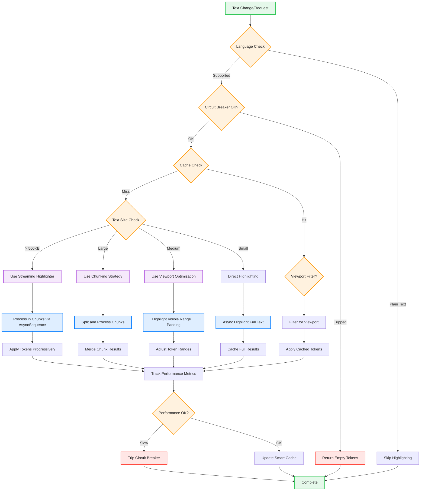

# Enhanced Syntax Highlighting Architecture

This diagram shows the current optimized syntax highlighting system with modern Swift 6 concurrency patterns, actor-based coordination, streaming for large files, and comprehensive performance tracking.

```mermaid
classDiagram
    direction LR
    
    %% Core Components - Updated to reflect actual implementation
    class OptimizedSyntaxHighlightingCoordinator {
        <<main coordinator>>
        -coordinator SyntaxHighlightingCoordinator
        -tokenCache SmartTokenCache
        -performanceTracker SyntaxHighlightingPerformanceTracker
        -memoryMonitor MemoryMonitor
        -configuration HighlightingConfiguration
        -circuitBreakerTrips Int
        -lastCircuitBreakerReset Date
        -lastHighlightedText String?
        -lastHighlightedTokens [HighlightedToken]
        +highlight() async [HighlightedToken]
        +highlightViewport() async [HighlightedToken]
        +highlightFull() async [HighlightedToken]
        +applyHighlighting() async
        +getPerformanceReport() String
        +updateConfiguration()
    }

    class AsyncSyntaxHighlighter {
        <<async coordinator>>
        -coordinator SyntaxHighlightingCoordinator
        -backgroundHighlighter BackgroundSyntaxHighlighter
        -highlightingTask Task?
        -debounceTask Task?
        -performanceMonitor SyntaxHighlightingPerformanceMonitor
        -tokenCache SmartTokenCache
        -memoryMonitor MemoryMonitor
        -errorRecovery ErrorRecoveryCoordinator
        +scheduleHighlighting()
        +highlightImmediately() async
        +highlightStreamingly() async
        +cancelAllHighlighting()
        +shouldUseStreaming() Bool
    }

    class StreamingHighlighter {
        <<large file handler>>
        -configuration Configuration
        -coordinator SyntaxHighlightingCoordinator
        +highlightStream() HighlightStream
        +Configuration.largeFile
        +Configuration.responsive
    }

    class HighlightingConfiguration {
        <<configuration>>
        +enableViewportOptimization Bool
        +viewportPadding Int
        +maxChunkSize Int
        +enableIncrementalHighlighting Bool
        +cacheWarmingEnabled Bool
        +circuitBreakerThreshold TimeInterval
        +static default Self
        +static performance Self
    }

    %% Performance Tracking - Fully Implemented
    class SyntaxHighlightingPerformanceTracker {
        <<performance tracker>>
        -recentMetrics [PerformanceMetrics]
        -maxMetricsCount Int
        -warningThreshold TimeInterval
        -criticalThreshold TimeInterval
        +trackOperation()
        +getAggregatedMetrics()
        +getPerformanceByLanguage()
        +generateReport()
        +reset()
    }

    class PerformanceMetrics {
        <<data model>>
        +tokenizationTime TimeInterval
        +cacheCheckTime TimeInterval
        +highlightingTime TimeInterval
        +applyAttributesTime TimeInterval
        +tokenCount Int
        +cacheHit Bool
        +language String
        +textLength Int
        +totalTime TimeInterval
        +performanceLevel PerformanceLevel
        +tokensPerSecond Double
    }

    class AggregatedMetrics {
        <<statistics>>
        +averageTotalTime TimeInterval
        +p50TotalTime TimeInterval
        +p95TotalTime TimeInterval
        +p99TotalTime TimeInterval
        +cacheHitRate Double
        +totalOperations Int
        +criticalOperations Int
        +averageTokensPerSecond Double
        +performanceScore Double
    }

    %% Smart Token Cache - Actor-based Implementation
    class SmartTokenCache {
        <<actor cache>>
        -cache [CacheKey: CacheEntry]
        -accessOrder [CacheKey]
        -hitCount Int
        -missCount Int
        -evictionCount Int
        -maxCacheSize Int
        -maxMemoryUsageMB Double
        -staleThreshold Duration
        +getCachedTokens() async [HighlightedToken]
        +setCachedTokens() async
        +getStatistics() async TokenCacheStatistics
        +optimizeCache() async
        +clearCache() async
    }

    class CacheKey {
        <<cache key>>
        +textHash Int
        +textLength Int
        +language Language
        +version Int
        +init(text, language, version)
    }

    class CacheEntry {
        <<cache entry>>
        +tokens [HighlightedToken]
        +timestamp Date
        +accessCount Int
        +computationTime Duration
        +textLength Int
        +lastViewportRange NSRange?
        +score Double
        +tokensInViewport() [HighlightedToken]
    }

    %% Streaming Components - New Addition
    class HighlightStream {
        <<async sequence>>
        +text String
        +language Language
        +configuration Configuration
        +coordinator SyntaxHighlightingCoordinator
        +makeAsyncIterator() AsyncIterator
    }

    class HighlightChunk {
        <<chunk>>
        +index Int
        +range Range~String.Index~
        +tokens [HighlightedToken]
        +isComplete Bool
        +progress Double
    }

    %% Background Processing - Actual Implementation
    class BackgroundSyntaxHighlighter {
        <<background processor>>
        -memoryMonitor MemoryMonitor
        -priorityQueue [BackgroundRequest]
        -visibleRange NSRange?
        -statistics BackgroundHighlightingStatistics
        +processRequest() async
        +updateVisibleRange()
        +cancelAllRequests()
    }

    class ErrorRecoveryCoordinator {
        <<error handling>>
        -retryCount Int
        -maxRetries Int
        +recover() async throws
        +canRecover() Bool
    }

    %% Memory and Performance Monitoring
    class MemoryMonitor {
        <<actor monitor>>
        -cleanupHandlers [String: CleanupHandler]
        -isMonitoring Bool
        -memoryPressureSource DispatchSourceMemoryPressure?
        +availableMemoryMB Double
        +isMemoryPressureHigh Bool
        +registerCleanupHandler()
        +performCleanup() async
    }

    class PerformanceMonitor {
        <<actor monitor>>
        -metrics [String: MonitoringPerformanceMetric]
        -cleanupTask Task?
        +startMeasuring() MeasurementToken
        +endMeasuring()
        +measure() async
        +generateReport() PerformanceReport
    }

    %% Core Integration
    class SyntaxHighlightingCoordinator {
        <<existing coordinator>>
        -swiftHighlighter SwiftSyntaxHighlighter
        -regexHighlighter RegexSyntaxHighlighter
        -fastJSONTokenizer FastJSONTokenizer
        -taskManager HighlightingTaskManager
        +highlight() [HighlightedToken]
        +highlightAsync() async [HighlightedToken]
        +applyHighlighting() async
        +supportsLanguage() Bool
    }

    class SyntaxHighlightingService {
        <<service layer>>
        -syntaxHighlighter SyntaxHighlightingCoordinator
        +shouldApplySyntaxHighlighting() Bool
        +calculateHighlightingRange() NSRange?
        +scheduleHighlighting()
        +determineHighlightingMode() HighlightingMode
    }

    %% Relationships - Updated for current architecture
    OptimizedSyntaxHighlightingCoordinator --> SyntaxHighlightingCoordinator : delegates to
    OptimizedSyntaxHighlightingCoordinator --> SmartTokenCache : uses
    OptimizedSyntaxHighlightingCoordinator --> SyntaxHighlightingPerformanceTracker : tracks with
    OptimizedSyntaxHighlightingCoordinator --> MemoryMonitor : monitors with
    OptimizedSyntaxHighlightingCoordinator --> HighlightingConfiguration : configured by
    
    AsyncSyntaxHighlighter --> SyntaxHighlightingCoordinator : coordinates
    AsyncSyntaxHighlighter --> SmartTokenCache : caches with
    AsyncSyntaxHighlighter --> BackgroundSyntaxHighlighter : processes with
    AsyncSyntaxHighlighter --> ErrorRecoveryCoordinator : recovers with
    AsyncSyntaxHighlighter --> StreamingHighlighter : streams with
    AsyncSyntaxHighlighter --> MemoryMonitor : monitors with
    
    StreamingHighlighter --> HighlightStream : produces
    HighlightStream --> HighlightChunk : yields
    
    SmartTokenCache --> CacheKey : indexes by
    SmartTokenCache --> CacheEntry : stores
    
    SyntaxHighlightingPerformanceTracker --> PerformanceMetrics : collects
    SyntaxHighlightingPerformanceTracker --> AggregatedMetrics : aggregates to
    
    SyntaxHighlightingService --> AsyncSyntaxHighlighter : uses
    SyntaxHighlightingService --> OptimizedSyntaxHighlightingCoordinator : uses

    %% Styling - Updated colors
    classDef main fill:#007AFF20,stroke:#007AFF,stroke-width:3px,color:#1D1D1F
    classDef async fill:#34C75920,stroke:#34C759,stroke-width:3px,color:#1D1D1F
    classDef performance fill:#FF950020,stroke:#FF9500,stroke-width:2px,color:#1D1D1F
    classDef cache fill:#AF52DE20,stroke:#AF52DE,stroke-width:2px,color:#1D1D1F
    classDef streaming fill:#007AFF20,stroke:#007AFF,stroke-width:2px,color:#1D1D1F
    classDef background fill:#8E8E9320,stroke:#8E8E93,stroke-width:2px,color:#1D1D1F
    classDef monitoring fill:#FF3B3020,stroke:#FF3B30,stroke-width:2px,color:#1D1D1F
    classDef service fill:#34C75920,stroke:#34C759,stroke-width:2px,color:#1D1D1F
    
    class OptimizedSyntaxHighlightingCoordinator main
    class AsyncSyntaxHighlighter async
    class StreamingHighlighter streaming
    class HighlightStream streaming
    class HighlightChunk streaming
    class SyntaxHighlightingPerformanceTracker performance
    class PerformanceMetrics performance
    class AggregatedMetrics performance
    class SmartTokenCache cache
    class CacheKey cache
    class CacheEntry cache
    class BackgroundSyntaxHighlighter background
    class ErrorRecoveryCoordinator background
    class MemoryMonitor monitoring
    class PerformanceMonitor monitoring
    class SyntaxHighlightingService service
    class SyntaxHighlightingCoordinator service
```



## Modernized Highlighting Flow



## Key Architectural Improvements

### 1. **Actor-Based Concurrency (Swift 6)**
- `SmartTokenCache` is now an actor for thread-safe caching
- `MemoryMonitor` and `PerformanceMonitor` use actor isolation
- Proper async/await patterns throughout

### 2. **Streaming for Large Files**
- `StreamingHighlighter` with `AsyncSequence` support
- Progressive token application for better UI responsiveness
- Configurable chunk sizes and buffering strategies

### 3. **Integrated Circuit Breaker**
- Simple counter-based implementation in `OptimizedSyntaxHighlightingCoordinator`
- Automatic reset after timeout periods
- Prevents system overload during performance issues

### 4. **Smart Cache Enhancements**
- Viewport-aware token filtering
- LRU eviction with intelligent scoring
- Memory pressure integration
- Stale entry cleanup

### 5. **Error Recovery**
- `ErrorRecoveryCoordinator` for handling failures
- Graceful fallback strategies
- Memory pressure handling

### 6. **Modern Performance Monitoring**
- Percentile-based metrics (P50, P95, P99)
- Language-specific performance breakdowns
- Real-time performance scoring

## Configuration Examples (Updated)

```swift
// Current default configuration
let config = HighlightingConfiguration.default
// enableViewportOptimization: true
// viewportPadding: 500 chars
// maxChunkSize: 5,000 chars
// circuitBreakerThreshold: 100ms

// Performance optimized configuration
let perfConfig = HighlightingConfiguration.performance
// viewportPadding: 200 chars (smaller)
// maxChunkSize: 2,000 chars (smaller chunks)
// circuitBreakerThreshold: 50ms (stricter)

// Streaming configuration for large files
let streamConfig = StreamingHighlighter.Configuration.largeFile
// chunkSize: 100,000 chars
// bufferSize: 2
// priority: .low
```

## Integration Points (Updated)

- **CodeEditorView**: Main text view with TextKit2 integration
- **SyntaxHighlightingCoordinator**: Core highlighting with SwiftSyntax and regex
- **AsyncSyntaxHighlighter**: Debounced async coordination with cancellation
- **OptimizedSyntaxHighlightingCoordinator**: Performance-optimized coordinator
- **StreamingHighlighter**: Large file handling with progressive updates
- **MemoryMonitor**: Memory pressure detection and cleanup coordination
- **PerformanceMonitor**: Comprehensive performance tracking and reporting

The current implementation is **significantly more sophisticated** than the original diagram, with modern Swift 6 concurrency patterns, better error handling, and more intelligent caching strategies.